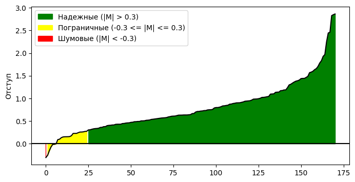
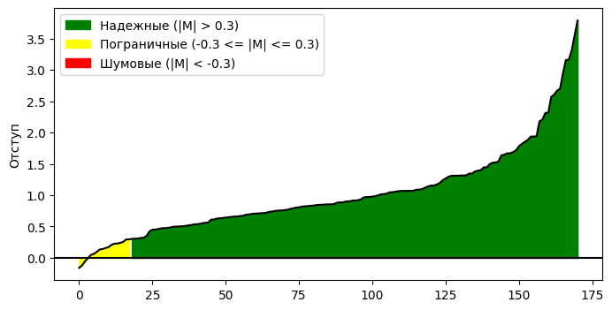
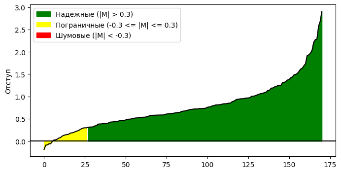
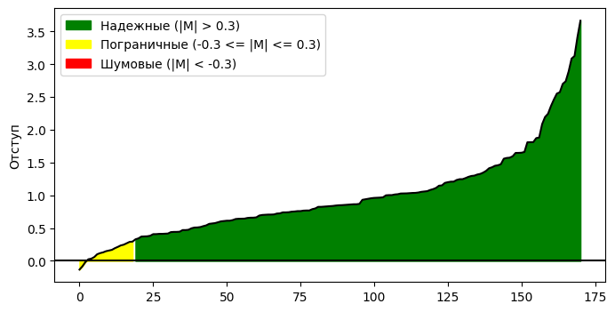

# Лабораторная работа №4

## Датасет
Для решения задачи бинарной классификации был выбран датасет для предсказания рака груди ([ссылка](https://www.kaggle.com/datasets/uciml/breast-cancer-wisconsin-data)).

## Реализация различных методов классификации 
### Вычисление отступа объекта
Вычисление отступа объекта выполняется при помощи следующей функции:
```python
def margin(self, X, y):
    return (X @ self.W) * y
```

Для визуализации отступов используется функция plot_margins. Порог неуверенности = 0.3. 
```python
def plot_margins(margins):
    plt.figure(figsize=(8, 4))
    plt.plot(margins, linestyle='-', color='black')
    plt.axhline(0, color='black')
    plt.ylabel("Отступ", fontsize=10)
    plt.fill_between(range(len(margins)), margins, 0, where=(margins > 0.3), color='green', label='Надежные (|M| > 0.3)')
    plt.fill_between(range(len(margins)), margins, 0, where=np.bitwise_and(margins >= -0.3, margins <= 0.3), color='yellow', 
                     label='Пограничные (-0.3 <= |M| <= 0.3)')
    plt.fill_between(range(len(margins)), margins, 0, where=(margins < -0.3), color='red', label='Шумовые (|M| < -0.3)')
    plt.legend()
    plt.show()
```

### Вычисление градиента функции потерь
```python
def grad(self, X, y, W):
    # Штрафуем за размер весов, добавляя к градиенту регуляризационный член
    return -2 * (X.T @ (y - (X @ W))) / len(y) + self.reg_coef * self.W
```

### Рекуррентная оценка функционала качества
В начале оценка ф. качества - ср. значение лосса по выборке. При обучении функционал обновляется следующим образом: 
```python
    ei = self.loss(X_train[indices], y_train[indices]) 
    Q = self.lambd * ei + (1 - self.lambd) * Q
```
Где `lambd` - темп забывания.

### Метод стохастического градиентного спуска с инерцией

В решении используется NAG, отличающийся от метода Momentum наличием шага в направлении текущего момента и вычислением градиента в новой точке, код формул с учётом регуляризации:

```python
    loss_grad = self.grad(X_train[indices], y_train[indices], W = self.W - lr * self.gamma * self.v) 
    self.v = self.gamma * self.v + (1 - self.gamma) * loss_grad 
    self.W = self.W * (1 - lr * self.reg_coef) - lr * self.v
```

### L2-регуляризация
Регуляризация позволяет уменьшить переобучение, уменьшая норму весов с определенным коэффициентом. Для градиентного шага использовалась формула:

$$w := w - h\frac{\partial\mathcal{L}}{\partial w} - h\tau w = w(1-h\tau) - h\frac{\partial\mathcal{L}}{\partial w}$$


### Скорейший градиентный спуск
Скорейший градиентный спуск основан на поиске оптимального адаптивного шага обучения. В коде lr определяется как обратное квадрату нормы выборки значение:

```python
lr = 1 / np.linalg.norm(X_train[indices]) ** 2
```

### Предъявление объектов по модулю отступа
Нужно для того, чтобы модель чаще обучалась на объектах, в которых она меньше уверена (с меньшим модулем отступа). Реализовано следующим образом:
1. Для каждого отступа считается абс. значение и берется экспонента от инвертированного значения
2. Пл. вероятности нормируется, чтобы в сумме по всем объектам получалась 1
3. Вычисленная пл. вероятности передается в `np.random.choice()`, где выбираются 10 объектов для обучения

```python
def margin_indices(self, X_train, y_train):
    margins = np.abs(self.margin(X_train, y_train))
    exp_margins = np.exp(-margins)
    p = exp_margins / np.sum(exp_margins)
    return np.random.choice(X_train.shape[0], 10, False, p)
```

## Обучение

Определение метода инициализации весов осуществляется передачей соответствующего значения параметра `weights_init_method` при вызове метода fit():

`'correlation'` - инициализация весов на основе корреляции между признаками и таргетами

`'multistart'` - выбор лучшего набора весов из сгенерированных из равномерного распределения в интервале от -1/2n до 1/2n

`'default'` - задание случайных весов из распределения в интервале от -1/2n до 1/2n

### C инициализацией весов через корреляцию
```python
start = time()
model = LinearClassifier(weights_init_method="correlation", reg_coef=0.0001, lambd=0.01, gamma=0.09,
                         obj_presentation="random", epochs=100)
model.fit(X_train, y_train)
y_pred = model.predict(X_test)
accuracy = accuracy_score(y_test, y_pred)
print(f'Время: {np.round(time()-start, 2)} сек.\nAccuracy: {np.round(accuracy, 2)}')
margins = np.sort(model.margin(X_test, y_test))
plot_margins(margins)
```

#### Результат


```
Время: 0.02 сек
Accuracy: 0.96
```

### С инициализацией весов через мультистарт

```python
start = time()
model = LinearClassifier(weights_init_method="multistart", reg_coef=0.0001, lambd=0.01, gamma=0.09,
                         obj_presentation="margin_abs", epochs=100)
model.fit(X_train, y_train)
y_pred = model.predict(X_test)
accuracy = accuracy_score(y_test, y_pred)
print(f'Время: {np.round(time()-start, 2)} сек.\nAccuracy: {np.round(accuracy, 2)}')
margins = np.sort(model.margin(X_test, y_test))
plot_margins(margins)
```
#### Результат


```
Время: 0.11 сек
Accuracy: 0.98
```

### Обучение с разным порядком предъявления объектов

Порядок предъявления определяется переданным значением параметра `obj_presentation`:

`'random'` - cлучайный

`'margin_abs'` - по модулю отступа

```python
start = time()
model = LinearClassifier(weights_init_method="default", reg_coef=0.0001, lambd=0.01, gamma=0.09,
                         obj_presentation="random", epochs=100)
model.fit(X_train, y_train)
y_pred = model.predict(X_test)
accuracy = accuracy_score(y_test, y_pred)
print(f'Время: {np.round(time()-start, 2)} сек.\nAccuracy: {np.round(accuracy, 2)}')
margins = np.sort(model.margin(X_test, y_test))
plot_margins(margins)
```

#### Результаты
1. Со случайным



```
Время: 0.03 сек
Accuracy: 0.96
```

2. С предъявлением объектов по модулю отступа



```
Время: 0.07 сек
Accuracy: 0.98
```
### Лучшая реализация
Лучшая реализация - с инициализированными мультистартом весами и предъявлением объектов по |M| (+ SGD и моменты Нестерова, адаптивный lr и L2 регуляризация):


```
Время: 0.07 сек
Accuracy: 0.99
```
## Эталонное решение

В качестве эталонного решения использовался класс `SGDClassifier` из библиотеки `sklearn`:

```python
from sklearn.linear_model import SGDClassifier

start = time()
model = SGDClassifier()
model.fit(X_train, y_train)
y_pred = model.predict(X_test)
accuracy = accuracy_score(y_test, y_pred)
print(f'Время: {time()-start:.3f} сек.\nAccuracy: {accuracy:.2f}')
```
Результат:
```
Время: 0.004 сек
Accuracy: 0.97
```
Accuracy кастомного алгоритма выше на 0.02, однако время выполнения уступает библиотечной реализации на порядок.
