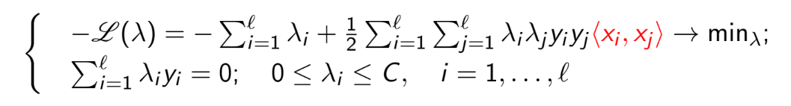
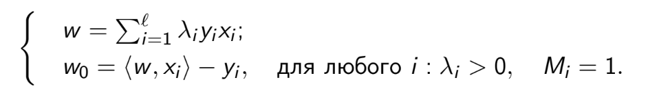
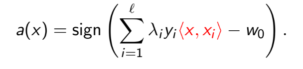
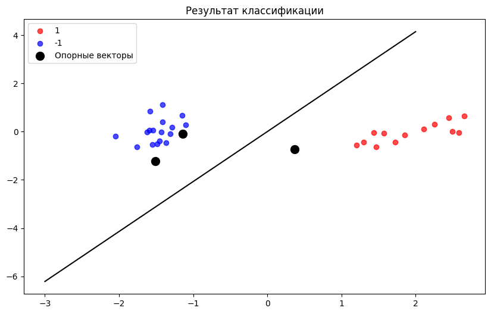

# Лабораторная работа №5

## Датасет

Для решения задачи был выбран датасет для классификации цветков ириса ([ссылка](https://www.kaggle.com/datasets/himanshunakrani/iris-dataset)).

## Решение двойственной задачи по лямбда

Прямой подход к обучению SVM включает минимизацию функции потерь с учетом ограничений на веса. Более удобным и эффективным оказывается переход к двойственной задаче, где мы работаем с параметрами Лагранжа λᵢ. Двойственная задача формулируется следующим образом:



Где C — это параметр регуляризации, контролирующий баланс между максимизацией отступа и минимизацией ошибки на обучающем наборе данных. Решение этой задачи позволяет находить значения λᵢ, которые затем используются для вычисления весов w и смещения w₀ модели.

Решение прямой задачи SVM выражается через решение двойственной задачи следующим образом:



w — это вектор весов, определяющий ориентацию гиперплоскости, а w₀ — смещение, которое позволяет перемещать гиперплоскость в пространстве признаков.

Линейный классификатор, основанный на найденных параметрах, может быть представлен в следующем виде:



В коде для оптимизации функции Лагранжа используется функция `scipy.optimize.minimize`:

```python
# Задаем ограничение для оптимизации: сумма ск. произведений коэф. Лагранжа на метки классов должна строго '= 0'
constraints = {'type': 'eq', 'fun': lambda lambdas: lambdas @ y}
# Используем scipy.optimize.minimize для минимизации лагранжиана с нужными ограничениями
self.lambdas = minimize(fun=lagrangian, x0=np.zeros(X.shape[0]), bounds=lambdas_E, constraints=constraints).x
```

Для инициализации объекта класса SVM необходимо указать `kernel` (тип ядра), и опционально параметры `C`, `gamma` и `d` (степень полинома). С учётом переданных параметров рассчитывается матрица Грама:

```python
def lagrangian(lambdas):
    if self.kernel == 'RBF':
        # Считаем матрицу ядра
        K = np.array([[self.rbf_kernel(X[i], X[j]) for j in range(X.shape[0])] for i in range(X.shape[0])])
    elif self.kernel == 'polynomial':
        # -||-
        K = np.array([[self.polynomial_kernel(X[i], X[j]) for j in range(X.shape[0])] for i in range(X.shape[0])])
    else: K = X @ X.T # -||-
    # Первый член (до знака '-') отвечает за максимизацию ширины отступа, а второй - за регуляризацию
    return 0.5 * np.sum(lambdas[:, None] * lambdas[None, :] * y[:, None] * y[None, :] * K) - np.sum(lambdas)

def rbf_kernel(self, x1, x2):
    return np.exp(-self.gamma * np.linalg.norm(x1 - x2) ** 2)

def polynomial_kernel(self, x1, x2):
    return (x1 @ x2 + 1) ** self.d
``` 

## Классификаторы

Для каждого типа ядра был создан классификатор (по умолчанию C=1, gamma=0.25, d=3):

### Линейное ядро

```python
start = time()
model = SVM(kernel='linear')
model.fit(X_train, y_train)
y_pred = model.predict(X_test)
print(f'Время: {np.round(time()-start, 2)} сек.\nAccuracy: {np.round(accuracy_score(y_test, y_pred), 2)}')
plot_result(X_test, y_test, model)
```

```
Время: 0.12 сек
Accuracy: 1.0
```

### RBF ядро

```python
model = SVM(kernel='RBF')
model.fit(X_train, y_train)
y_pred = model.predict(X_test)
```

```
Время: 59.45 сек
Accuracy: 1.0
```

### Полиномиальное ядро

```python
model = SVM(kernel='polynomial')
model.fit(X_train, y_train)
y_pred = model.predict(X_test)
```

```
Время: 6.1 сек
Accuracy: 1.0
```
## Визуализация решения



## Эталонное решение

В качестве эталона использовался класс sklearn.svm.SVC c идентичными параметрами ядер:

### Линейное ядро

```python
from sklearn.svm import SVC

model = SVC(kernel='linear', random_state=42, C=1)
model.fit(X_train, y_train)
y_pred = model.predict(X_test)
```

```
Время: 0.004 сек
Accuracy: 1.0
```

### RBF ядро

```python
model = SVC(kernel='rbf', random_state=42, C=1, gamma=0.25)
model.fit(X_train, y_train)
y_pred = model.predict(X_test)
```

```
Время: 0.005 сек
Accuracy: 1.0
```

### Полиномиальное ядро

```python
model = SVC(kernel='poly', random_state=42, C=1, degree=3)
model.fit(X_train, y_train)
y_pred = model.predict(X_test)
```

```
Время: 0.005 сек
Accuracy: 1.0
```

Из замеров видно, что при идентичной accuracy библиотечная реализация алгоритма значительно быстрее по времени выполнения.
