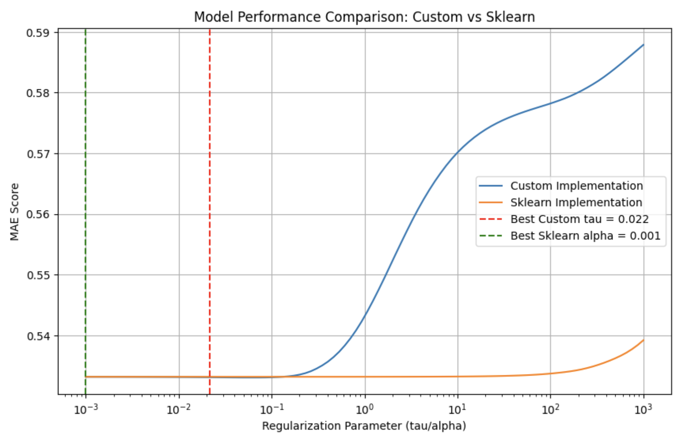

# Линейная регрессия

## 1. Многомерная линейная регрессия

### Метод наименьших квадратов (МНК)
- $X$ - объекты (обычно $\mathbb{R}^n$)
- $Y$ - ответы (обычно $\mathbb{R}$ или $\mathbb{R}^m$)
- $X^l = (x_i, y_i)_{i=1}^l$ - обучающая выборка
- $a(x,w)$ - модель зависимости, где $w \in \mathbb{R}^p$ - вектор параметров

Функционал МНК:
$$Q(w, X^l) = \sum_{i=1}^l \gamma_i(a(x_i,w) - y_i)^2 \to \min_w$$
где $\gamma_i$ - веса объектов

### Многомерная модель
$$a(x,w) = \sum_{j=1}^n w_j f_j(x)$$

В матричной форме:
- $F_{l\times n}$ - матрица признаков
- $y_{l\times 1}$ - вектор ответов
- $w_{n\times 1}$ - вектор весов

Нормальная система уравнений:
$$F^T F w = F^T y$$

Решение:
$$w^* = (F^T F)^{-1}F^T y = F^+y$$

## 2. Регуляризация

### Гребневая регрессия (Ridge)
Добавляет L2-регуляризацию:
$$Q_\tau(w) = \|Fw - y\|^2 + \frac{\tau}{2}\|w\|^2$$

Решение:
$$w^*_\tau = (F^T F + \tau I_n)^{-1}F^T y$$

#### Эффективный выбор параметра регуляризации
При подборе оптимального параметра регуляризации τ на контрольной выборке $X^k = (x'_i, y'_i)_{i=1}^k$ можно использовать SVD-разложение для оптимизации вычислений.

Матрица признаков контрольной выборки:
$$F'_{k\times n} = \begin{pmatrix} 
f_1(x'_1) & \cdots & f_n(x'_1) \\
\vdots & \ddots & \vdots \\
f_1(x'_k) & \cdots & f_n(x'_k)
\end{pmatrix}, \quad
y'_{k\times 1} = \begin{pmatrix} 
y'_1 \\
\vdots \\
y'_k
\end{pmatrix}$$

Функционал качества на контрольной выборке:
$$Q(w^*_\tau, X^k) = \|F'w^*_\tau - y'\|^2 = \left\|F'U \cdot \text{diag}\left(\frac{\lambda_j}{\lambda_j + \tau}\right) \cdot V^Ty - y'\right\|^2$$

Такой подход требует $O(kn^2 + knT)$ операций для вычисления функционала $T$ раз, что существенно эффективнее прямого пересчета решения для каждого значения $\tau$.

### LASSO (L1-регуляризация)
Минимизирует:
$$\|Fw - y\|^2 + \mu\sum_{j=1}^n |w_j| \to \min_w$$

Преимущество: производит отбор признаков

## Набор данных

### Качество красного вина

https://www.kaggle.com/datasets/uciml/red-wine-quality-cortez-et-al-2009

Два набора данных связаны с красным и белым вариантами португальского вина "Vinho Verde". Доступны только физико-химические (входные) и сенсорные (выходные) переменные (например, нет данных о сортах винограда, марке вина, цене продажи вина и т.д.).

Эти наборы данных можно рассматривать как задачи классификации или регрессии. Классы упорядочены и несбалансированы (например, обычных вин гораздо больше, чем отличных или плохих).

## Релизация на python

```python
import numpy as np
from pydantic import BaseModel


class TauSelectionResult(BaseModel):
    """Results of tau parameter selection process."""

    optimal_tau: float
    scores: dict[float, float]
    best_score: float


class RidgeRegression:
    """Ridge regression implementation (L2 regularization).

    Minimizes the objective function:
    Q_τ(w) = ||Fw - y||^2 + (τ/2)||w||^2
    """

    def __init__(self, tau: float = 1.0):
        """Initialize Ridge regression model.

        Args:
            tau: Regularization strength (default=1.0). Must be positive.
                Larger values specify stronger regularization.
        """
        if tau < 0:
            raise ValueError("Regularization parameter tau must be positive")
        self.tau = tau
        self.weights: np.ndarray | None = None

    def fit(self, X: np.ndarray, y: np.ndarray) -> "RidgeRegression":
        """Fit Ridge regression model.

        Args:
            X: Training data of shape (n_samples, n_features)
            y: Target values of shape (n_samples,)

        Returns:
            self: Returns the instance itself
        """
        n_samples, n_features = X.shape

        # Add bias term
        bias_column = np.ones((n_samples, 1))
        features = np.concatenate([bias_column, X], axis=1)

        # Calculate optimal weights using the analytical solution:
        # w* = (F^T F + τI)^(-1) F^T y
        identity = np.eye(n_features + 1)  # +1 for bias term
        self.weights = np.linalg.solve(
            features.T @ features + self.tau * identity, features.T @ y
        )
        return self

    def predict(self, X: np.ndarray) -> np.ndarray:
        """Predict using the linear model.

        Args:
            X: Samples of shape (n_samples, n_features)

        Returns:
            y: Returns predicted values
        """
        if self.weights is None:
            raise RuntimeError("Model must be fitted before making predictions")

        # Add bias term and calculate predictions
        bias_column = np.ones((X.shape[0], 1))
        features = np.concatenate([bias_column, X], axis=1)

        return features @ self.weights

    def select_tau(
        self,
        X_train: np.ndarray,
        y_train: np.ndarray,
        X_val: np.ndarray,
        y_val: np.ndarray,
        tau_values: np.ndarray,
    ) -> TauSelectionResult:
        """Select optimal regularization parameter using validation set.

        Args:
            X_train: Training features of shape (n_train_samples, n_features)
            y_train: Training targets of shape (n_train_samples,)
            X_val: Validation features of shape (n_val_samples, n_features)
            y_val: Validation targets of shape (n_val_samples,)
            tau_values: Array of regularization parameters to evaluate

        Returns:
            TauSelectionResult containing:
                - optimal_tau: Best regularization parameter
                - scores: Dictionary mapping tau values to their validation scores
                - best_score: Best validation score achieved
        """
        # Add bias term to training and validation features
        F_train = np.concatenate([np.ones((X_train.shape[0], 1)), X_train], axis=1)
        F_val = np.concatenate([np.ones((X_val.shape[0], 1)), X_val], axis=1)

        # Calculate SVD once for training data
        U, S, Vt = np.linalg.svd(F_train, full_matrices=False)

        # Calculate validation scores for each tau
        scores = {}
        best_score = np.inf
        optimal_tau = tau_values[0]  # Initialize to avoid potential reference error

        for tau in tau_values:
            # Calculate weights using SVD components with training data
            S_tau = S / (S**2 + tau)
            w_tau = Vt.T @ (S_tau * (U.T @ y_train))

            # Calculate validation score
            y_pred = F_val @ w_tau
            score = np.sum((y_val - y_pred) ** 2)
            scores[tau] = score
            if score < best_score:
                best_score = score
                optimal_tau = tau

        return TauSelectionResult(
            optimal_tau=optimal_tau, scores=scores, best_score=best_score
        )
```

## Влияние параметра регуляризации на качество модели



Best _Custom_ score: MAE **0.5331** at tau = **0.0215**

Best _Sklearn_ score: MAE **0.5332** at alpha = **0.0010**
