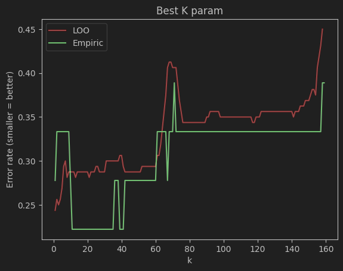

# Лабораторная работа №2. Метрическая классификация

В рамках лабораторной работы предстоит реализовать алгоритм классификации KNN и подобрать параметр k методом скользящего контроля.

На лекции были рассмотрены следующие алгоритмы:
* алгоритм метрической классификации KNN;
* метод окна Парзена;
* алгоритм отбора эталонов STOLP.

## Задание

1. выбрать датасет для классификации, например на [kaggle](https://www.kaggle.com/datasets?tags=13302-Classification);
2. реализовать алгоритм KNN с методом окна Парзена переменной ширины;
   1. в качестве ядра можно использовать гауссово ядро;
3. подобрать параметр k методом скользящего контроля (LOO);
4. обосновать выбор параметров алгоритма, построить графики эмпирического риска для различных k;
5. сравнить с [эталонной](https://scikit-learn.org/stable/) реализацией KNN;
   1. сравнить качество работы;
   2. сравнить время работы;
6. подготовить небольшой отчет о проделанной работе.

## Решение

### 1. Выбор датасета

[Wine Recognition Dataset](https://scikit-learn.org/1.5/datasets/toy_dataset.html#wine-dataset)

- 13 признаков
- 3 класса

### 2. Реализация алгоритма KNN

- Метод окна Парзена переменной ширины
- Гауссово ядро

#### Реализация

```python
class KNN:
    def __init__(self, k: int = 3):
        self.k = k
        self.X_train = None
        self.y_train = None
        self.unique_labels_count = None

    def fit(self, X: np.ndarray, y: np.array):
        self.X_train = X
        self.y_train = y
        self.unique_labels_count = len(np.unique(self.y_train))
        return self

    def predict_proba(self, X: np.ndarray):
        probs = np.zeros((len(X), self.unique_labels_count))

        for i, x in enumerate(X):
            distances = np.array([self.euclidean_distance(x, xt) for xt in self.X_train])
            sorted_indices = np.argsort(distances)
            distances /= distances[sorted_indices[self.k]]
            kernels = self.gaussian_kernel(distances[sorted_indices])
            for w, y in zip(kernels, self.y_train[sorted_indices]):
                probs[i][y] += w
            probs[i] /= probs[i].sum()

        return probs

    def predict(self, X: np.ndarray):
        return np.argmax(self.predict_proba(X), axis=1)

    @staticmethod
    def euclidean_distance(x1: np.array, x2: np.array):
        return np.linalg.norm(x1 - x2)

    @staticmethod
    def gaussian_kernel(r: np.array):
        return 1 / np.sqrt(2 * np.pi) * np.exp(-0.5 * r ** 2)
```

#### Пример работы

```python
knn = KNN(3)
knn.fit(X_train, y_train)
y_pred = knn.predict(X_test)
print('Accuracy', np.mean(y_pred == y_test))
```

```
Accuracy 0.6666666666666666
```

### 3. Подбор параметра k методом скользящего контроля (LOO)

```python
def leave_one_out(
    X: np.ndarray,
    y: np.array,
):
    for i in range(len(X)):
        yield X[i], y[i], np.delete(X, i, 0), np.delete(y, i)
```

#### Подбор по LOO

```python
loo_errors = []

for k in range(1, len(X_train) - 1):
    loo_errors.append([k, 0])
    for xi, yi, X_rest, y_rest in leave_one_out(X_train, y_train):
        yi_pred, = KNN(k).fit(X_rest, y_rest).predict([xi])
        loo_errors[-1][1] += (yi != yi_pred)
    loo_errors[-1][1] /= len(X_train)

print('Лучшие параметры K по Leave-One-Out')
print_best_k(loo_errors)
```

```
Лучшие параметры K по Leave-One-Out
k=1, error_rate=0.24
k=3, error_rate=0.25
k=2, error_rate=0.26
k=4, error_rate=0.26
k=5, error_rate=0.27
k=8, error_rate=0.28
k=13, error_rate=0.28
k=21, error_rate=0.28
k=9, error_rate=0.29
k=10, error_rate=0.29
```

#### Подбор по тестовой выборке

```python
empiric_errors = []

for k in range(1, len(X_train)):
    y_pred = KNN(k).fit(X_train, y_train).predict(X_test)
    error_rate = np.mean(y_test != y_pred)
    empiric_errors.append((k, error_rate))

print('Лучшие параметры K полученные из экспериментам')
print_best_k(empiric_errors)
```

```
Лучшие параметры K полученные из экспериментам
k=11, error_rate=0.22
k=12, error_rate=0.22
k=13, error_rate=0.22
k=14, error_rate=0.22
k=15, error_rate=0.22
k=16, error_rate=0.22
k=17, error_rate=0.22
k=18, error_rate=0.22
k=19, error_rate=0.22
k=20, error_rate=0.22
```

### 4. График эмпирического риска для различных k



### 5. Сравнение с эталонной реализацией

```python
import time

from sklearn.neighbors import KNeighborsClassifier

ks = (3, 10, 20)
impls = (KNN, KNeighborsClassifier)

for impl in impls:
    for k in ks:
        start = time.monotonic()
        neigh = impl(k)
        neigh.fit(X_train, y_train)
        y_pred = neigh.predict(X_test)
        speed = time.monotonic() - start
        print(f'{impl.__name__}(k={k})\n'
              f'Time: {speed}s\n'
              f'Accuracy: {np.mean(y_pred == y_test)}\n')
```

```
KNN(k=1)
Time: 0.0065152079332619905s
Accuracy: 0.7222222222222222

KNN(k=10)
Time: 0.0052839580457657576s
Accuracy: 0.7222222222222222

KNN(k=20)
Time: 0.005104833049699664s
Accuracy: 0.7777777777777778

KNeighborsClassifier(k=1)
Time: 0.0022031250409781933s
Accuracy: 0.7777777777777778

KNeighborsClassifier(k=10)
Time: 0.0009392499923706055s
Accuracy: 0.5555555555555556

KNeighborsClassifier(k=20)
Time: 0.0008967090398073196s
Accuracy: 0.7777777777777778
```

#### Качество, accuracy

| k  | My   | Sklearn |
|----|------|---------|
| 1  | 0.72 | 0.77    |
| 10 | 0.72 | 0.55    |
| 20 | 0.78 | 0.78    |

#### Время работы, секунды

| k  | My    | Sklearn |
|----|-------|---------|
| 1  | 0.030 | 0.002   |
| 10 | 0.008 | 0.001   |
| 20 | 0.007 | 0.001   |

### 6. Выводы

- В рамках лабораторной работы был реализован алгоритм классификации K ближайших соседей с использованием окна Парзена и Гауссова ядра
- С помощью метода Leave-One-Out были получены оптимальные параметры для количества ближайших соседей
- Также реализован подбор количества соседей с помощью тестовой выборки
- Качество реализации сопоставимо с реализацией Sklearn, но на маленьких k результат существенно разнятся
- Время работы значительно меньше, так как делаются дополнительные вычисления помимо расчета расстояний. Например, расчет Гауссова ядра
