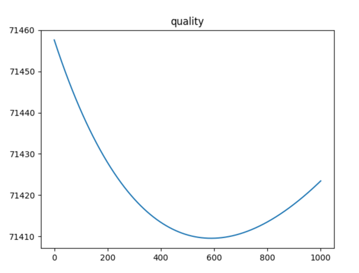
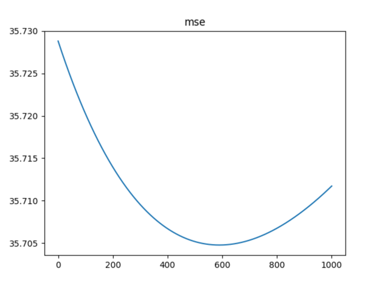
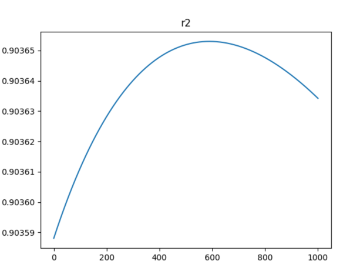

# Лабораторная работа №6. Линейная регрессия

В рамках лабораторной работы предстоит реализовать линейную регрессию и сравнить с эталонной реализацией алгоритма.

## Задание

1. выбрать датасет для линейной регрессии;
2. реализовать решение задачи гребневой регрессии через сингулярное разложение;
3. реализовать оптимальный подбор параметра регуляризации (см. слайд 13);
4. сравнить с эталонным решением;

## Решение

### Датасет

[Student Performance Dataset](https://www.kaggle.com/datasets/nikhil7280/student-performance-multiple-linear-regression)

### Реализация гребневой регрессии через сингулярное разложение

Реализация представлена в файле [linear_reg.py](./linear_reg.py)

### Оптимальный подбор параметра регуляризации

Наилучшее значение параметра регуляризации ищется путем перебора со сравнением метрики качества

На выбранном датасете лучшим параметром `tau` оказался 589, с функционалом `q` равным 71409.523

#### MSE

#### R^2

### Сравнение с эталонным решением

#### MyRidgeRegression

Time elapsed: 0.0007009506225585938

R^2: 0.9036530066503878

MSE: 35.70476170671727

#### SKLearn Ridge Regression

Time elapsed: 0.01001596450805664

R^2: 0.9889832645273239

MSE: 4.0826381930830005

### Вывод
По метрикам собственное решение уступает на несколько процентов библиотечному.
Скорость работы собственного решения, однако, выше на 2 порядка.
В любом случае R^2 получился выше 0.9, что говорит о корректности работы алгоритма.