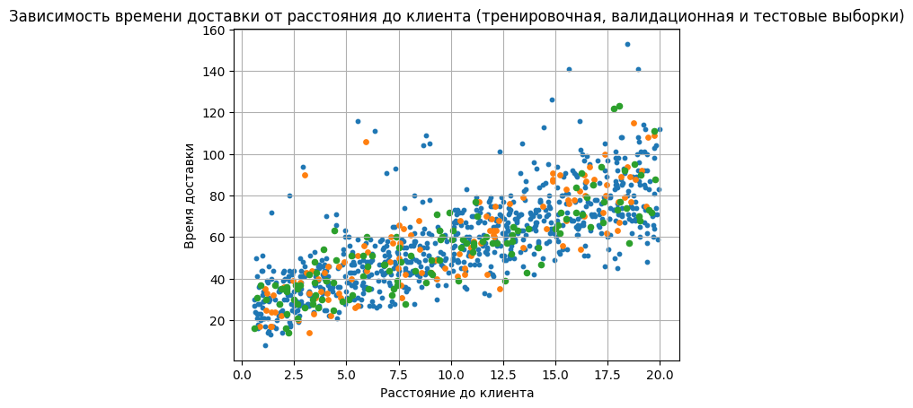
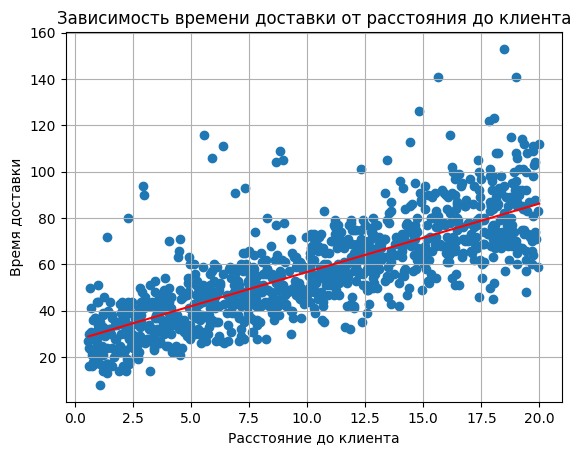
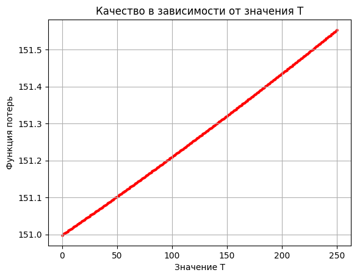
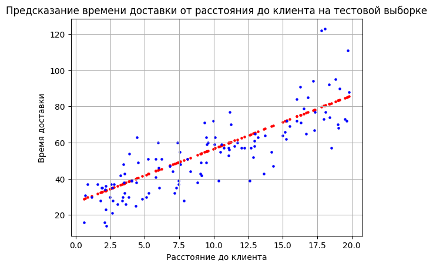
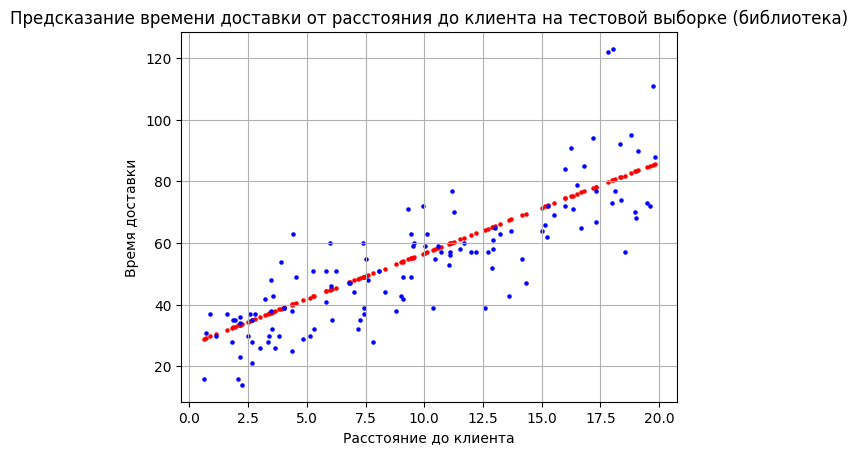

# Лабораторная работа №6 "Линейная регрессия"

## Данные

[Набор](https://www.kaggle.com/datasets/denkuznetz/food-delivery-time-prediction) состоит из 1000 строк и 9 колонок. В наборе данных содержится информациях о доставках из ресторанов и магазинов (длительность доставки, длительность приготовления заказа, опыт курьера и тд).

Для задачи регрессии в качестве целевой переменной используется преобразованная колонка `Delivery_Time_min` - время доставки заказа.
В качестве признака использовалась колонка `Distance_km` - расстояние от точки выдачи заказа до клиента.

Набор был поделён на тренировочную, валидационную и тестовые выборки (синие, оранжевые и зелёные точки соответственно):

## Гребневая регрессия через сингулярное разложение

В ходе работы была реализована гребневная регрессия (т.е. регрессия со штрафом, равным L2-норме весов).

Вычисление весов производилось с помощью сингулярного разложения матрицы признаков по формуле: `β = V (Σ / (Σ^2 + α)) U^T y`, где `V`, `Σ`, `U` - матрицы сингулярного разложения матрицы признаков, `y` - вектор целевой переменной, `α` - параметр регуляризации.

График полученной прямой на фоне тренировочной выборки:

График зависимости значения функционала ошибки от параметра регуляризации:

Из графика видно, что оптимальное значение `tao = 0` (ошибка минимальная).

Перебор осуществлялся эффективным образом без пересчёта SVD. Кол-во операций: `O(kn2 + knT)`.

График полученной прямой на фоне тестовой выборки (при оптимальном значении `tao`):

Её ошибка на тестовой выборке = `130`.

## Библиотечная версия

В качестве библиотечной версии использовался класс `sklearn.linear_model.Ridge`.

График полученной с помощью библиотеки прямой на фоне тренировочной выборки:

Знаечние функционала ошибки для библиотечной реализации = `130` совпало со значением функционала ошибки для ручной реализации.

При этом время работы библиотечной реализации больше времени работы ручной реализации:

| Стадия | Библиотека | Ручная реализация |
| ------ | ---------- | ----------------- |
| Обучение | 1970 мкс | 74.5 мкс |
| Инференс | 141 мкс | 4.42 мкс |
