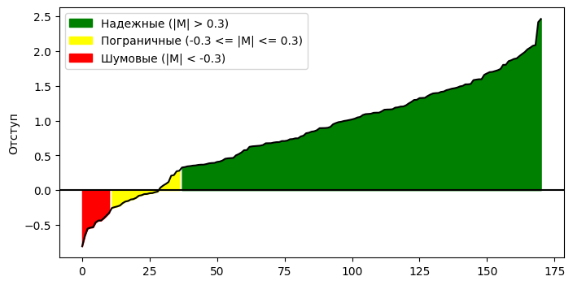
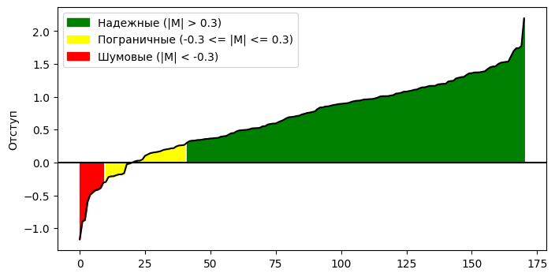
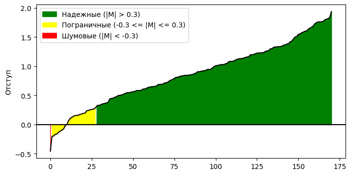

# Лабораторная работа №4

Для выполнения задания был выбран датасет рака груди, для которого был применён LabelEncoder и StandardScaler

## Реализация

### Вычисление отступа градиента было реализовано в методе:

```python
def compute_margin(self, X, y):
    return y * (X @ self.w_)
```

### Вычисление градиента реализовано в функции:

```python
def compute_loss_and_gradient(X, w, y, alpha):
    predictions = X @ w
    errors = y - predictions
    loss = 0.5 * np.sum(errors ** 2) + 0.5 * alpha * np.sum(w ** 2)
    grad = -(X.T @ errors) + alpha * w
    return loss, grad
```

### Рекуррентная оценка лосса считается после каждой эпохи в методах обучения:

```python
loss_val = compute_loss(X, w, y, self.alpha)
self.losses_.append(loss_val)
```

### Метод стохастического градиентного спуска с инерцией реализован в методе fit_momentum:

```python
    def fit_momentum(self, X, y, lr=0.01, gamma=0.9):
        n_samples, n_features = X.shape
        w = self.w_.copy()
        v = np.zeros_like(w)
        self.losses_ = []
        for epoch in range(self.n_epochs):
            indices = np.arange(n_samples)
            np.random.shuffle(indices)
            X = X[indices]
            y = y[indices]
            for i in range(n_samples):
                x_i = X[i]
                y_i = y[i]
                _, grad_i = compute_loss_and_gradient(x_i.reshape(1, -1), w, np.array([y_i]), self.alpha)
                v = gamma * v + lr * grad_i
                w = w - v
            loss_val = compute_loss(X, w, y, self.alpha)
            self.losses_.append(loss_val)
        self.w_ = w
```

### L2-регуляризация

Реализована в compute_loss_and_gradient, и в compute_loss через + 0.5 * alpha * np.sum(w ** 2) и + alpha * w в градиенте.

### Скорейший градиентный спуск

```python
def fit_fast_gd(self, X, y):
    n_samples, n_features = X.shape
    w = self.w_.copy()
    self.losses_ = []
    for epoch in range(self.n_epochs):
        indices = np.arange(n_samples)
        np.random.shuffle(indices)
        X = X[indices]
        y = y[indices]
        for i in range(n_samples):
            x_i = X[i]
            y_i = y[i]
            pred = w @ x_i
            error = y_i - pred
            grad_i = -x_i * error + self.alpha * w
            h_star = 1.0 / (np.dot(x_i, x_i) + 1e-12)
            w = w - h_star * grad_i
        loss_val = compute_loss(X, w, y, self.alpha)
        self.losses_.append(loss_val)

    self.w_ = w
```

### Предъявление объектов по модулю отступа

```python
def fit_margin_prob(self, X, y):
    lr = 0.01
    n_samples, n_features = X.shape
    w = self.w_.copy()
    self.losses_ = []
    for epoch in range(self.n_epochs):
        margins = self.compute_margin(X, y)
        eps = 1e-12
        abs_margins = np.abs(margins) + eps
        inv_m = 1.0 / abs_margins
        p = inv_m / np.sum(inv_m)
        chosen_indices = np.random.choice(
            np.arange(n_samples),
            size=n_samples,
            replace=True,
            p=p
        )
        for i in chosen_indices:
            x_i = X[i]
            y_i = y[i]
            _, grad_i = compute_loss_and_gradient(x_i.reshape(1, -1), w, np.array([y_i]), self.alpha)
            w = w - lr * grad_i
        loss_val = compute_loss(X, w, y, self.alpha)
        self.losses_.append(loss_val)

    self.w_ = w
```

## Результаты 

### C инициализацией весов через корреляцию

Time: 0.284
Accuracy: 0.830




### С инициализацией весов через мультистарт

Time: 0.281
Accuracy: 0.877




### С предъявлением объектов и мультистартом

Time: 0.581
Accuracy: 0.942




### Эталонное решение

Time: 0.003
Accuracy: 0.970

## Вывод

Лучшая реализация - с инициализацией через мультистарт и предъявлением объектов по модулю отступа, 
это решение значительно отстаёт по времени, но не сильно отстаёт по качеству - 3% от эталонного, в отличие от 10% и 14% в других реализациях
