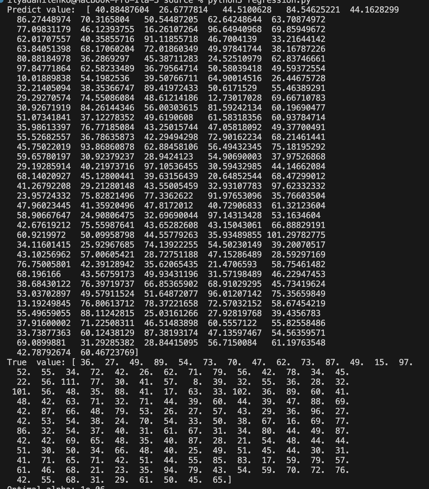
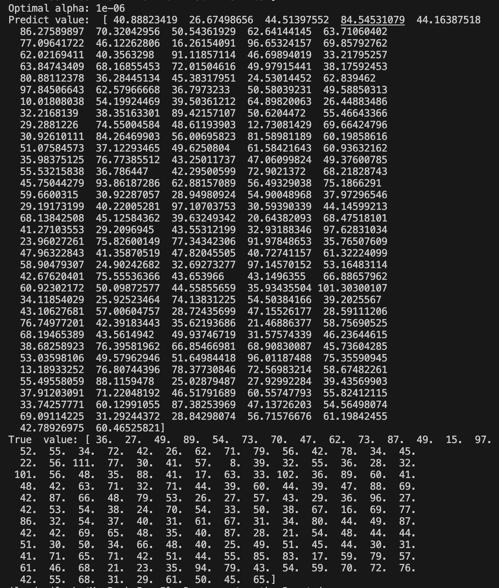
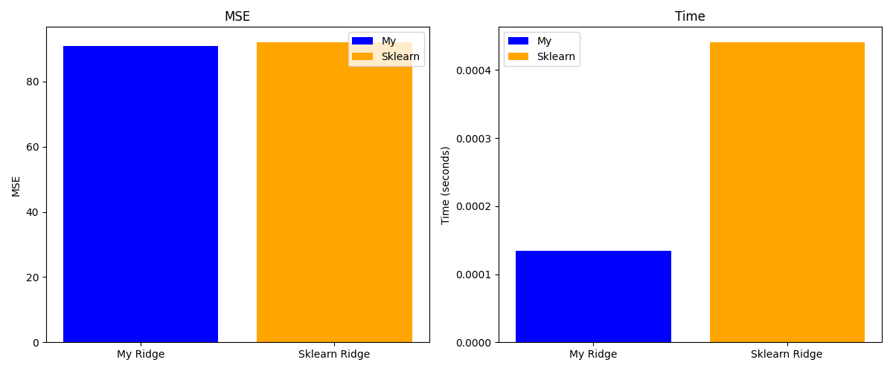

## Lab 6

### Задание 1
Датасет для линейной регрессии времени доставки:
https://www.kaggle.com/datasets/denkuznetz/food-delivery-time-prediction

Скрипт в котором реализована функция чтения датасета: [read.py](./source/read.py). Функция `read`.

### Задание 2

Решение задачи гребневой регрессии через сингулярное разложение реализованно классом `RidgeRegression` в скрипте [regression.py](./source/regression.py). В качестве аргумента конструктора класса принимает параметр регуляризации.

Вывод программы

### Задание 3
Оптимальный подбор параметра регуляризации реализованно с помощью функции `get_optim_alpha` в скрипте [regression.py](./source/regression.py). Данная функция в качестве аргумента принимает данные для тренировки, а также список из различных значений параметра регуляризации.

Вывод программы

### Задание 4

Сравнение происходит в скрипте [metrics.py](./source/metrics.py). За эталон взят `Ridge` из библиотеки `sklearn`. В качестве метрики точности взят `MSE`.

Результаты сравнения по точности и по времени работы:

Как видно из графиков сравнения точность и у самописной реализации и у эталонной практически одинаковая. Однако самописный алгоритм сильно выигрывает по время исполнения.