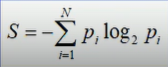
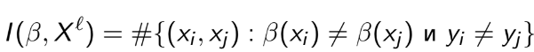
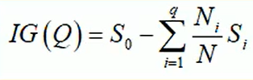
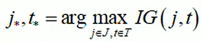
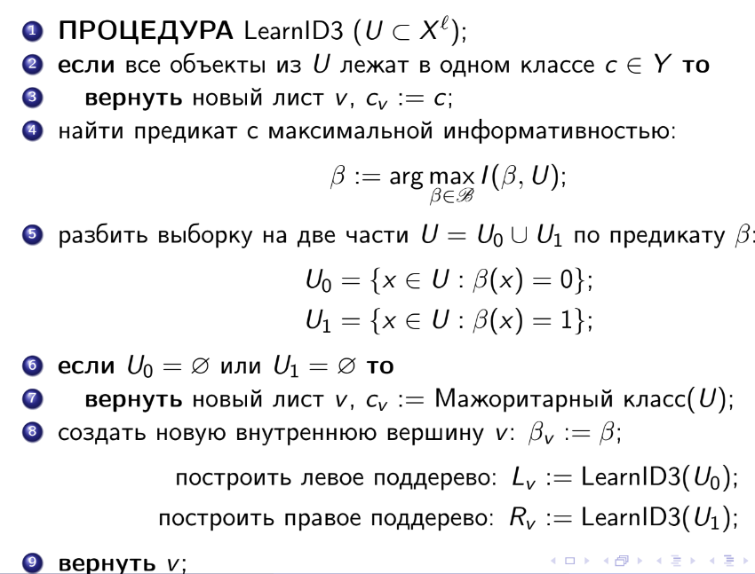
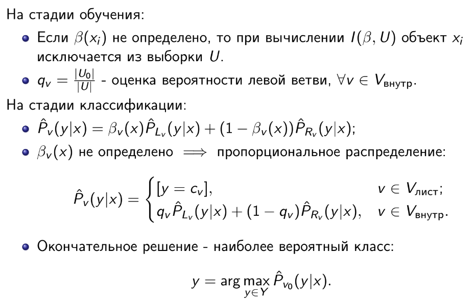
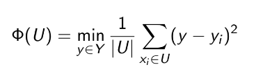
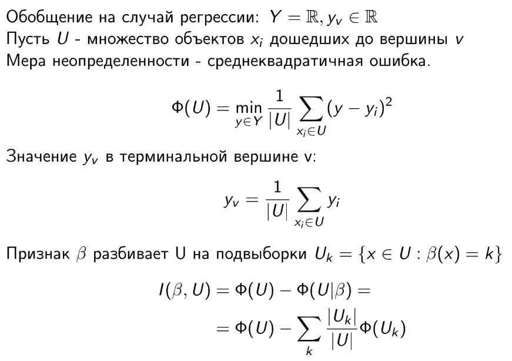

### Датасет
В качестве датасета был выбран классический "Титаник", который удовлетворяет условиям лабораторной работы: пропуски присутствуют, есть как категориальные, так и количественные признаки. Так как на тестовой выборке на kaggle меток нет, был использован train сет, который использовался для спиттинга на обучающую и тестовую выборки.

Ссылка на датасет: https://www.kaggle.com/c/titanic/data

Анализ и преобразование данных перед обучением описаны в файле research.ipynb, как и все последующие инициализации и тесты моделей.

### Логические деревья

Логические деревья, использующие предикаты для разбиения данных на подмножества, позволяют классифицировать данные на основе их характеристик и, при небольшом количестве признаков, хорошо интерпетировать результаты.

Для выполнения работы были написаны статические методы для вычисления энтропии, информационного выигрыша и разбиения данных на подмножества.

#### Характеристики информативности

Энтропия является характеристикой хоатичности системы, чем больше разнообразие классов, тем больше энтропия, по сути - характеристика информативности (impurity).

Формула:

, где N - количество классов, p_i - вероятность появления класса i.

Для всей выборки считаем вероятность каждого класса и по формуле находим S0 - энтропию исходного набора.

После - задаем пороговое значение и разделяем выборку на два подмножества. Считаем энтропию для каждого подмножества и находим информационный выигрыш.

Также был использован многоклассовый критерий ветвления Донского, который позволяет выбрать пороговое значение для разбиения.

Формула:

, где I(B,X^l) - значение критерия Донского для разбиения X по предикату B, yi!= yj, то есть должны быть разные классы,
Находим сколько пар имеют разные классы и отправились в разные дочерние вершины. Хорошо подходит, так как нам нужно понять насколько хорошо мы сделали разбиение.

#### Информационный выигрыш

Формула информационного выигрыша:

, где q - количество подвыборок, N_i - количество элементов в подвыборке, N - количество элементов в исходном наборе, S_i - энтропия подвыборки, Q - порог.

В каждой вершине дерева выбирается пороговое значение, которое максимизирует информационный выигрыш.

В общем случае, для подбора порога и признака, по которому будет происходить разбиение, используется метод best_split.

Формула:

, где j - признак, t - порог, IG - информационный выигрыш, J - множество признаков, T - множество порогов.

### ID3

ID3 позволяет в каждой вершине дерева выбрать такие признаки и пороги, которые максимизируют информационный выигрыш. То есть, в каждой вершине стараемся сделать наилучшее разбиение той выборки, которая попала в вершину. Алгоритм работает рекурсивно, либо пока не достигнем листовых вершин, в которых энтропия равна 0, либо пока не достигнем заданной глубины дерева, либо не сработает другой критерий останова.

Часто применяемые критерии останова:

1. Impurity = 0 или меньше заданного значения
2. Число объектов в вершине меньше заданного значения
3. Вероятность правильной классификации больше заданного значения (в таком случае формируем листовую вершину)
4. Достигнуто максимально количество листьев
5. Достигнута максимальная глубина дерева

Описание алгоритма:

Алгоритм обработки пропусков:

#### Прунинг

Для редукции дерева был написан метод для прунинга, который представляет собой удаление некоторых вершин после построения дерева для упрощения модели и улучшения обобщающей способности не на выборке, а на тесте-инференсе.
Для этого нужно пройтись сверху вниз по дереву (либо снизу вверх), и если в вершине окажется пустое множество из тестовой-контрольной выборки, то удалить её и вернуть новый лист с мажоритарным классом, если не пустое, то посчитать число ошибок четырьмя способами:

1. r(v) - поддеревом, растущим из вершины v,
2. rl(v) - поддеревом, растущим из левого дочернего узла,
3. rr(v) - поддеревом, растущим из правого дочернего узла,
4. rc(v) - к классу

В зависимости от того, какие из них минимально

- сохраняем поддерево v
- сохраняем поддерево v поддеревом Lv
- сохраняем поддерево v поддеревом Rv
- заменить поддерево v листом, в котором по классу ошибка минимальна.

#### Результаты тестов

1. model_entropy_md_5

- Точность: 0.6567
- Время: 0.5007 секунд

2. model_entropy_md_3

- Точность: 0.6493
- Время: 0.2652 секунд

3. model_entropy_md_1

- Точность: 0.7910
- Время: 0.0978 секунд

4. model_donsky_md_5

- Точность: 0.7425
- Время: 15.3828 секунд

5. model_donsky_md_3

- Точность: 0.7985
- Время: 14.7039 секунд

6. model_donsky_md_1

- Точность: 0.7910
- Время: 10.1043 секунд

7. sklearn_entropy_md_5

- Точность: 0.7948
- Время: 0.0097 секунд

#### Прунинг, сравнение

1. model_donsky_md_3

- После прунинга без изменений, точность: 0.7985

2. model_donsky_md_5

- После прунинга осталась только одна вершина.
- Точность до прунинга: 0.7425
- Точность после прунинга: 0.7910

#### Выводы

1. С критерием Донского алгоритм работает дольше.
2. По энтропии самописная модель выдает лучшую точность с глубиной 1, по критерию Донского - с глубиной 3.
3. Модель sklearn работает на порядок быстрее и выдает наибольшую точность среди моделей с max_depth = 5.
4. Таргет сильно зависим от одного категориального признака (пола).

### Регрессия

Регресионные деревья решений, в отличие от классификаторов, позволяют предсказывать непрерывные значения целевой переменной на основе входных признаков. В качестве таргета был выбран признак Fare (плата). Для регресии в качестве меры неопределенности используется среднеквадратичная ошибка - стандартная метрика для регрессии.

Формула:

, где |U| - количество элементов в выборке U, y_i - значение целевой переменной для i-го элемента, y_mean - среднее значение целевой переменной.

Для выбора наилучшего разбиения алгоритм перебирает все возможные разбиения по всем признакам и выбирает такое, которое минимизирует среднеквадратичную ошибку. Для этого был написан метод find_best_split, который перебирает все возможные пороговые значения для каждого признака и выбирает такое, которое минимизирует среднеквадратичную ошибку. В качестве критерия информативности используется взвешенная сумма среднеквадратичных ошибок подмножеств, для которого был написан метод calculate_split_mse.

В качестве критерия останова, помимо максимальной глубины дерева, были добавлены ограничения на минимальное количество элементов в листе и минимальное количество элементов для разбиения. Обработка пропущенных значений производится за счет вероятностного предсказания, как это было сделано в классификаторе.

#### Результаты тестов

1. model_reg до прунинга
Глубина дерева: 5
Количество узлов: 45
MSE: 1659.5988
Время обучения: 0.1009 секунд

2. model_reg после прунинга
Глубина дерева: 5
Количество узлов: 19
MSE: 1245.0887

3. sklearn_reg
Глубина дерева: 5
MSE: 1213.0605
Время обучения: 0.0000 секунд

#### Выводы:
1. Модель от sklearn работает быстрее и метрика MSE немного точнее (это, в том числе, видно по графикам в конце файла research).
2. После прунинга, не смотря на такую же глубину, количество узлов значительно сократилось, а MSE получился лучше, чем с моделью skearn.