# Лабораторная работа 1

## Датасеты

### Датасет Iris

Ссылка: <https://www.kaggle.com/datasets/himanshunakrani/iris-dataset>

Диаграмма после применения t-SNE:

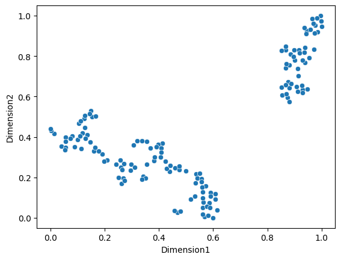

Предположительное количество кластеров: 2-3

### Датасет Mall Customer

Ссылка: <https://www.kaggle.com/datasets/vjchoudhary7/customer-segmentation-tutorial-in-python>

Диаграмма после применения t-SNE:

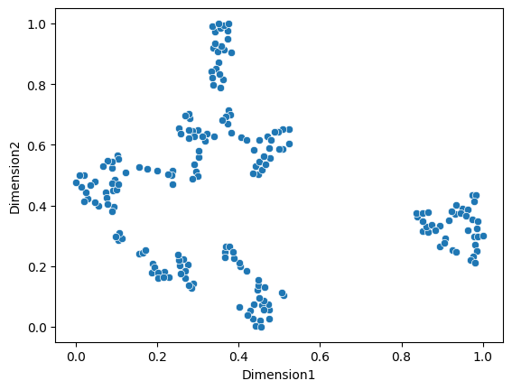

Предположительное количество кластеров: 3-5

## Иерархическая кластеризация

Код:

```python
# алгоритм кластеризации
def hierarchical_clustering(cluster_data):
    clusters = [cluster_data]
    distances = {}
    indexes_1, indexes_2, dists, lens = [], [], [], []

    for i in range(1, len(cluster_data) + 1):
        min_dist = float('inf')

        # конец кластеризации
        if len(clusters[-1]) == 1:
            max_diff = 0
            for j in range(len(dists) - 1):
                if abs(dists[j + 1] - dists[j]) > max_diff:
                    max_diff = abs(dists[j + 1] - dists[j])
                    index = j

            matrix = np.array([indexes_1, indexes_2, dists, lens])
            return clusters[index], matrix

        if i == 1:
            # первый шаг кластеризации
            for k in range(len(clusters[i - 1])):
                for j in range(len(clusters[i - 1])):
                    if k != j:
                        dist = np.linalg.norm(np.array(clusters[i - 1][k]) - np.array(clusters[i - 1][j]))
                        distances[(clusters[i - 1][k], clusters[i - 1][j])] = dist
                        if dist < min_dist:
                            min_dist, min_1, min_2 = dist, clusters[i - 1][k], clusters[i - 1][j]
        else:
            # последующие шаги кластеризации
            for key, value in distances.items():
                if value < min_dist:
                    min_dist, min_1, min_2 = value, key[0], key[1]

        # добавление информации о кластерах
        if i == 1:
            clusters_indexes = clusters[-1]
        else:
            clusters_indexes.append(new_cluster)

        new_cluster = (min_1, min_2)
        
        indexes_1.append(clusters_indexes.index(min_1))
        indexes_2.append(clusters_indexes.index(min_2))
        dists.append(min_dist)
        lens.append(len(points(min_1)) + len(points(min_2)))

        # добавление состояния кластеров в список
        cluster_copy = clusters[-1].copy()
        cluster_copy.remove(min_1)
        cluster_copy.remove(min_2)
        clusters.append([*cluster_copy])

        # обновление расстояний между кластерами
        for s in clusters[-1]:
            v_s = distances.get((s, new_cluster[0]), distances.get((new_cluster[0], s)))
            u_s = distances.get((s, new_cluster[1]), distances.get((new_cluster[1], s)))
            distances[(new_cluster, s)] = 0.5 * (v_s + u_s + abs(v_s - u_s))

        for key in list(distances.keys()):
            if min_2 in key or min_1 in key:
                del distances[key]

        clusters[-1].append(new_cluster)
```

### Иерархическая кластеризация на датасете Iris

Дендрограмма и кластеры для ручного алгоритма:

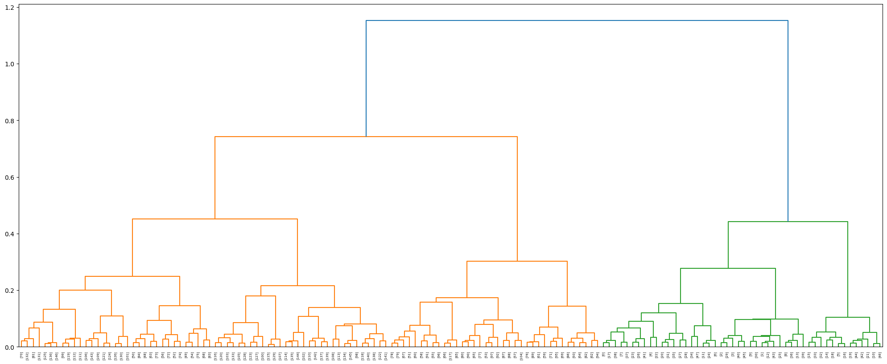

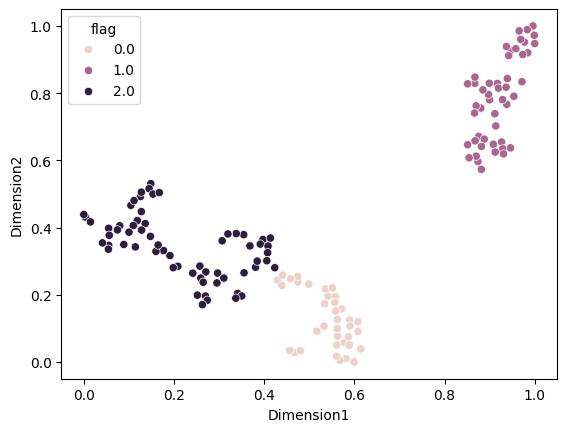

Дендрограмма и кластеры для библиотечного алгоритма:

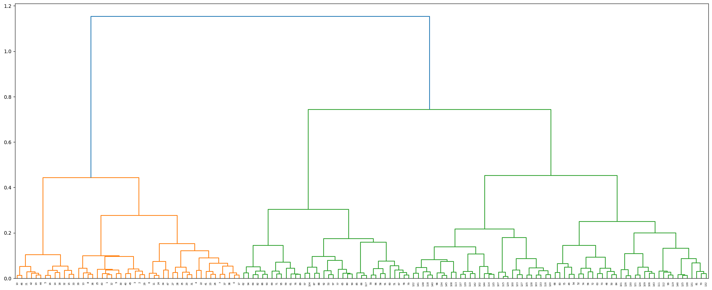

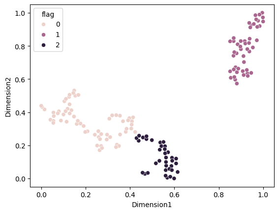

Метрики кластеризации:

```
Внутрикластерное расстояние (вручную): 11.880865208802376
Межкластерное расстояние (вручную): 454.5125475186916
Время работы (вручную): 0:00:00.572804

Внутрикластерное расстояние (библиотека): 11.88086520880237
Межкластерное расстояние (библиотека): 454.51254751869226
Время работы (библиотека): 0:00:00.004698
```

Внутрикластерное и межкластерное расстояния идентичны, скорость ручного алгоритма ниже в 120 раз

### Иерархическая кластеризация на датасете Mall Customer

Дендрограмма и кластеры для ручного алгоритма:

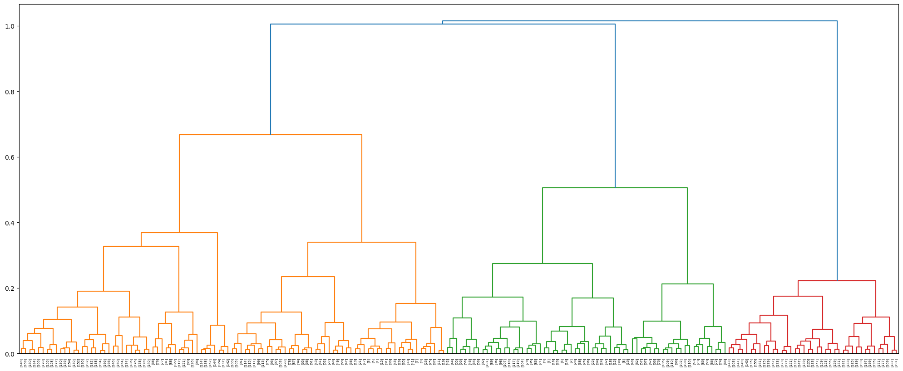

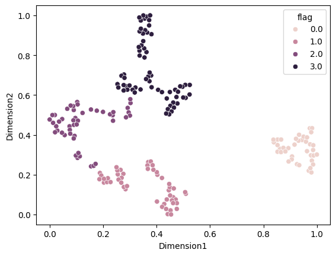

Дендрограмма и кластеры для библиотечного алгоритма:

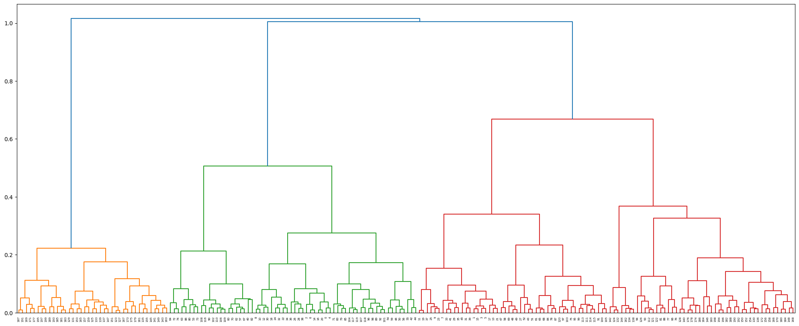


Метрики кластеризации:

```
Внутрикластерное расстояние (вручную): 15.703341397367915
Межкластерное расстояние (вручную): 1072.012297695141
Время работы (вручную): 0:00:01.175616

Внутрикластерное расстояние (библиотека): 15.703341397367938
Межкластерное расстояние (библиотека): 1080.7182562544137
Время работы (библиотека): 0:00:00.002990
```

Внутрикластерное расстояние идентично, межкластерное очень близко, скорость ручного алгоритма ниже в 390 раз

## EM-кластеризация

Код:

```python
def em_clustering(data, K, delta, iter_max):
    N = len(data)
    M = len(data[0])
    
    # начальные приближения
    w = [1 / K for _ in range(K)]
    mu = [random.choice(data) for _ in range(K)]

    it = 0
    diag_sum = 0
    row = []
    for k in range(K):
        for i in range(N):
            diag_sum += np.linalg.norm(np.array(data[i]) - np.array(mu[it]))
        it += 1
        row.append(diag_sum / (N * K))
    covs = [np.diag([row[i]] * M) for i in range(K)]

    y = []
    it = 0
    changes = True

    # основной цикл алгоритма
    while changes is True:
        gamma = {}
        for i in range(K):
            gamma[i] = []

        sigma = []
        for i in range(K):
            sigma.append(np.linalg.det(covs[i]))

        # expectation
        for n in range(N):
            p_x = []
            for k in range(K):
                mat_mul = np.linalg.norm(np.array(data[n]) - np.array(mu[k]))**2
                p_x.append(np.exp(-0.5 * mat_mul) / ((2 * np.pi) ** (N / 2) * sigma[k]**0.5))

            for k in range(K):
                gamma[k].append(w[k] * p_x[k] / sum([w[i] * p_x[i] for i in range(K)]))

        # maximization
        w = []
        mu = []
        covs = []
        for k in range(K):
            n_k = sum(gamma[k])

            w.append(n_k / N)

            vect = []
            for j in range(M):
                mult = []
                for n in range(N):
                    mult.append(np.array(data[n])[j] * gamma[k][n])
                vect.append(sum(mult))

            mu.append(np.array(vect) / (N * w[-1]))


            sigma = []
            for j in range(M):
                mult = []
                for n in range(N):
                    mult.append(gamma[k][n] * (np.array(data[n])[j] - mu[k][j]) ** 2)

                sigma.append(sum(mult) / (N * w[-1]))
            covs.append(np.diag(sigma))

        # обновление вероятностей
        y_i = []
        clusters = dict()
        for n in range(N):
            prob = dict()
            for k in range(K):
                prob[k] = gamma[k][n]

            max_p = max(prob.values())
            y_i.append(max_p)

            for key, value in prob.items():
                if value == max_p:
                    clusters[n] = key
                    break
        y.append(y_i)

        # проверка на изменения
        if it > 0:
            changes_num = 0
            for i in range(len(y_i)):
                new_delta = abs(y[-2][i] - y[-1][i])
                if new_delta > delta:
                    changes_num += 1
            if changes_num == 0:
                changes = False

        it += 1
    return clusters
```

### EM-кластеризация на датасете Iris

Кластеры для ручного алгоритма:

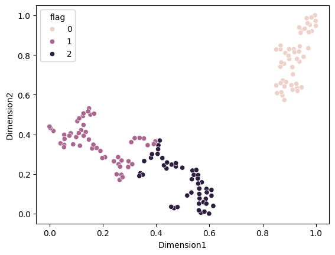

Кластеры для библиотечного алгоритма:

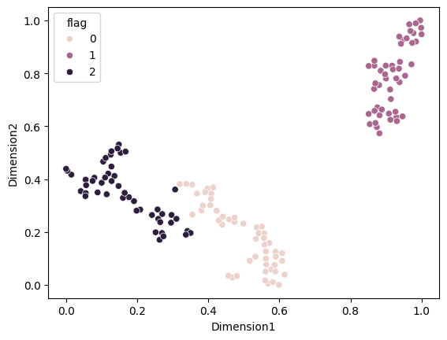

Метрики кластеризации:

```
Внутрикластерное расстояние (вручную): 11.93761722532072
Межкластерное расстояние (вручную): 443.59387872786186
Время работы (вручную): 0:00:00.353494

Внутрикластерное расстояние (библиотека): 12.230746878396168
Межкластерное расстояние (библиотека): 454.8982834125578
Время работы (библиотека): 0:00:00.122002
```

Внутрикластерное и межкластерное расстояния очень близки, скорость ручного алгоритма ниже в 3 раза

### EM-кластеризация на датасете Mall Customer

Кластеры для ручного алгоритма:

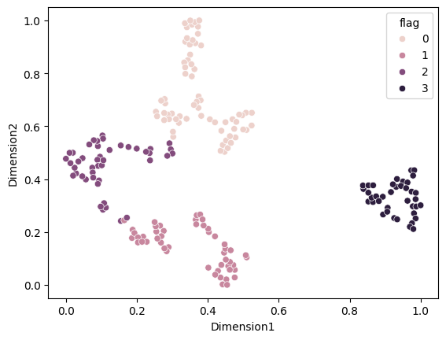

Кластеры для библиотечного алгоритма:

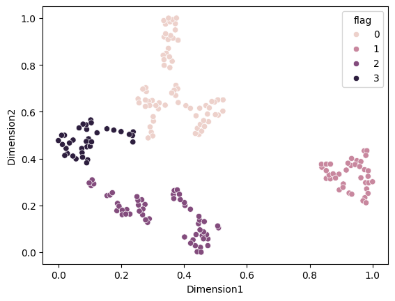

Метрики кластеризации:

```
Внутрикластерное расстояние (вручную): 15.596744759005338
Межкластерное расстояние (вручную): 1084.4564828020718
Время работы (вручную): 0:00:00.183016

Внутрикластерное расстояние (библиотека): 15.81516768375786
Межкластерное расстояние (библиотека): 1085.7781911891457
Время работы (библиотека): 0:00:00.034988
```

Внутрикластерное и межкластерное расстояния очень близки, скорость ручного алгоритма ниже в 5 раз

## DBSCAN-кластеризация

Код:

```python
def dbscan_clustering(data, eps, m):
    noise = -1
    a = -1

    visited_points = []
    clustered_points = []
    clusters = {noise: []}

    # цикл посещения точки
    for point in data:
        if point in visited_points:
            continue
        visited_points.append(point)

        # оценка количества соседей
        neighbors = [p for p in data if np.linalg.norm(np.array(point) - np.array(p)) < eps]
        if len(neighbors) < m:
            clusters[noise].append(point)
        else:
            # новый кластер
            a += 1
            if a not in clusters:
                clusters[a] = []
            clusters[a].append(point)
            clustered_points.append(point)

            # посещение соседей
            while neighbors:
                q = neighbors.pop()
                if q not in clustered_points:
                    clustered_points.append(q)
                    clusters[a].append(q)
                    if q in clusters[noise]:
                        clusters[noise].remove(q)
                if q not in visited_points:
                    visited_points.append(q)
                    q_neighbors = [p for p in data if np.linalg.norm(np.array(q) - np.array(p)) < eps]
                    if len(q_neighbors) > m:
                        neighbors.extend(q_neighbors)

    return clusters
```

### DBSCAN-кластеризация на датасете Iris

Кластеры для ручного алгоритма:


Кластеры для библиотечного алгоритма:

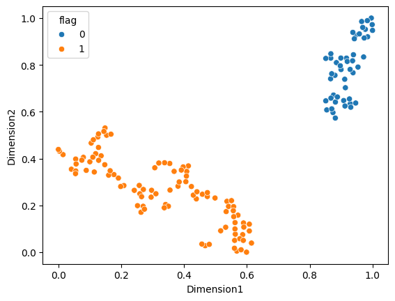

Метрики кластеризации:

```
Внутрикластерное расстояние (вручную): 17.572591602422865
Межкластерное расстояние (вручную): 190.4435938820269
Время работы (вручную): 0:00:00.136022

Внутрикластерное расстояние (библиотека): 17.57259160242286
Межкластерное расстояние (библиотека): 190.443593882027
Время работы (библиотека): 0:00:00.002998
```

Внутрикластерное и межкластерное расстояния идентичны, скорость ручного алгоритма ниже в 45 раз

### DBSCAN-кластеризация на датасете Mall Customer

Кластеры для ручного алгоритма:

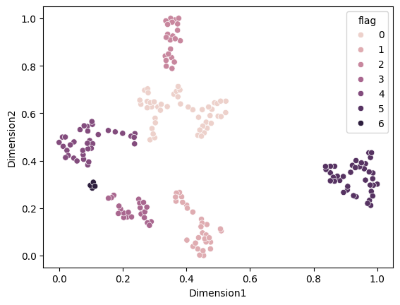

Кластеры для библиотечного алгоритма:

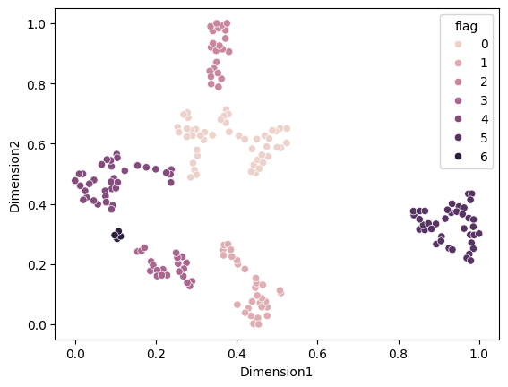

Метрики кластеризации:
```
Внутрикластерное расстояние (вручную): 10.104590120531553
Межкластерное расстояние (вручную): 3311.3300152731777
Время работы (вручную): 0:00:00.250792

Внутрикластерное расстояние (библиотека): 10.104590120531562
Межкластерное расстояние (библиотека): 3311.330015273183
Время работы (библиотека): 0:00:00.004988
```

Внутрикластерное и межкластерное расстояния идентичны, скорость ручного алгоритма ниже в 50 раз
