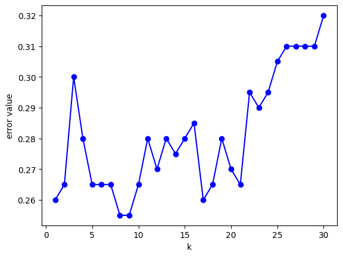
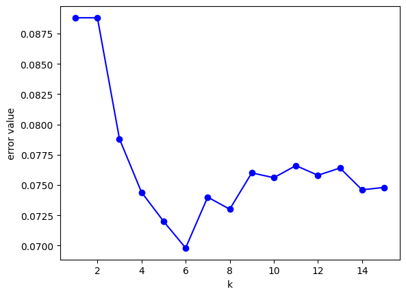

# Лабораторная работа 2

## Код алгоритма

```python
# гауссово ядро
def gaussian_kernel(distances, h):
    return np.exp(-1 / 2 * (distances ** 2) / ((h+1e-10) ** 2)) / (2 * np.pi)

def knn(X_train, y_train, X_test, k):
    # вычисление расстояний
    distances = cdist(X_test, X_train)
    
    # нахождение ближайших точек
    nearest = np.argpartition(distances, k, axis=1)[:, :k]

    # расстояния для парзеновского окна
    h = np.take_along_axis(distances, nearest[:, -1:], axis=1)
    dists = np.take_along_axis(distances, nearest, axis=1)
    
    # вычисление весов
    weights = gaussian_kernel(dists, h)
    
    # присвоение меток класса
    y_neighbors = y_train[nearest]
    classes = np.unique(y_train)
    masks = [y_neighbors == c for c in classes]
    weighted_counts = np.array([np.sum(weights * mask, axis=1) for mask in masks])
    predictions = classes[np.argmax(weighted_counts, axis=0)]
    
    return predictions
```

## Тестирование на датасетах

Для большей объективности рассмотрим два разных датасета разного размера

### Датасет Screentime Analysis

<https://www.kaggle.com/datasets/anandshaw2001/mobile-apps-screentime-analysis>

График ошибок для разных k при применении LOO:



### Классификация при применении оптимального k=9

Вручную (метод окна Парзена):

```
             precision    recall  f1-score   support

 8 Ball Pool       0.50      0.50      0.50         6
    Facebook       0.57      0.67      0.62         6
   Instagram       0.57      0.67      0.62         6
    LinkedIn       0.60      0.86      0.71         7
     Netflix       0.80      0.67      0.73         6
      Safari       0.83      0.83      0.83         6
    WhatsApp       1.00      0.71      0.83         7
           X       0.75      0.50      0.60         6

    accuracy                           0.68        50
   macro avg       0.70      0.68      0.68        50
weighted avg       0.71      0.68      0.68        50

Время работы (вручную): 0:00:00.001004
```

С помощью библиотеки:

```
              precision    recall  f1-score   support

 8 Ball Pool       0.50      0.50      0.50         6
    Facebook       0.44      0.67      0.53         6
   Instagram       0.50      0.50      0.50         6
    LinkedIn       0.60      0.86      0.71         7
     Netflix       0.80      0.67      0.73         6
      Safari       0.83      0.83      0.83         6
    WhatsApp       1.00      0.57      0.73         7
           X       0.75      0.50      0.60         6

    accuracy                           0.64        50
   macro avg       0.68      0.64      0.64        50
weighted avg       0.68      0.64      0.64        50

Время работы (библиотека): 0:00:00.009979
```

На этом датасете при оптимальном k точность классификации выше у ручного алгоритма на 4%, время работы ручного алгоритма меньше в 10 раз

### Датасет Air Quality and Pollution

<https://www.kaggle.com/datasets/mujtabamatin/air-quality-and-pollution-assessment>

График ошибок для разных k при применении LOO:



### Классификация при применении оптимального k=6

Вручную (метод окна Парзена):

```
              precision    recall  f1-score   support

        Good       0.99      1.00      0.99       500
   Hazardous       0.92      0.75      0.83       125
    Moderate       0.93      0.96      0.94       375
        Poor       0.85      0.86      0.85       250

    accuracy                           0.93      1250
   macro avg       0.92      0.89      0.90      1250
weighted avg       0.93      0.93      0.93      1250

Время работы (вручную): 0:00:00.088078
```

С помощью библиотеки:

```
              precision    recall  f1-score   support

        Good       0.99      1.00      0.99       500
   Hazardous       0.88      0.80      0.84       125
    Moderate       0.92      0.97      0.94       375
        Poor       0.87      0.82      0.85       250

    accuracy                           0.93      1250
   macro avg       0.91      0.90      0.90      1250
weighted avg       0.93      0.93      0.93      1250

Время работы (библиотека): 0:00:00.133017
```

На этом датасете при оптимальном k точность классификации одинаковая, время работы ручного алгоритма меньше в 1.5 раза
