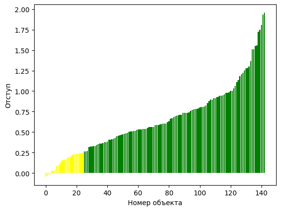

# Лабораторная работа 4

## Датасет

Breast Cancer

<https://www.kaggle.com/datasets/denkuznetz/housing-prices-regression>

## Реализация функций

```python
# Метод стохастического градиентного спуска с инерцией
def sgd_with_momentum(X, y, learning_rate=0.001, momentum=0.5, tau=0.1, num_epochs=1000, w=None):
    eps = 1e-7
    n_samples, n_features = X.shape
    if w is None:
        w = np.zeros(n_features)
    velocity = np.zeros(n_features)

    for epoch in range(num_epochs):
        i = random.randint(0, n_samples - 1)
        # вычисление градиента
        gradient = X[i] * (np.dot(w, X[i]) - y[i]) + w * tau
        velocity = momentum * velocity + learning_rate * gradient
        w -= velocity
            
        if np.linalg.norm(gradient) < eps:
            break
    
    return w
```

```python
# Метод стохастического градиентного спуска с инерцией с предъявлением объектов по модулю отступа
def sgd_with_momentum_ms(X, y, learning_rate=0.001, momentum=0.5, tau=0.1, num_epochs=1000, w=None):
    eps = 1e-7
    n_samples, n_features = X.shape
    if w is None:
        w = np.zeros(n_features)
    velocity = np.zeros(n_features)

    indices, probs = margin_sampling(w, X, y)
    
    for epoch in range(num_epochs):
        i = random.choices(indices, weights=probs, k=1)[0]
        # вычисление градиента
        gradient = X[i] * (np.dot(w, X[i]) - y[i]) + w * tau
        velocity = momentum * velocity + learning_rate * gradient
        w -= velocity
            
        if np.linalg.norm(gradient) < eps:
            break
    
    return w
```

```python
# Скорейший градиентный спуск
def fastest_gradient_descent(X, y, tau=0.1, num_epochs=100, w=None):
    eps = 1e-7
    n_samples, n_features = X.shape
    if w is None:
        w = np.zeros(n_features)

    for epoch in range(num_epochs):
        # вычисление градиента
        gradient = -2 * np.dot(X.T, (y - np.dot(X, w))) + 2 * tau * w
        
        numerator = np.dot(gradient.T, gradient)
        denominator = np.dot((np.dot(X, gradient)).T, np.dot(X, gradient))
        if denominator != 0:
            step = numerator / denominator
        else:
            step = 1.0
        
        w -= step * gradient
        if np.linalg.norm(gradient) < eps:
            break

    return w
```

```python
# Инициализация весов через корреляцию
def correlation_init(X, y):
    n_samples, n_features = X.shape
    w = np.zeros(n_features)
    for j in range(n_features):
        fj = X[:, j]
        numerator = np.dot(y, fj)
        denominator = np.dot(fj, fj)
        if denominator != 0:
            w[j] = numerator / denominator
        else:
            w[j] = 0
    return w
```


```python
# Случайная инициализация весов через мультистарт
def multi_start_initialization(X, y, tau=0.1, n_restarts=50, method='M'):
    n_samples, n_features = X.shape
    best_w = None
    best_loss = float('inf')

    for _ in range(n_restarts):
        w = np.random.randn(n_features)
        if method == 'M':
            w = sgd_with_momentum(X, y, learning_rate=0.001, momentum=0.5, tau=tau, num_epochs=10000, w=w)
        else:
            w = fastest_gradient_descent(X, y, tau=tau, num_epochs=100, w=w)
        loss = np.mean((np.dot(X, w) - y) ** 2) + tau * np.sum(w ** 2)
        if loss < best_loss:
            best_loss = loss
            best_w = w

    return best_w, best_loss
```

## Тестирование результатов

SGD с инициализацией весов нулями:

```
              precision    recall  f1-score   support

          -1       0.99      0.93      0.96        90
           1       0.90      0.98      0.94        53

    accuracy                           0.95       143
   macro avg       0.94      0.96      0.95       143
weighted avg       0.95      0.95      0.95       143
```

SGD с инициализацией весов через корреляцию:

```
              precision    recall  f1-score   support

          -1       0.99      0.97      0.98        90
           1       0.95      0.98      0.96        53

    accuracy                           0.97       143
   macro avg       0.97      0.97      0.97       143
weighted avg       0.97      0.97      0.97       143
```

SGD с случайной инициализацией весов через мультистарт:

```
              precision    recall  f1-score   support

          -1       0.99      0.97      0.98        90
           1       0.95      0.98      0.96        53

    accuracy                           0.97       143
   macro avg       0.97      0.97      0.97       143
weighted avg       0.97      0.97      0.97       143
```

SGD с предъявлением объектов по модулю отступа:

```
              precision    recall  f1-score   support

          -1       0.97      0.93      0.95        90
           1       0.89      0.94      0.92        53

    accuracy                           0.94       143
   macro avg       0.93      0.94      0.93       143
weighted avg       0.94      0.94      0.94       143
```

Скорейший градиентный спуск с инициализацией весов нулями:

```
             precision    recall  f1-score   support

          -1       0.69      0.52      0.59        90
           1       0.43      0.60      0.50        53

    accuracy                           0.55       143
   macro avg       0.56      0.56      0.55       143
weighted avg       0.59      0.55      0.56       143
```

Скорейший градиентный спуск с инициализацией весов через корреляцию:

```
              precision    recall  f1-score   support

          -1       0.95      0.92      0.94        90
           1       0.88      0.92      0.90        53

    accuracy                           0.92       143
   macro avg       0.91      0.92      0.92       143
weighted avg       0.92      0.92      0.92       143
```

Скорейший градиентный спуск с случайной инициализацией весов через мультистарт:

```
              precision    recall  f1-score   support

          -1       0.97      0.94      0.96        90
           1       0.91      0.94      0.93        53

    accuracy                           0.94       143
   macro avg       0.94      0.94      0.94       143
weighted avg       0.94      0.94      0.94       143
```

Наилучшим методом оказался стохастический градиентный спуск с инициализацией весов через корреляцию:

```
              precision    recall  f1-score   support

          -1       0.99      0.97      0.98        90
           1       0.95      0.98      0.96        53

    accuracy                           0.97       143
   macro avg       0.97      0.97      0.97       143
weighted avg       0.97      0.97      0.97       143
```



Графики отступа для других методов можно увидеть в блокноте с кодом.

У библиотечного метода SGDClassifier метрики чуть хуже, чем у лучшего ручного метода:

```
              precision    recall  f1-score   support

          -1       0.95      0.99      0.97        90
           1       0.98      0.91      0.94        53

    accuracy                           0.96       143
   macro avg       0.96      0.95      0.95       143
weighted avg       0.96      0.96      0.96       143
```
