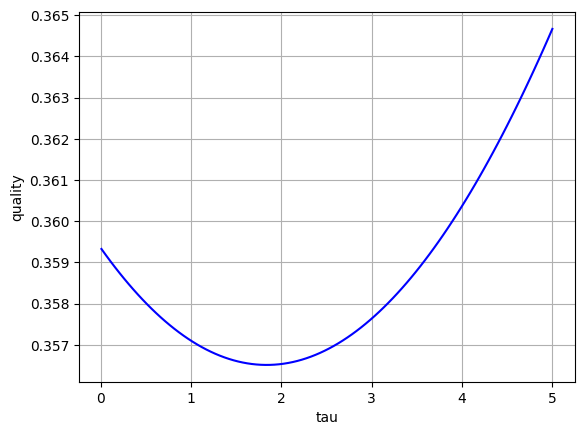
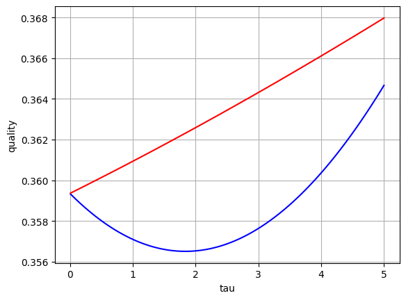

# Лабораторная работа 6

## Датасет

Housing Price Regression

<https://www.kaggle.com/datasets/denkuznetz/housing-prices-regression>

## Код алгоритма

```python
# регрессия
def regression(X, y, tau):
    X = np.column_stack([np.ones(X.shape[0]), X])
    U, s, Vt = np.linalg.svd(X, full_matrices=False)
    s_reg = s / (s**2 + tau)
    coef = Vt.T @ np.diag(s_reg) @ U.T @ y
    return coef

def predict(X, coef):
    X = np.column_stack([np.ones(X.shape[0]), X])
    y_pred = X @ coef
    return y_pred
```

## Ручной алгоритм

Данные подбора параметра Q (качества):

```
Лучший параметр регуляризации: 1.8245454545454547
Качество: 0.3565094842375256
Время работы (вручную): 0:00:00.014985
```

График качества для разных tau (параметров регуляризации):



## Библиотечный алгоритм

Данные подбора параметра Q:

```
Лучший параметр регуляризации: 0.01
Качество: 0.3593706105245881
Время работы (библиотека): 0:00:00.081993
```

Лучшее значение качества достигается у ручного алгоритма. Время работы лучше у ручного алгоритма в 5,5 раз.

Сравнение качества ручного и библиотечного метода при разных tau:


