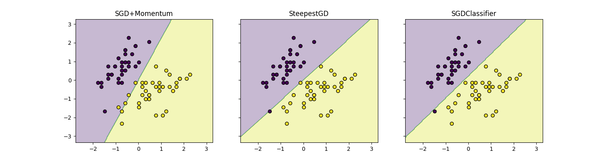

# Лабораторная работа №4 "Линейная классификация"

## Датасет
Для экспериментов был использован датасет Iris, в котором выбраны два класса для задачи бинарной классификации. Признаки предварительно нормализованы с использованием `StandardScaler`.

## Реализация различных методов классификации
### Линейный классификатор
Классификатор реализован как пользовательский класс `CustomLinearClassifier` с поддержкой двух методов оптимизации:
1. **SGD с моментом** — метод стохастического градиентного спуска с использованием момента для ускорения сходимости. Градиенты вычисляются для каждого объекта, веса обновляются с учетом экспоненциального сглаживания изменений.
2. **Скорейший градиентный спуск** — метод, в котором шаг обучения адаптивно подбирается на основе нормы градиента, что позволяет ускорить сходимость на начальных этапах обучения.

### Инициализация весов
Три способа инициализации:
1. **Нулевые веса** — все параметры инициализируются нулями.
2. **Случайная инициализация** — небольшие случайные значения.
3. **Инициализация на основе корреляции** — веса инициализируются корреляцией между признаками и метками классов.

### Вычисление функции потерь
Используется квадратичная функция потерь:
$$ \mathcal{L}(w, x, y) = (y - \langle w, x \rangle)^2 + \frac{\alpha}{2} ||w||^2, $$
где $\alpha$ — коэффициент L2-регуляризации. Регуляризация добавляет штраф за большие значения весов, чтобы уменьшить переобучение. Градиенты вычисляются с учетом регуляризации, что способствует уменьшению нормы весов в процессе оптимизации.

### Предъявление объектов по модулю отступа
Для повышения эффективности обучения выбираются объекты, на которых модель имеет меньшую уверенность. Это реализовано на основе вычисления отступов:
$$ M(x, y) = y \cdot \langle w, x \rangle. $$
Данные сортируются по модулю отступов, после чего модель обучается на наиболее значимых объектах.

## Гиперпараметры
### Основные гиперпараметры, используемые в модели:
1. **`lr`** (learning rate) — скорость обучения. Используется в методе SGD для контроля величины шага обновления весов. Значение по умолчанию: `0.01`.
2. **`gamma`** — коэффициент момента, определяет, насколько сильно учитываются прошлые изменения в градиентах. Значение по умолчанию: `0.9`.
3. **`reg_alpha`** — коэффициент регуляризации. Чем выше значение, тем сильнее штрафуются большие веса. Значение по умолчанию: `0.01`.
4. **`epochs`** — количество эпох обучения. Определяет, сколько раз модель проходит по всем данным. Значение по умолчанию: `50`.
5. **`init_type`** — тип инициализации весов (`zeros`, `random`, `correlation`).
6. **`selection`** — метод выбора объектов для обучения (`None` или `margin_selection`).

## Сравнение методов
### Обучение
Для обучения применялись два метода оптимизации:
1. **SGD с моментом**:
   - Инициализация весов: на основе корреляции.
   - Кол-во эпох 8000
   - Alpha 0.1
   - Лучшая точность на тестовой выборке: **1.00**.
2. **Скорейший градиентный спуск**:
   - Инициализация весов: на основе корреляции
   - Кол-во эпох 8000
   - Alpha 0.1
   - Лучшая точность на тестовой выборке: **1.00**.

Эталонное решение с использованием `SGDClassifier` из `sklearn` показало точность **1.00**.

### Графики разделяющих гиперплоскостей
На графиках ниже визуализированы разделяющие гиперплоскости для каждого метода обучения:

1. **SGD с моментом**: высокое качество разделения классов благодаря использованию момента.
2. **Скорейший градиентный спуск**: точность сравнимая, но требует большего времени на сходимость.
3. **SGDClassifier из sklearn**: эталонная реализация, подтверждающая качество пользовательских методов.

