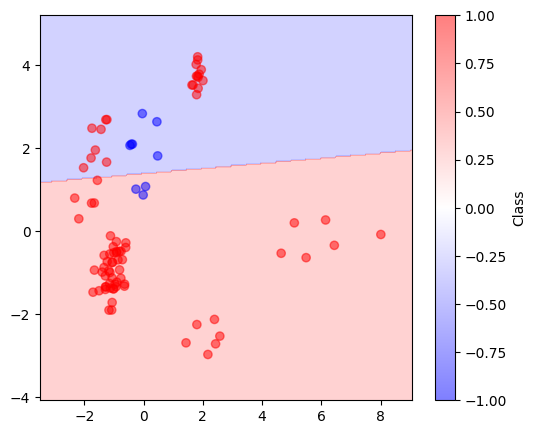
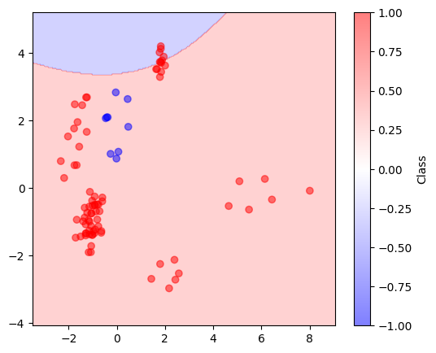

# Лабораторная работа №5 "Метод опорных векторов (SVM)"

## Датасет
Для решения задачи SVM был выбран датасет о грибах, доступный в [Kaggle](https://www.kaggle.com/uciml/mushroom-classification). Датасет содержит категориальные признаки, которые были преобразованы в числовые с использованием `LabelEncoder`.

## Реализация SVM
Была разработана пользовательская реализация метода опорных векторов (SVM) с использованием метода двойственной оптимизации и кастомных ядер: линейного, гауссова (RBF) и полиномиального.

### Особенности реализации
- **Ядра:** Реализованы три типа ядер: линейное, гауссово (RBF) и полиномиальное.
- **Оптимизация:** Для решения двойственной задачи используется метод `minimize` из библиотеки `scipy`.
- **Коэффициенты:** Вычисляются коэффициенты $\lambda$ для опорных векторов и смещение $b$.
- **Предсказание:** Классификация объектов основывается на знаке значения функции принятия решений.
- **Визуализация** Для визуализации был использован метод главных компонент
 

## Решение и визуализация

Для проверки качества классификации было принято решение сравнить Precision, Recall, F1 

Для проверки был взят набор данных размером 500 экземпляров

### Линейное ядро

**Метрики линейного ядра**

| Metric      | Custom(-1) | Custom(+1) | Sklearn(-1) | Sklearn(+1) |
|-------------|------------|------------|-------------|-------------|
| Precision   | 0.846154   | 1.000000   | 1.0         | 1.0         |
| Recall      | 1.000000   | 0.890123   | 1.0         | 1.0         |
| F1-score    | 0.814286   | 0.882759   | 1.0         | 1.0         |

---

### Гауссово ядро

**Метрики гауссово ядра**

| Metric      | Custom(-1) | Custom(+1) | Sklearn(-1) | Sklearn(+1) |
|-------------|------------|------------|-------------|-------------|
| Precision   | 1.0        | 1.0        | 1.0         | 1.0         |
| Recall      | 1.0        | 1.0        | 1.0         | 1.0         |
| F1-score    | 1.0        | 1.0        | 1.0         | 1.0         |

---

### Полиномиальное ядро

**Метрики полиномиального ядра (степень 3)**

| Metric      | Custom(-1) | Custom(+1) | Sklearn(-1) | Sklearn(+1) |
|-------------|------------|------------|-------------|-------------|
| Precision   | 0.750000   | 1.000000   | 1.000000    | 0.987805    |
| Recall      | 1.000000   | 0.962963   | 0.888889    | 1.000000    |
| F1-score    | 0.857143   | 0.981132   | 0.941176    | 0.993865    |

### Сравнение решений

Для данной задачи лучшим ядром оказалось - гауссово

## Дополнения

Решение на scipy.minimize сильно отстает во времени по сравнению с sklearn.SVM 

- Custom SVM : 27.03840970993042 сек
- sk.SVM: 0.006678104400634766 сек