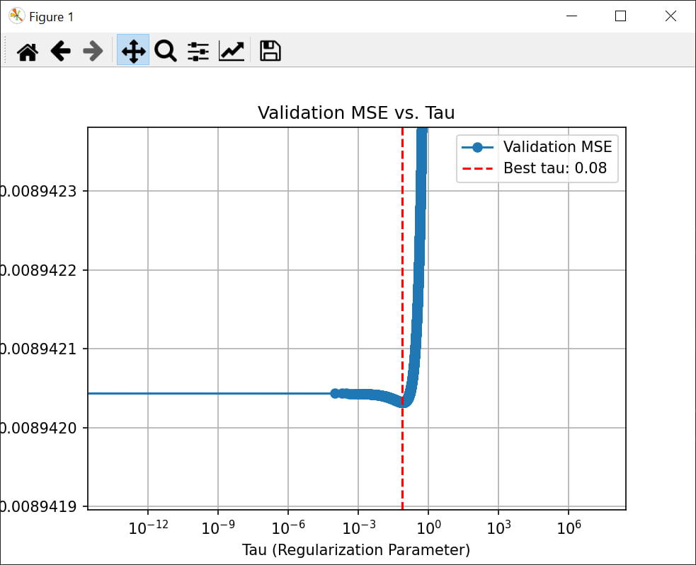

# Лабораторная работа №6 "Линейная регрессия"

## Датасет  
Для выполнения лабораторной работы использовался датасет [Insurance Dataset on Kaggle](https://www.kaggle.com/datasets/mirichoi0218/insurance/data).  

Признаки, представленные в категориальном виде, были преобразованы с использованием one-hot кодирования.  

## Реализация гребневой регрессии через SVD  

Для решения задачи гребневой регрессии была разработана пользовательская функция, использующая сингулярное разложение (SVD). Основные этапы:
1. Выполнено разложение входной матрицы \( X \) на компоненты \( U \), \( S \), \( V^T \).
2. Добавлен регуляризационный параметр \( τ \) для компенсации переобучения.
3. Вычислены оптимальные веса \( w \) с учетом регуляризации:  
   $$ w_τ = V^T \cdot \left( \frac{S}{S^2 + τ} \right) \cdot U^T \cdot y $$

### Подбор оптимального значения \( τ \)  
Оптимальное значение параметра \( τ \) определено перебором с использованием валидационного множества. Для каждого \( τ \) предсказания сравнивались с реальными значениями по метрике среднеквадратичной ошибки (MSE), и выбрано значение \( τ \), минимизирующее ошибку.  

### Гиперпараметры:
- **\( τ \)**: регуляризационный параметр, варьировался от 0 до 1 с шагом 0.0001.  
- **Тестовая, валидационная и обучающая выборки**: данные разбиты в пропорции 65%-17.5%-17.5%.  

## Сравнение с эталонным решением  
Для сравнения разработанного алгоритма была использована реализация гребневой регрессии из библиотеки `sklearn`. При оптимальном \( τ \), найденном через пользовательскую реализацию, результаты совпадают с эталоном, что подтверждает корректность работы пользовательского алгоритма.  

## Результаты

### Оптимальное значение \( τ \)  
Оптимальное значение \( τ \): **0.0773**  

### Среднеквадратичная ошибка (MSE):  
- **Пользовательская реализация (на тестовой выборке)**: **0.0107**  
- **Реализация scikit-learn**: **0.0107**  

### Графики:

**Зависимость валидационной MSE от значения \( τ \):**  
   Показано, как изменение регуляризационного параметра влияет на ошибку на валидационной выборке. Минимальная ошибка достигается при \( τ = 0.0773 \).

**Сравнение предсказаний:**  
   - Первый график: сравнение реальных значений и предсказаний пользовательской реализации.  
   - Второй график: сравнение реальных значений и предсказаний с использованием модели `Ridge` из `scikit-learn`.  

