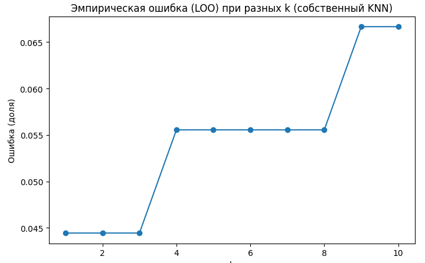

## Лабораторная работа №2. Метрическая классификация

### Описание

Целью данной лабораторной работы является реализация алгоритма метрической классификации KNN (k-ближайших соседей) с использованием метода окна Парзена переменной ширины. Также необходимо подобрать оптимальный параметр  методом скользящего контроля (Leave-One-Out, LOO), сравнить результаты с библиотечной реализацией KNN и провести анализ полученных результатов.

### Используемые методы и алгоритмы

**Алгоритм метрической классификации KNN**

KNN (k-ближайших соседей) — это алгоритм классификации, который присваивает классы объекту на основе классов его ближайших соседей.

**Метод окна Парзена**

В данной работе используется метод окна Парзена переменной ширины с гауссовым ядром. Это позволяет учитывать расстояния до ближайших соседей, что делает классификацию более точной.

**Метод Leave-One-Out (LOO)**

LOO — это метод кросс-валидации, при котором один объект используется в качестве тестового набора, а оставшиеся объекты — для обучения. Это позволяет точно оценить качество классификации для различных значений .

### Результаты:

**Данные**

Для выполнения лабораторной работы использовался датасет Iris. Он содержит три класса (setosa, versicolor, virginica), которые классифицируются на основе четырех признаков (длина и ширина лепестка и чашелистика).

**Реализация**

Собственная реализация KNN выполнена с использованием метода окна Парзена и гауссова ядра.

Подбор  осуществляется методом LOO для значений от 1 до 10.

**График эмпирической ошибки**

Для анализа параметра  построен график эмпирической ошибки, показывающий зависимость ошибки от значения .

**Сравнение с библиотечной реализацией**

Библиотечная реализация KNN выполнена с использованием sklearn.

Для оптимального  найдены значения Accuracy, Precision, Recall и F1-score.

Проведено сравнение времени работы алгоритмов.

**Собственный алгоритм**

- Оптимальное значение : 1

- Время выполнения: 429924 мс

- Accuracy: 98.33%

- Precision: 98.55%

- Recall: 98.04%

- F1-score: 98.25%

**Библиотечный алгоритм**

- Оптимальное значение : 5

- Время выполнения: 396450 мс

- Accuracy: 96.67%

- Precision: 97.22%

- Recall: 96.08%

- F1-score: 96.47%

**График эмпирической ошибки**

График демонстрирует, что минимальная ошибка достигается при **k=1**, после чего ошибка начинает расти. Это говорит о том, что при слишком большом значении k модель начинает терять чувствительность к локальным особенностям данных, что приводит к ухудшению точности классификации. Выбор оптимального k (в данном случае **k=1**) позволяет минимизировать эмпирическую ошибку и достичь лучшего качества модели.

### Выводы

Реализован алгоритм KNN с методом окна Парзена и гауссовым ядром. Метод LOO позволил подобрать оптимальное значение k.

Собственная реализация KNN показала более высокую точность (98.33% Accuracy) по сравнению с библиотечной (96.67%), но библиотечная версия работает быстрее и лучше подходит для больших данных. Метод окна Парзена улучшает качество классификации по сравнению с классическим KNN.
