## Лабораторная работа №1. Кластеризация

### Описание

В данной лабораторной работе был реализован алгоритм иерархической кластеризации, EM-алгоритм и DBSCAN. На выбранных данных была проверена работоспособность этих алгоритмов. Было произведено сравнение разработанных решений и их библиотечных версий. Библиотечные версии показывают то же качество за гораздо более короткое время.

### Выбор датасетов:

Выбранные датасеты: fish и iris.
Убраны метки классов из данных.

Рыбы: На основании плотных групп на графике можно предположить 4 кластера. Lанные сгруппированы в компактные, хорошо разделенные группы. Это может указывать на то, что кластеры имеют форму, близкую к эллипсоидной.

Ирисы: На графике видно 4 кластера. Видно несколько перекрывающихся групп, что может указывать на сложности разделения. Вероятно, для таких данных хорошо подойдут алгоритмы, чувствительные к плотности

Данные визуализированы реализован с помощью библиотеки seaborn.
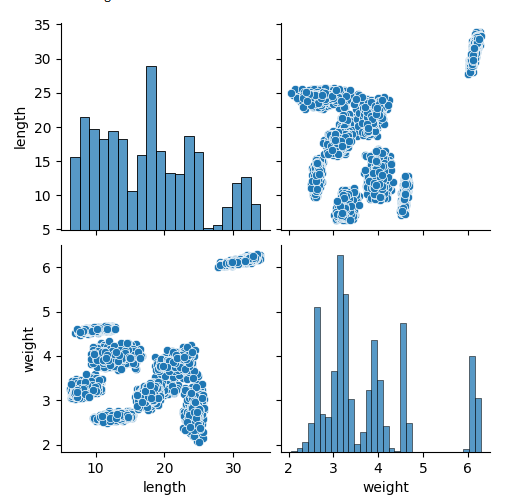
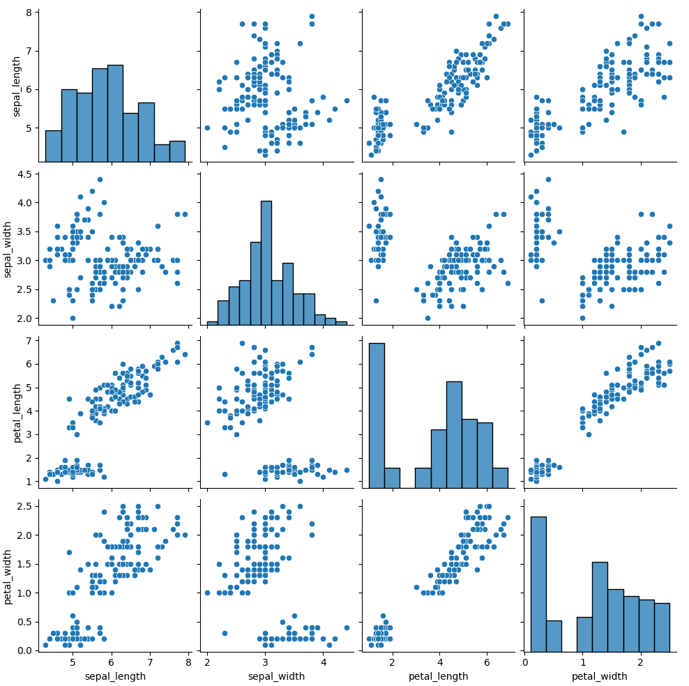

Визуальные признаки группировки точек в графиках позволяют сделать выводы о форме и плотности кластеров.

### Иерархическая кластеризация:

Построены дендрограммы по результатам ручной кластеризации. Данные дендрограммы полностью совпадают с библиотечными дендрограммами.
Время выполнения ручного алгоритма значительно превышает время работы библиотечной реализации.

**Дендрограмма ручного алгоритма (fish)**
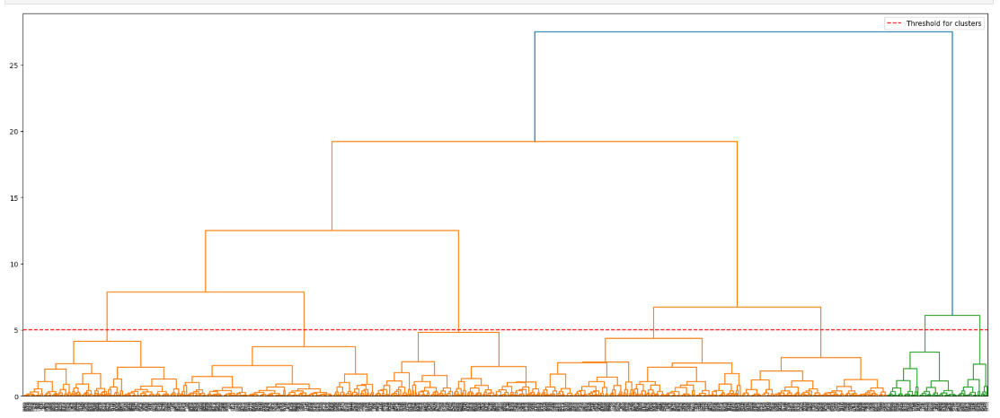
**Дендрограмма автоматического алгоритма (fish)**
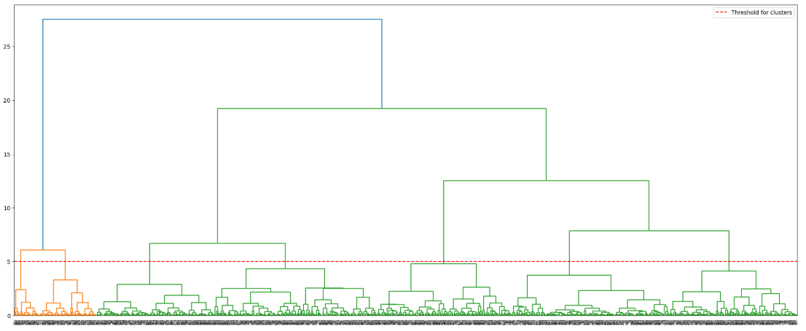

Дендрограмма показывает четко выделенные разрывы между ветвями, что подтверждает хорошо различимые кластеры.

**Сравнение метрик и визуализаций кластеризации (fish)**

Внутрикластерное расстояние у иерархического алгоритма (вручную): 1296.8668606834203

Межкластерное расстояние у иерархического алгоритма (вручную): 21534.560983057083

Время работы у иерархического алгоритма (вручную): 43000000

Внутрикластерное расстояние у иерархического алгоритма (библиотека): 1296.8668606834253

Межкластерное расстояние у иерархического алгоритма (библиотека): 21602.788252350874

Время работы у иерархического алгоритма (библиотека): 11968
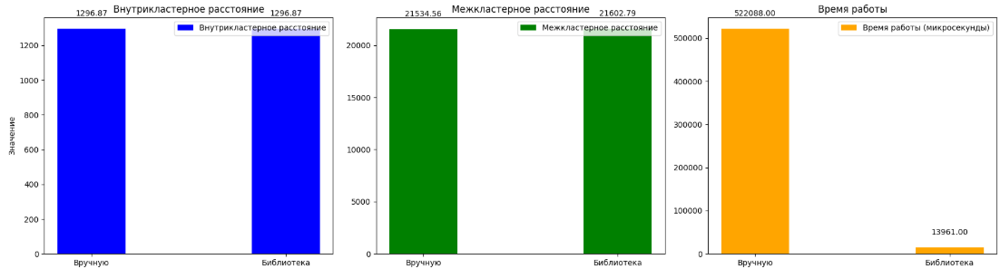
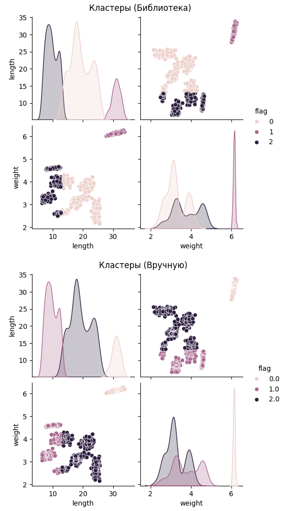

**Дендрограмма ручного алгоритма (iris)**
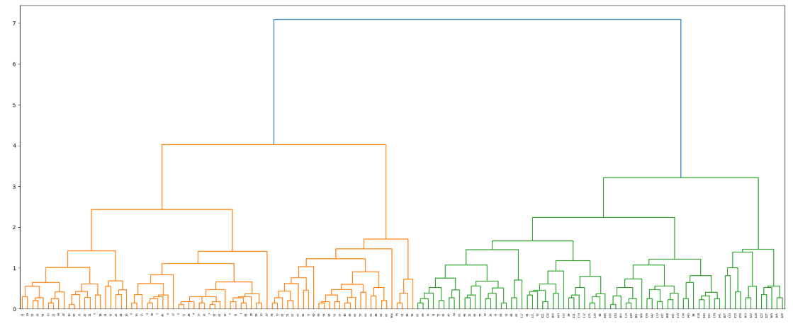
**Дендрограмма автоматического алгоритма (iris)**
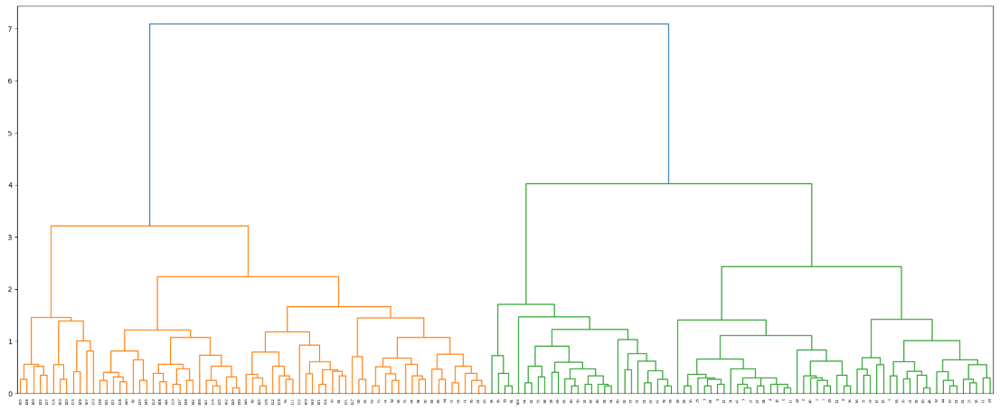

Кластеры разделены, но могут быть более близкими, особенно если оценивать их плотность.

**Сравнение метрик и визуализаций кластеризации (iris)**

Внутрикластерное расстояние у иерархического алгоритма (вручную): 69.24563758419474

Межкластерное расстояние у иерархического алгоритма (вручную): 1067.5786375731197

Время работы у иерархического алгоритма (вручную): 462730 

Внутрикластерное расстояние у иерархического алгоритма (библиотека): 69.24563758419475

Межкластерное расстояние у иерархического алгоритма (библиотека): 1067.5786375731195

Время работы у иерархического алгоритма (библиотека): 2508

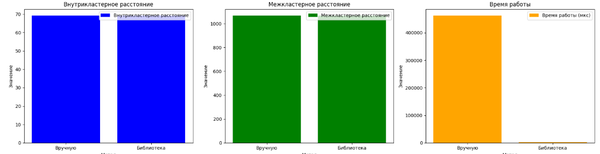
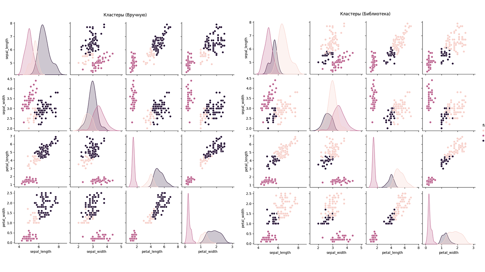

### Реализация алгоритмов:

#### EM-алгоритм (Gaussian Mixture Model).
Точность EM-алгоритма немного отличается от библиотечного из-за вероятностной природы алгоритма и случайных начальных условий.
Время работы библиотечного алгоритма и ручной реализации сильно различаются.

**Сравнение метрик и визуализаций (fish)**

Внутрикластерное расстояние у ем алгоритма (вручную): 1233.6127855211025

Межкластерное расстояние у ем алгоритма (вручную): 21502.953735903982

Время работы у ем алгоритма (вручную): 304076

Внутрикластерное расстояние у ем алгоритма (библиотека): 1366.2229940609502

Межкластерное расстояние у ем алгоритма (библиотека): 21445.34086343496

Время работы у ем алгоритма (библиотека): 68000

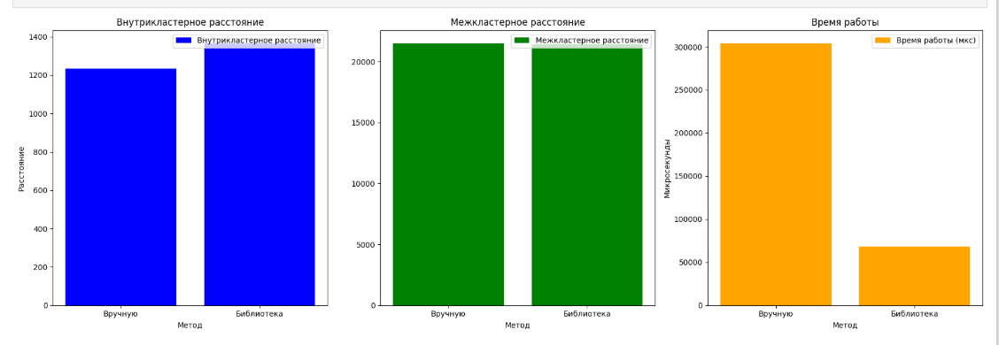
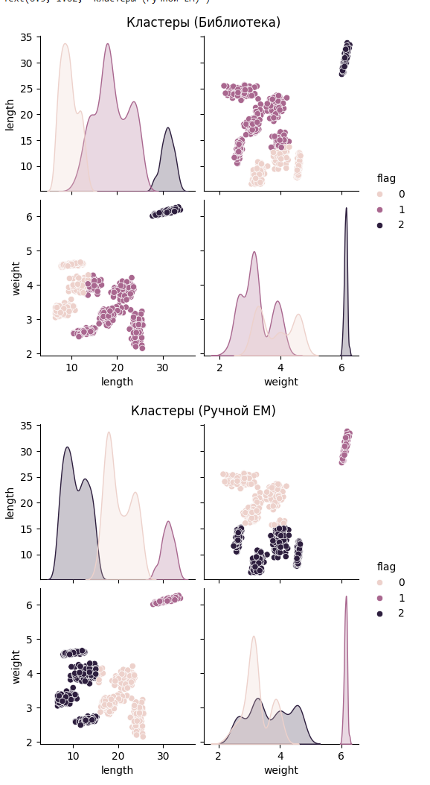

**Сравнение метрик и визуализаций (iris)**

Внутрикластерное расстояние у ем алгоритма (вручную): 89.23122330600778

Межкластерное расстояние у ем алгоритма (вручную): 609.8364815003295

Время работы у ем алгоритма (вручную): 137172

Внутрикластерное расстояние у ем алгоритма (библиотека): 69.46833732502265

Межкластерное расстояние у ем алгоритма (библиотека): 1086.3004837712463

Время работы у ем алгоритма (библиотека): 27005

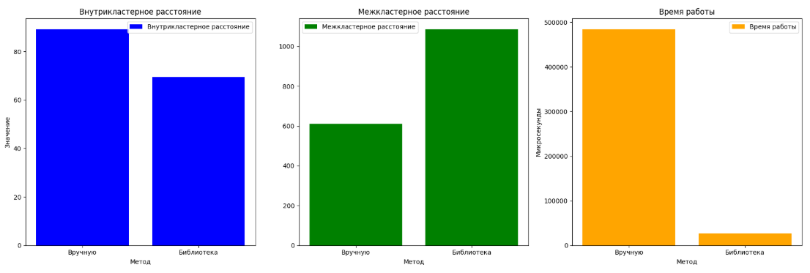
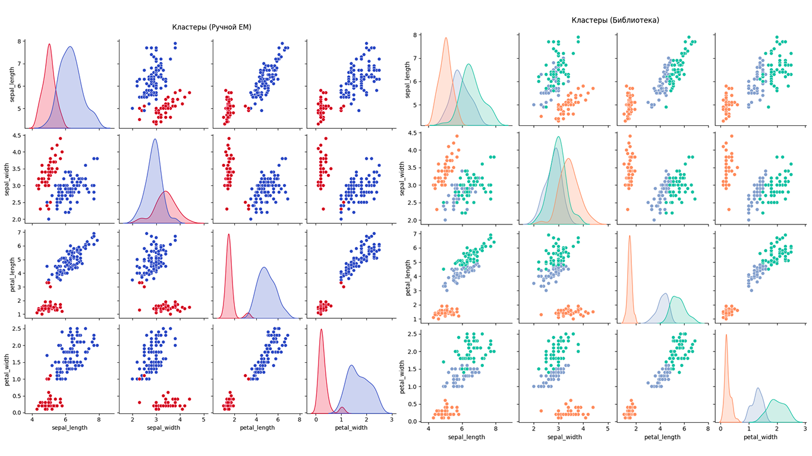

#### DBSCAN.
Точность ручной реализации DBSCAN практически полностью совпадает с библиотечной версией.
Однако библиотечный алгоритм работает значительно быстрее.

**Сравнение метрик и визуализаций (fish)**

Внутрикластерное расстояние у dbscan алгоритма (вручную): 363.1595384134298

Межкластерное расстояние у dbscan алгоритма (вручную): 807867.6387485993

Время работы у dbscan алгоритма (вручную): 920563

Внутрикластерное расстояние у dbscan алгоритма (автоматически): 363.1595384134296

Межкластерное расстояние у dbscan алгоритма (автоматически): 807867.6387485998

Время работы у dbscan алгоритма (автоматически): 10002

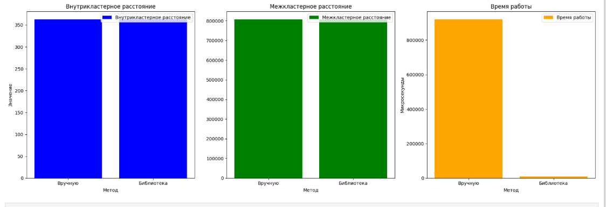
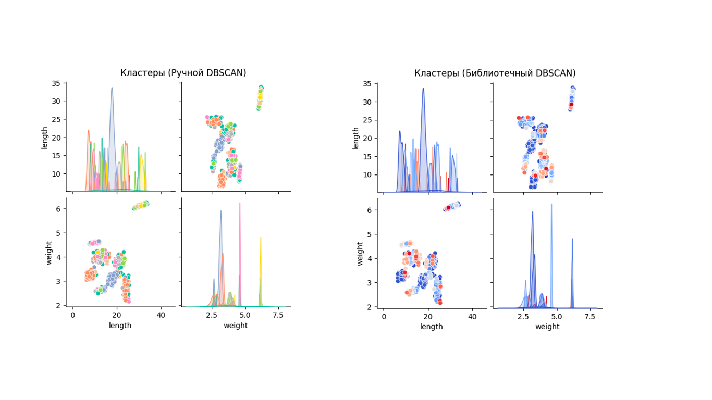

**Сравнение метрик и визуализаций (iris)**

Внутрикластерное расстояние у dbscan алгоритма (вручную): 69.43968816357007

Межкластерное расстояние у dbscan алгоритма (вручную): 4440.966300482999

Время работы у dbscan алгоритма (вручную): 122709

Внутрикластерное расстояние у dbscan алгоритма (автоматически): 69.43968816357007

Межкластерное расстояние у dbscan алгоритма (автоматически): 4440.9663004830045

Время работы у dbscan алгоритма (автоматически): 2999

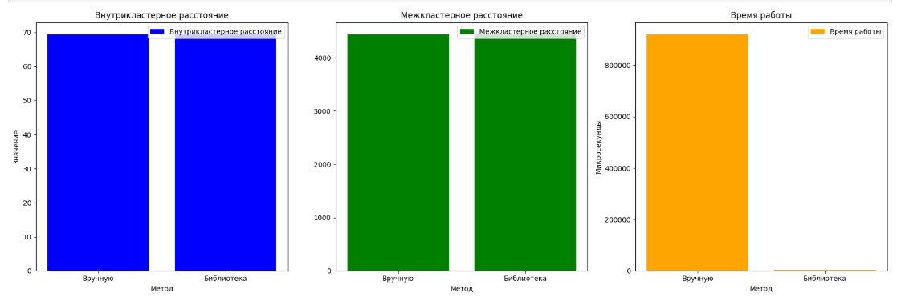
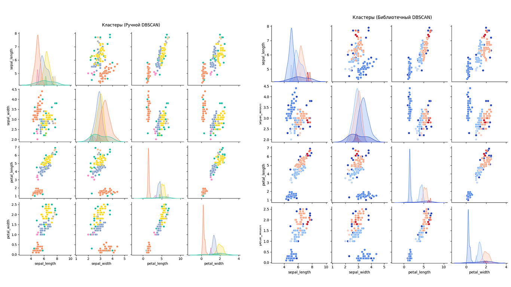

### Выводы

На основании проведенного анализа, наиболее эффективным алгоритмом из реализованных является иерархический. Его точность сопоставима с библиотечным решением, а показатели метрик кластеризации демонстрируют оптимальные результаты. 
Работа продемонстрировала сильные и слабые стороны различных подходов к кластеризации. Оптимизация параметров и выбор алгоритма зависят от природы данных и гипотез о структуре кластеров. 
