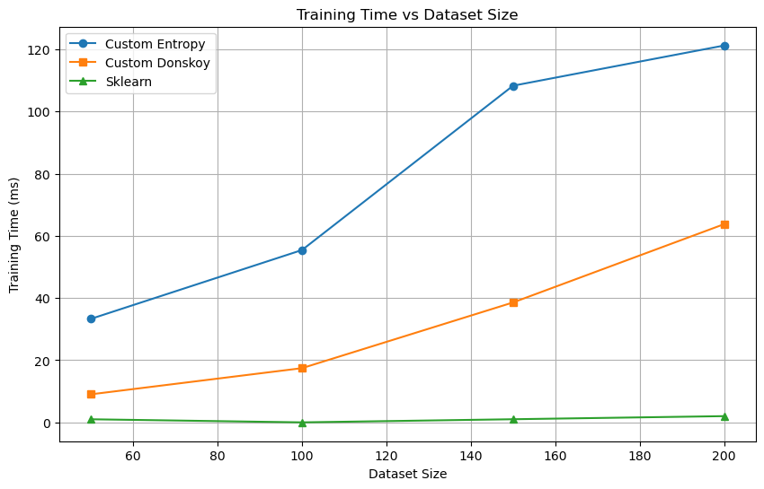
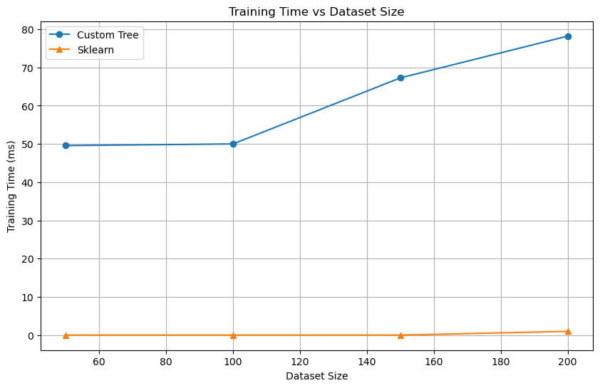

# Lab 3 Logical Classification

## Dataset

For this task, we need to implement a decision tree classifier using the ID3 algorithm. We used the [stars dataset](https://www.kaggle.com/datasets/waqi786/stars-dataset) for this task. Based on temperature, relative illumination, relative radius, absolute magnitude, color, and spectral class, determine the star type (one of the following classes: Brown Dwarf , Red Dwarf , White Dwarf , Main Sequence , Supergiant , and Hypergiant ).

## Classification Task

An ID3 was implemented in the [classifier_new.py](Source/classifier_new.py) file. Two types of criteria were used: entropy and donskoy

**Multiclass Entropy criterion:**
```python

def entropy(probabilities):
    probabilities = np.clip(probabilities, 1e-10, 1)
    return -probabilities * np.log2(probabilities)

def multiClassEntropyCriterion(feature_values, class_labels):
    max_information_gain = -1
    best_split_threshold = None

    total_samples = len(feature_values)
    unique_classes, class_counts_parent = np.unique(class_labels, return_counts=True)

    sorted_thresholds = np.unique(feature_values)[:-1]

    for threshold in sorted_thresholds:
        # Split based on the threshold
        right_child_mask = feature_values > threshold
        right_child_count = np.sum(right_child_mask)
        
        if right_child_count == 0 or right_child_count == total_samples:
            continue  # Skip invalid splits

        class_counts_right_child = np.array([np.sum((class_labels == class_label) & right_child_mask) for class_label in unique_classes])
        class_counts_left_child = class_counts_parent - class_counts_right_child

        # Compute entropy values
        parent_entropy = np.sum(entropy(class_counts_parent / total_samples))
        right_child_entropy = np.sum(entropy(class_counts_right_child / right_child_count))
        left_child_entropy = np.sum(entropy(class_counts_left_child / (total_samples - right_child_count)))

        # Compute information gain
        information_gain = (parent_entropy -
                            (right_child_count / total_samples) * right_child_entropy -
                            ((total_samples - right_child_count) / total_samples) * left_child_entropy)

        # Update best split if information gain is improved
        if information_gain > max_information_gain:
            max_information_gain = round(information_gain, 5)
            best_split_threshold = threshold

    return max_information_gain, best_split_threshold

```

**Donskoy criterion:**
```python
def DonskoyCriterion(feature_values, class_labels):
    max_information_gain = -1
    best_split_threshold = None

    unique_thresholds = sorted(np.unique(feature_values))[:-1]

    for threshold in unique_thresholds:
        # Split based on the threshold
        split_mask = feature_values > threshold
        split_counts = np.sum(split_mask)

        if split_counts == 0 or split_counts == len(feature_values):
            continue  # Skip invalid splits

        # Calculate the information gain
        information_gain = np.sum((split_mask[:, None] != split_mask) & (class_labels[:, None] != class_labels))

        # Update best split if information gain is improved
        if information_gain > max_information_gain:
            max_information_gain = round(information_gain, 5)
            best_split_threshold = threshold

    return max_information_gain, best_split_threshold
```
## Training

The tree was trained on the complete dataset using both criteria first and later trained on a dataset with missing values.

The original dataset was a complete one so a code was used to introduce some random missing values.

```python
np.random.seed(42)
        ix = [(row, col) for row in range(X.shape[0]) for col in range(X.shape[1])]
        for row, col in random.sample(ix, int(round(missing_rate * len(ix)))):
            X.iloc[row, col] = np.nan
```

**Results:**

Comparison Table:
| Method | Complete Data Accuracy | Missing Data Accuracy | Complete Data Time (ms) | Missing Data Time (ms) |
| --- | --- | --- | --- | --- |
| Custom Entropy | 0.9792 | 0.8750 | 156.68 | 109.39 |
| Custom Donskoy | 0.9792 | 0.8333 | 100.24 | 70.35 |
| Sklearn | 1.0000 | 0.9167 | 0.00 | 0.00 |


Training times (milliseconds) for different sizes of the dataset:
| Size | Entropy Train | Donskoy Train | Sklearn Train | Donskoy Entropy Ratio |
| --- | --- | --- | --- | --- |
| 50 | 33.30 | 9.02 | 0.99 | 0.27 |
| 100 | 55.44 | 17.44 | 0.00 | 0.31 |
| 150 | 108.32 | 38.58 | 1.00 | 0.36 |
| 200 | 121.25 | 63.78 | 2.00 | 0.53 |




**Comparison:**

Based on the results, we can make several key observations:

1. **Accuracy Performance:**
- Both custom implementations (Entropy and Donskoy) achieved identical accuracy (97.92%) on complete data, showing strong performance
- With missing data, the Entropy criterion performed slightly better (87.50%) compared to Donskoy (83.33%)
- Sklearn's implementation maintained superior accuracy in both scenarios (100% and 91.67% respectively)

2. **Computational Efficiency:**
- The Donskoy criterion consistently demonstrated faster training times compared to Entropy
- The Donskoy/Entropy ratio increased with dataset size (from 0.27 to 0.53), suggesting Donskoy scales better
- Both custom implementations were significantly slower than Sklearn's optimized implementation

3. **Missing Data Handling:**
- All methods showed some degradation in accuracy when handling missing data
- The Entropy criterion appeared more robust to missing values, with a smaller drop in accuracy (10.42% vs 14.59% for Donskoy)
- Even with missing data, both custom implementations maintained reasonable performance above 83%

In conclusion, while both custom implementations showed strong performance, the Entropy criterion demonstrated better robustness to missing data at the cost of longer training times. The Donskoy criterion offers a faster alternative with comparable accuracy on complete data but may be less suitable for datasets with missing values.

## Regression Task

For the regression task, we used the same dataset and MSE as uncertainty measure. The task was to predict the luminosity of a star based on its temperature, radius, and absolute magnitude.

**MSE Criterion:**

```python

def uncertainty_measure(Y):
    if len(Y) == 0:
        return 0
    return np.mean((Y - np.mean(Y)) ** 2)

def MSECriterion(X, y):
    if len(X) < 2:  # Need at least 2 samples to split
        return float('inf'), None
    
    min_mse = float('inf')
    best_threshold = None
    
    # Use percentile points as candidate splits for better distribution
    percentiles = np.percentile(X, np.linspace(1, 99, 50))
    unique_values = np.unique(percentiles)
    
    parent_mse = uncertainty_measure(y)
    
    for threshold in unique_values:
        left_mask = X <= threshold
        right_mask = ~left_mask
        
        # Skip if split would result in too small nodes
        if np.sum(left_mask) < 2 or np.sum(right_mask) < 2:
            continue
        
        y_left = y[left_mask]
        y_right = y[right_mask]
        
        # Calculate weighted MSE
        n_left = len(y_left)
        n_right = len(y_right)
        n_total = len(y)
        
        left_mse = uncertainty_measure(y_left)
        right_mse = uncertainty_measure(y_right)
        
        weighted_mse = (n_left/n_total) * left_mse + (n_right/n_total) * right_mse
        
        if weighted_mse < min_mse:
            min_mse = weighted_mse
            best_threshold = threshold
    
    improvement = parent_mse - min_mse
    # Only return split if it improves MSE significantly
    if improvement <= 1e-7:
        return float('inf'), None
        
    return min_mse, best_threshold
```

## Training

The tree was trained on the complete dataset as well as a dataset with missing values using the MSE criterion.

**Results:**

Comparison Table:

| Method | Complete MSE | Complete R² | Missing MSE | Missing R² | Complete Time (ms) | Missing Time (ms) |
|--------|-------------|-------------|-------------|------------|-------------------|------------------|
| Custom Tree | 0.5756 | 0.5942 | 0.6983 | 0.5076 | 77.78 | 69.82 |
| Sklearn | 0.5101 | 0.6403 | 0.6063 | 0.5725 | 0.00 | 0.00 |

Time results for different sizes of the dataset:

| Size | Custom Train | Sklearn Train |
|------|--------------|---------------|
| 50   | 49.56       | 0.00         |
| 100  | 50.00       | 0.00         |
| 150  | 67.27       | 0.00         |
| 200  | 78.19       | 0.99         |



**Comparison:**

The custom regression tree implementation shows competitive but slightly lower performance compared to scikit-learn's implementation:

1. Performance Metrics:
- On complete data, the custom tree achieves an MSE of 0.5756 vs sklearn's 0.5101 (13% higher error)
- R² scores are correspondingly lower (0.5942 vs 0.6403)
- Similar pattern on data with missing values, where the custom implementation has ~15% higher error

2. Training Time:
- The custom implementation is significantly slower, taking 70-80ms vs near-instantaneous training in sklearn
- This performance gap widens with larger dataset sizes
- The time complexity appears to scale roughly linearly with dataset size

3. Key Observations:
- The custom tree maintains reasonable predictive power despite being less optimized
- Performance degradation with missing values is comparable between implementations
- The main tradeoff is computational efficiency vs interpretability and control
- Sklearn's highly optimized C implementation explains the speed advantage

Overall, while not matching sklearn's performance, the custom implementation provides a solid foundation for understanding tree-based regression and can be suitable for smaller datasets where training time is less critical.

## Tree Pruning

A recursive post-pruning was implemented with a complete dataset. The tree was pruned by removing the least significant nodes.

**Results:**

Classification Tree:

| Metric | Value |
|--------|-------|
| **Dataset Splits** |  |
| Training samples | 144 |
| Test samples | 48 |
| Number of classes | 6 |
| **Before Pruning** |  |
| Number of nodes | 11 |
| Test accuracy | 0.5625 |
| **After Pruning** |  |
| Number of nodes | 7 |
| Test accuracy | 0.6875 |
| **Results** |  |
| Node reduction | 4 nodes (36.4%) |
| Accuracy change | +12.50% |

Regression Tree:

| Metric | Value |
|--------|-------|
| **Dataset Splits** |  |
| Training samples | 144 |
| Validation samples | 48 |
| Test samples | 48 |
| **Before Pruning** |  |
| Number of nodes | 45 |
| Test MSE | 0.6362 |
| Test R² | 0.5431 |
| **After Pruning** |  |
| Number of nodes | 9 |
| Test MSE | 0.6921 |
| Test R² | 0.5030 |
| **Results** |  |
| Node reduction | 36 nodes (80.0%) |
| MSE change | +0.0560 (+8.8%) |
| R² change | -0.0402 (-7.4%) |

**Conclusion:**

The pruning results demonstrate interesting tradeoffs between model complexity and performance for both classification and regression trees:

For the classification tree:
- Pruning reduced the tree size by 36.4% (from 11 to 7 nodes)
- Despite the simpler structure, accuracy actually improved by 12.5% (from 0.5625 to 0.6875)
- This suggests the original tree was overfitting the training data, and pruning helped create a more generalizable model

For the regression tree:
- More aggressive pruning occurred, reducing nodes by 80% (from 45 to 9 nodes)
- Test MSE increased slightly by 8.8% (from 0.6362 to 0.6921)
- R² score decreased by 7.4% (from 0.5431 to 0.5030)
- The large reduction in nodes with relatively small performance impact suggests the original tree had many redundant splits

Overall, pruning was successful in significantly reducing model complexity while maintaining reasonable performance. The classification tree actually benefited from pruning with improved accuracy, while the regression tree saw only minor degradation despite massive simplification. This demonstrates that pruning can be an effective technique for creating simpler, more interpretable models without necessarily sacrificing predictive power.


