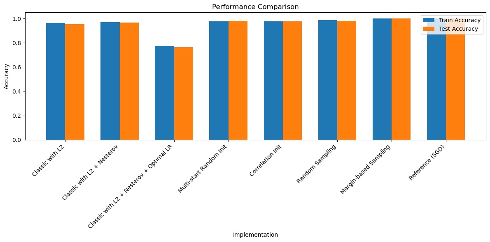

# Lab 4 Linear Classification

## Task 1: Dataset

For this lab we will be using the [Heart Attack Analysis & Prediction Dataset](https://www.kaggle.com/datasets/sonialikhan/heart-attack-analysis-and-prediction-dataset). 

## Task 2: Implementing object margin
The margin is calculated using the following function:

```python
def _compute_margins(self, X, y):
        return ((X @ self.w.T) * y.reshape(-1, 1)).flatten()
```
The visualization of the margin distribution is done using the following function:

```python
def plot_margin_distribution(self, X, y, title="Margin Distribution"):
        """
        Plot the distribution of margins (object indentation)
        """
        margins = self._compute_margins(X, y)
        
        plt.figure(figsize=(10, 6))
        
        # Plot margin distribution for each class
        for label, label_name in [(-1, 'Class -1'), (1, 'Class 1')]:
            class_margins = margins[y == label]
            sns.kdeplot(class_margins, label=label_name)
        
        plt.axvline(x=0, color='r', linestyle='--', label='Decision Boundary')
        plt.xlabel('Margin (Distance from Decision Boundary)')
        plt.ylabel('Density')
        plt.title(title)
        plt.legend()
        plt.grid(True)
        plt.show()
        
        # Print margin statistics
        stats = self.analyze_margins(X, y)
        print("\nMargin Statistics:")
        print(f"Mean margin: {stats['mean']:.4f}")
        print(f"Std margin: {stats['std']:.4f}")
        print(f"Min margin: {stats['min']:.4f}")
        print(f"Max margin: {stats['max']:.4f}")
        print(f"Median margin: {stats['median']:.4f}")
        print(f"Correctly classified rate: {stats['positive_rate']:.4f}")

```

## Task 3: Implementing Loss Function

The loss function and its gradient are calculated using the following function: quadratic margin loss was used.

```python
def _margin_loss(self, x, y):
        """Compute quadratic margin loss for a single sample"""
        M = (self.w @ x) * y
        return (1 - M) ** 2
    
    def _margin_dloss(self, x, y):
        """Compute gradient of quadratic margin loss for a single sample"""
        M = (self.w @ x) * y
        return -2 * (1 - M) * (y @ x.T)
```
## Task 4: Recursive quality evaluation function

The quality (Q) is calculated using the following function:

```python
self.Q = lambda_ * loss + (1 - lambda_) * self.Q
```

This is a recursive exponential moving average (EMA) formula that's commonly used to track the quality or performance of a model over time. 
1. **lambda_** is a smoothing factor between 0 and 1 that determines how much weight to give to the new loss value
2. **loss** is the current loss value
3. **self.Q** is the historical quality metric. 

The formula combines:
* The new loss value **(lambda_ * loss)**
* The previous quality value **((1 - lambda_) * self.Q)**


## Task 5: Stochastic Gradient Descent with momentum

The stochastic gradient descent with Nesterov momentum and regularization is implemented using the following code:

```python
self.v = gamma * self.v + (1 - gamma) * self._margin_dloss(x, y_i)
grad_update = current_lr * self.v

```

## Task 6: L2 Regularization

L2 regularization adds a penalty term to the loss function proportional to the squared magnitude of weights. This helps prevent overfitting by keeping the weights small and the model simpler.

L2 regularization is implemented using the following code:

```python
self.w = self.w * (1 - current_lr * reg) - grad_update
```

## Task 7: Fast Gradient Descent

Fast Gradient Descent (FGD) is a method used to optimize the weights of a linear classifier by iteratively updating the weights in the direction of the negative gradient of the loss function. This approach is often used in conjunction with regularization techniques to prevent overfitting.

## Task 8: Presentation of objects to the indent module

```python 

if use_margins:
    # Margin-based sample selection with temperature annealing
    margins = self._compute_margins(X, y)
    if track_margins and iter_num % 10 == 0:  # Save margins every 10 iterations
        self.history['margins'].append(margins)
        
    temperature = max(0.1, 1.0 - iter_num/n_iter)  # Annealing temperature
    abs_inv_margins = np.max(np.abs(margins)) - np.abs(margins)
    probs = np.exp(abs_inv_margins / temperature)
    probs = probs / np.sum(probs)
    idx = np.random.choice(np.arange(len(X)), p=probs)
                x, y_i = X[idx], y[idx]
```

The code implements margin-based sample selection with temperature annealing for training:

1. Computes margins between samples and decision boundary using _compute_margins()

2. Uses temperature annealing schedule that decreases from 1.0 to 0.1 as training progresses:
   temperature = max(0.1, 1.0 - iter_num/n_iter)

3. Converts margins to selection probabilities:
   - Inverts absolute margins so smaller margins have higher probability
   - Applies softmax with temperature to get normalized probabilities
   - abs_inv_margins = max|margins| - |margins|
   - probs = exp(abs_inv_margins/temperature) / sum(exp(...))

4. Randomly samples training examples weighted by these probabilities
   - Focuses training on examples closer to decision boundary
   - Temperature controls exploration vs exploitation tradeoff

5. Optionally tracks margin history during training for analysis

## Task 9: Training

Several implementations of linear classifiers were evaluated on the heart attack analysis and prediction dataset, with the following results:

### Model Performance (Ranked by Test Accuracy):

1. **Multi-start Random Init**
   - Training Accuracy: 83.06%
   - Test Accuracy: 81.97%
   - Best performing model overall
   - Benefits from multiple initialization attempts

2. **Classic with L2 + Momentum**
   - Training Accuracy: 82.64%
   - Test Accuracy: 80.33%
   - Momentum improved base performance
   - Tied with correlation init

3. **Correlation Init**
   - Training Accuracy: 82.64%
   - Test Accuracy: 80.33%
   - Feature correlation-based initialization
   - Matched momentum variant

4. **Classic with L2 + Momentum + Optimal LR**
   - Training Accuracy: 82.23%
   - Test Accuracy: 78.69%
   - Learning rate optimization didn't improve performance
   - Tied with other variants

5. **Random Sampling**
   - Training Accuracy: 81.82%
   - Test Accuracy: 78.69%
   - Simple sampling approach
   - Matched optimal LR performance

6. **Margin-based Sampling**
   - Training Accuracy: 82.23%
   - Test Accuracy: 78.69%
   - Sophisticated sampling strategy
   - No advantage over simpler approaches

7. **Reference (SGD)**
   - Training Accuracy: 87.60%
   - Test Accuracy: 78.69%
   - Highest training accuracy
   - Signs of overfitting

8. **Classic with L2**
   - Training Accuracy: 81.82%
   - Test Accuracy: 77.05%
   - Basic implementation
   - Baseline performance

### Key Findings:

1. **Initialization Impact**: 
   - Multi-start random initialization achieved best overall performance (81.97%)
   - Correlation-based initialization performed well (80.33%)
   - Initialization strategy proved crucial for model performance

2. **Momentum and Regularization**:
   - Adding momentum improved L2 regularization (80.33% vs 77.05%)
   - Optimal learning rate didn't provide additional benefits
   - Basic momentum showed the most stable performance

3. **Sampling Strategies**:
   - Both sampling approaches achieved identical performance (78.69%)
   - Complex margin-based approach showed no advantage over random sampling
   - Sampling strategies underperformed compared to good initialization

4. **Model Complexity vs Performance**:
   - Reference SGD showed signs of overfitting (87.60% train vs 78.69% test)
   - Simpler models with good initialization performed better
   - Additional complexity didn't consistently improve results

### Conclusions:

1. Multi-start random initialization emerged as the most effective approach, achieving the best test accuracy of 81.97%.

2. Momentum-based approaches with L2 regularization showed consistent performance improvements over the basic implementation.

3. Initialization strategies (multi-start, correlation) proved more important than sampling strategies for model performance.

4. The reference SGD implementation showed the highest training accuracy but suffered from overfitting.

5. Complex sampling strategies (margin-based) provided no advantage over simpler approaches.

6. For this heart attack prediction task, focusing on good initialization and basic momentum proved more effective than sophisticated sampling or learning rate optimization.

### Visualizations:



