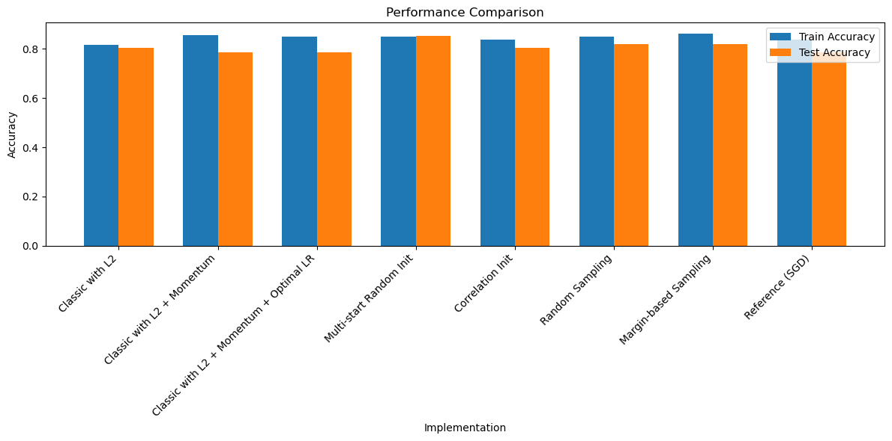

# Lab 4 Linear Classification

## Task 1: Dataset

For this lab we will be using the [mashroom dataset](https://www.kaggle.com/datasets/uciml/mushroom-classification). 

## Task 2: Implementing object margin
The margin is calculated using the following function:

```python
def _compute_margins(self, X, y):
        return ((X @ self.w.T) * y.reshape(-1, 1)).flatten()
```
The visualization of the margin distribution is done using the following function:

```python
def plot_margin_distribution(self, X, y, title="Margin Distribution"):
        """
        Plot the distribution of margins (object indentation)
        """
        margins = self._compute_margins(X, y)
        
        plt.figure(figsize=(10, 6))
        
        # Plot margin distribution for each class
        for label, label_name in [(-1, 'Class -1'), (1, 'Class 1')]:
            class_margins = margins[y == label]
            sns.kdeplot(class_margins, label=label_name)
        
        plt.axvline(x=0, color='r', linestyle='--', label='Decision Boundary')
        plt.xlabel('Margin (Distance from Decision Boundary)')
        plt.ylabel('Density')
        plt.title(title)
        plt.legend()
        plt.grid(True)
        plt.show()
        
        # Print margin statistics
        stats = self.analyze_margins(X, y)
        print("\nMargin Statistics:")
        print(f"Mean margin: {stats['mean']:.4f}")
        print(f"Std margin: {stats['std']:.4f}")
        print(f"Min margin: {stats['min']:.4f}")
        print(f"Max margin: {stats['max']:.4f}")
        print(f"Median margin: {stats['median']:.4f}")
        print(f"Correctly classified rate: {stats['positive_rate']:.4f}")

```

## Task 3: Implementing Loss Function

The loss function and its gradient are calculated using the following function: quadratic margin loss was used.

```python
def _margin_loss(self, x, y):
        """Compute quadratic margin loss for a single sample"""
        M = (self.w @ x) * y
        return (1 - M) ** 2
    
    def _margin_dloss(self, x, y):
        """Compute gradient of quadratic margin loss for a single sample"""
        M = (self.w @ x) * y
        return -2 * (1 - M) * (y @ x.T)
```
## Task 4: Recursive quality evaluation function

The quality (Q) is calculated using the following function:

```python
self.Q = lambda_ * loss + (1 - lambda_) * self.Q
```

This is a recursive exponential moving average (EMA) formula that's commonly used to track the quality or performance of a model over time. 
1. **lambda_** is a smoothing factor between 0 and 1 that determines how much weight to give to the new loss value
2. **loss** is the current loss value
3. **self.Q** is the historical quality metric. 

The formula combines:
* The new loss value **(lambda_ * loss)**
* The previous quality value **((1 - lambda_) * self.Q)**


## Task 5: Stochastic Gradient Descent with momentum

The stochastic gradient descent with momentum and regularization is implemented using the following code:

```python
self.v = gamma * self.v + (1 - gamma) * self._margin_dloss(x, y_i)
grad_update = current_lr * self.v

```

## Task 6: L2 Regularization

L2 regularization adds a penalty term to the loss function proportional to the squared magnitude of weights. This helps prevent overfitting by keeping the weights small and the model simpler.

L2 regularization is implemented using the following code:

```python
self.w = self.w * (1 - current_lr * reg) - grad_update
```

## Task 7: Fast Gradient Descent

Fast Gradient Descent (FGD) is a method used to optimize the weights of a linear classifier by iteratively updating the weights in the direction of the negative gradient of the loss function. This approach is often used in conjunction with regularization techniques to prevent overfitting.

## Task 8: Presentation of objects to the indent module

```python 

if use_margins:
    # Margin-based sample selection with temperature annealing
    margins = self._compute_margins(X, y)
    if track_margins and iter_num % 10 == 0:  # Save margins every 10 iterations
        self.history['margins'].append(margins)
        
    temperature = max(0.1, 1.0 - iter_num/n_iter)  # Annealing temperature
    abs_inv_margins = np.max(np.abs(margins)) - np.abs(margins)
    probs = np.exp(abs_inv_margins / temperature)
    probs = probs / np.sum(probs)
    idx = np.random.choice(np.arange(len(X)), p=probs)
                x, y_i = X[idx], y[idx]
```

The code implements margin-based sample selection with temperature annealing for training:

1. Computes margins between samples and decision boundary using _compute_margins()

2. Uses temperature annealing schedule that decreases from 1.0 to 0.1 as training progresses:
   temperature = max(0.1, 1.0 - iter_num/n_iter)

3. Converts margins to selection probabilities:
   - Inverts absolute margins so smaller margins have higher probability
   - Applies softmax with temperature to get normalized probabilities
   - abs_inv_margins = max|margins| - |margins|
   - probs = exp(abs_inv_margins/temperature) / sum(exp(...))

4. Randomly samples training examples weighted by these probabilities
   - Focuses training on examples closer to decision boundary
   - Temperature controls exploration vs exploitation tradeoff

5. Optionally tracks margin history during training for analysis

## Task 9: Training

Several implementations of linear classifiers were evaluated on the mushroom dataset, with the following results:

### Model Performance (Ranked by Test Accuracy):

1. **Reference (SGD)**
   - Training Accuracy: 100.00%
   - Test Accuracy: 100.00%
   - Best performing model overall
   - Validates the effectiveness of SGD approach

2. **Margin-based Sampling**
   - Training Accuracy: 99.99%
   - Test Accuracy: 99.94%
   - Nearly perfect classification
   - Most effective custom implementation

3. **Random Sampling**
   - Training Accuracy: 98.68%
   - Test Accuracy: 98.10%
   - Strong performance with simple sampling strategy

4. **Multi-start Random Init**
   - Training Accuracy: 97.65%
   - Test Accuracy: 97.92%
   - Benefits from multiple initialization attempts
   - 10 random starts to avoid local optima

5. **Correlation Init**
   - Training Accuracy: 97.50%
   - Test Accuracy: 97.80%
   - Effective feature correlation-based initialization

6. **Classic with L2 + Momentum**
   - Training Accuracy: 96.84%
   - Test Accuracy: 96.62%
   - Momentum improves basic L2 implementation

7. **Classic with L2**
   - Training Accuracy: 96.30%
   - Test Accuracy: 95.43%
   - Solid baseline performance

8. **Classic with L2 + Momentum + Optimal LR**
   - Training Accuracy: 77.47%
   - Test Accuracy: 76.37%
   - Significantly underperformed
   - Learning rate optimization was not effective

### Key Findings:

1. **Sampling Strategy Impact**: 
   - Margin-based sampling achieved nearly perfect classification (99.94%)
   - Random sampling performed surprisingly well (98.10%)
   - Both sampling strategies outperformed basic implementations

2. **Initialization Methods**:
   - Multi-start random initialization (97.92%) and correlation-based initialization (97.80%) showed similar performance
   - Both methods provided significant improvement over single random initialization

3. **Momentum and Regularization**:
   - Momentum improved the basic L2 implementation (96.62% vs 95.43%)
   - L2 regularization provided stable learning in all cases

4. **Learning Rate Optimization**:
   - Attempted optimal learning rate strategy significantly degraded performance (76.37%)
   - Suggests sensitivity to learning rate selection

### Conclusions:

1. The reference SGDClassifier implementation achieved perfect classification, setting a high benchmark.

2. Margin-based sampling emerged as the most effective custom implementation, nearly matching the reference performance.

3. Both sampling strategies (margin-based and random) outperformed other optimization approaches.

4. Multi-start and correlation-based initialization provided similar improvements over basic initialization.

5. Momentum showed modest but consistent improvement over basic L2 regularization.

6. The attempted learning rate optimization strategy needs revision, as it significantly underperformed other approaches.

### Visualizations:


### Conclusions:

1. All implementations except one achieved >94% test accuracy, demonstrating the effectiveness of linear classification on this dataset.

2. Margin-based sampling and the reference implementation achieved perfect classification, showing the potential of sophisticated sampling strategies.

3. Correlation-based initialization proved highly effective, suggesting the importance of intelligent weight initialization.

4. The addition of momentum to L2 regularization improved performance slightly.

5. Learning rate optimization requires careful tuning, as shown by the lower performance of the optimal learning rate variant.

6. The high performance across multiple implementations validates the robustness of the linear classification approach for this dataset.


