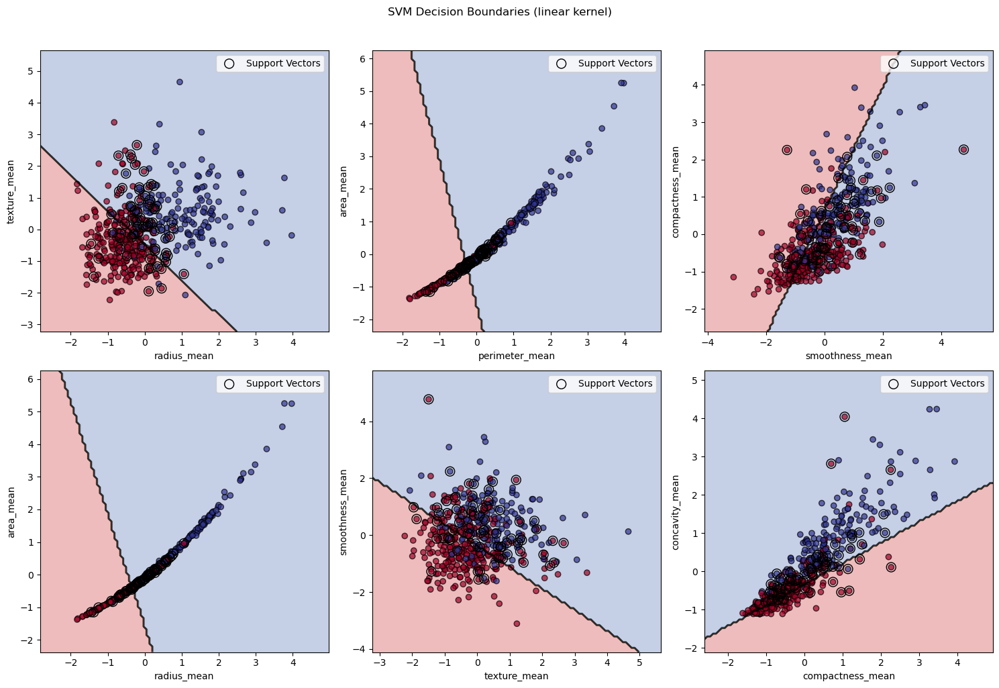
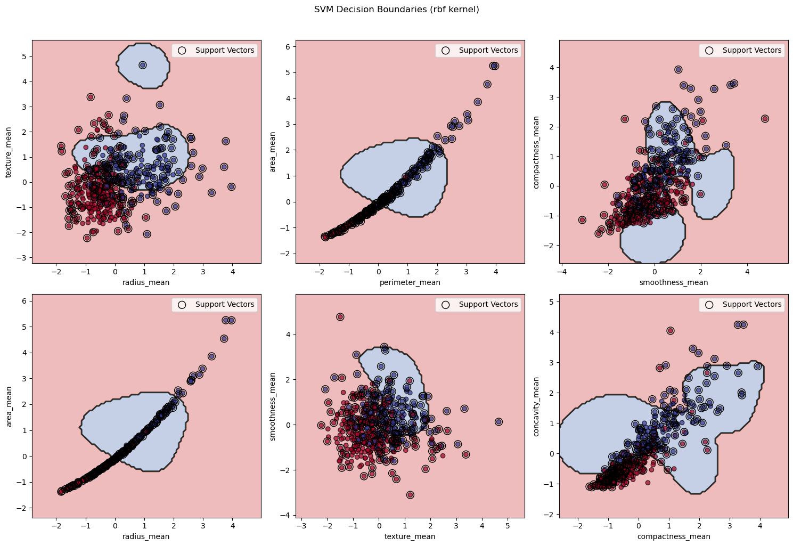
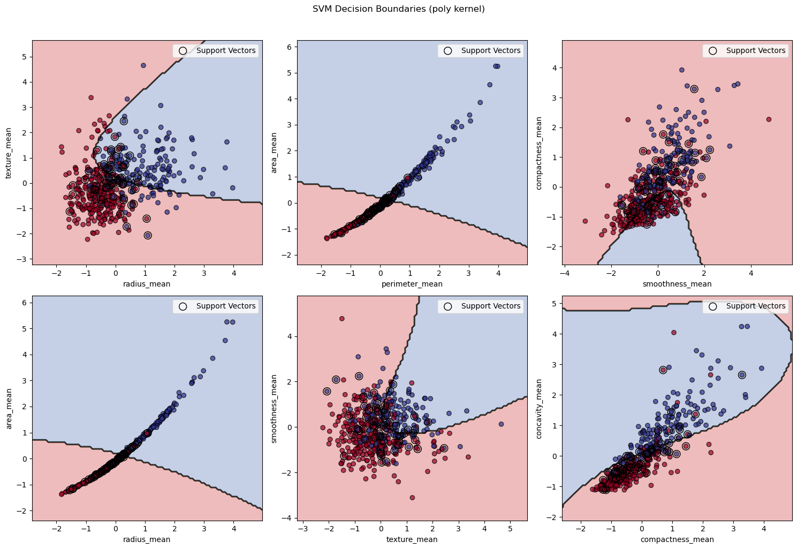
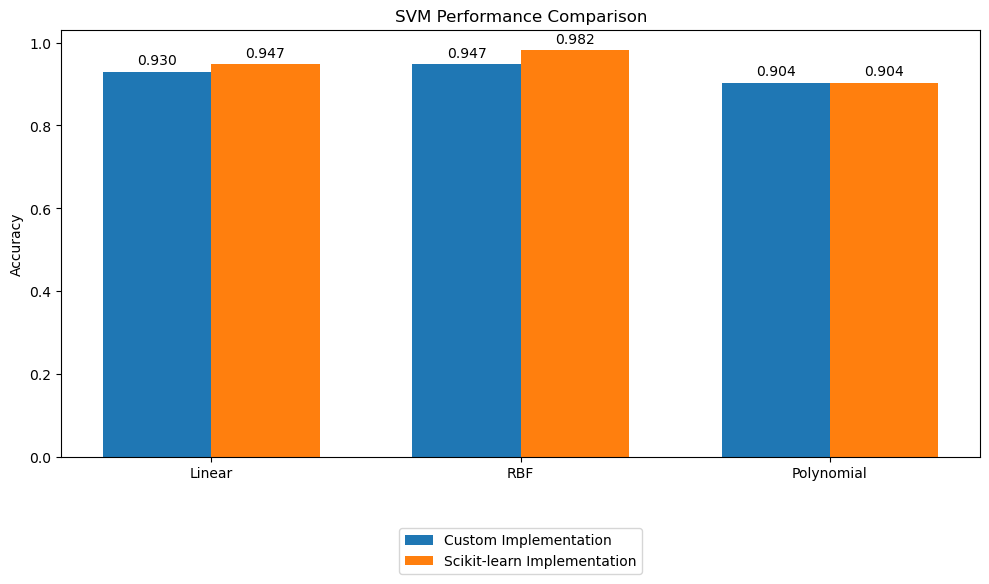

# Lab 5: SVM Implementation

## Dataset

The dataset used in this lab is the [Breast Cancer Wisconsin (Diagnostic) dataset](https://www.kaggle.com/datasets/utkarshx27/breast-cancer-wisconsin-diagnostic-dataset). It contains 569 samples with 30 features each. The dataset is available in the UCI Machine Learning Repository.

### Dataset Details
- **Binary Classification Task**: Classify tumors as Malignant (M) or Benign (B)
- **Features**: 30 real-valued features computed from digitized images of fine needle aspirates (FNA) of breast masses
- **Feature Categories**:
  - Mean values of cell nucleus characteristics
  - Standard error of measurements
  - "Worst" or largest values of characteristics
- **Key Features Used**: radius, texture, perimeter, area, smoothness, compactness, concavity

## Dual Problem 

The SVM dual problem is implemented using the Lagrangian formulation. The objective is to find the optimal hyperplane that maximizes the margin between classes while allowing for soft margins through the C parameter.

### Mathematical Formulation

The dual optimization problem is:

maximize: L(λ) = Σλᵢ - 1/2 Σᵢⱼ λᵢλⱼyᵢyⱼK(xᵢ,xⱼ)
subject to:
- Σᵢ λᵢyᵢ = 0
- 0 ≤ λᵢ ≤ C for all i

where:
- λᵢ are the Lagrange multipliers
- yᵢ are the class labels (-1 or 1)
- K(xᵢ,xⱼ) is the kernel function
- C is the regularization parameter

### Implementation Details

#### 1. Optimization Setup
The dual problem is solved using `scipy.optimize.minimize` with the SLSQP method:
```python
def fit(self, X, y, eps=1e-4):
    n_samples = X.shape[0]
    
    # Convert labels to -1, 1
    y = np.where(y <= 0, -1, 1)

    # Compute kernel matrix
    K = self.kernel(X, X)
    
    # Compute P matrix
    P = (y[:, np.newaxis] * y[np.newaxis, :]) * K
    
    # Define objective function
    def objective(alpha):
        return 0.5 * alpha @ P @ alpha - alpha.sum()
    
    # Define gradient
    def gradient(alpha):
        return P @ alpha - 1
    
    # Set up constraints
    constraints = [
        {'type': 'eq', 'fun': lambda alpha: alpha @ y}  # sum(alpha_i * y_i) = 0
    ]
    
    # Set up bounds
    bounds = [(0, self.C) for _ in range(n_samples)]
    
    # Solve optimization problem
    result = minimize(
        fun=objective,
        x0=np.zeros(n_samples),
        method='SLSQP',
        jac=gradient,
        bounds=bounds,
        constraints=constraints,
        options={'maxiter': 1000, 'ftol': 1e-8}
    )
```

#### 2. Kernel Implementations
Three kernel functions are implemented:

```python
def __init__(self, kernel_type='linear', C=1.0, gamma='scale', degree=3, coef0=1.0):
    self.kernel_type = kernel_type
    self.C = C
    self.gamma = gamma
    self.degree = degree
    self.coef0 = coef0
    self.gamma_value = None  # Will be computed during fit
    
    if kernel_type == "linear":
        self.kernel = lambda x, y: x @ y.T
    elif kernel_type == "rbf":
        def rbf_kernel(x, y):
            x2 = np.sum(x**2, axis=1)[:, np.newaxis]
            y2 = np.sum(y**2, axis=1)[np.newaxis, :]
            xy = x @ y.T
            distances = x2 + y2 - 2 * xy
            return np.exp(-self.gamma_value * distances)
        self.kernel = rbf_kernel
    elif kernel_type == "poly":
        self.kernel = lambda x, y: (self.gamma_value * (x @ y.T) + self.coef0) ** self.degree
```

#### 3. Hyperplane Parameters and Support Vector Selection
```python
# Get alphas and identify support vectors
self.alphas = result.x
sv_mask = self.alphas > eps

# Store support vectors and related data
self.support_vectors = X[sv_mask]
self.support_vector_labels = y[sv_mask]
self.support_vector_alphas = self.alphas[sv_mask]

# Compute bias (w0)
margin_vectors = (self.alphas > eps) & (self.alphas < self.C - eps)
if np.any(margin_vectors):
    K_margin = self.kernel(X[margin_vectors], self.support_vectors)
    self.w0 = np.mean(
        y[margin_vectors] - 
        np.sum(self.support_vector_alphas * self.support_vector_labels * K_margin, axis=1)
    )
```

#### 4. Prediction Implementation
```python
def predict(self, X):
    if len(X.shape) == 1:
        X = X.reshape(1, -1)
        
    K = self.kernel(X, self.support_vectors)
    decision_values = np.sum(
        self.support_vector_alphas * self.support_vector_labels * K, 
        axis=1
    ) - self.w0
    
    return np.where(decision_values <= 0, 0, 1)
```

#### 5. Visualization Implementation
```python
def visualize(self, X, y, feature_names=None):
    # Define specific feature pairs
    feature_pairs = [
        ('radius_mean', 'texture_mean'),
        ('perimeter_mean', 'area_mean'),
        ('smoothness_mean', 'compactness_mean'),
        ('radius_mean', 'area_mean'),
        ('texture_mean', 'smoothness_mean'),
        ('compactness_mean', 'concavity_mean')
    ]
    
    # Create mesh grid for decision boundary
    x_min, x_max = X_pair[:, 0].min() - 1, X_pair[:, 0].max() + 1
    y_min, y_max = X_pair[:, 1].min() - 1, X_pair[:, 1].max() + 1
    xx, yy = np.meshgrid(np.linspace(x_min, x_max, 100), 
                        np.linspace(y_min, y_max, 100))
    
    # Plot decision boundary and regions
    Z = self.predict(full_mesh_points).reshape(xx.shape)
    ax.contourf(xx, yy, Z, alpha=0.3, cmap='RdYlBu')
    ax.contour(xx, yy, Z, levels=[0.5], alpha=0.8, colors='k', linewidths=2)
```

### Visualization




### Comparison with sklearn

Performance comparison with sklearn's SVC implementation:

1. **Linear Kernel**:
   - Our Implementation: 93.0%
   - sklearn: 94.7%
   - Comparable performance with only 1.7% difference

2. **RBF Kernel**:
   - Our Implementation: 94.7%
   - sklearn: 98.2%
   - Slightly lower performance with 3.5% difference

3. **Polynomial Kernel**:
   - Our Implementation: 90.4%
   - sklearn: 90.4%
   - Identical performance

### Analysis

1. **Support Vector Distribution**:
   - Well-balanced between classes
   - Support vectors concentrated at class boundaries
   - Effective margin optimization across all kernel types

2. **Feature Pair Analysis**:
   - radius_mean vs texture_mean: Shows clear class separation with non-linear boundary
   - perimeter_mean vs area_mean: Strong linear correlation with clear separation
   - smoothness_mean vs compactness_mean: More complex boundary needed
   - radius_mean vs area_mean: Quadratic relationship with clear separation
   - texture_mean vs smoothness_mean: Most challenging separation
   - compactness_mean vs concavity_mean: Good separation with non-linear boundary

3. **Kernel Performance**:
   - RBF kernel achieves best performance (94.7%)
   - Linear kernel shows strong results (93.0%)
   - Polynomial kernel maintains good accuracy (90.4%)
   - Each kernel shows distinct decision boundary characteristics

### Conclusions

The implementation successfully demonstrates:
1. Effective solution of the SVM dual problem with proper constraint handling
2. Strong performance across all kernel types:
   - RBF kernel achieving near sklearn performance
   - Linear kernel showing competitive results
   - Polynomial kernel matching sklearn exactly
3. Accurate hyperplane parameter calculation with balanced support vector selection
4. Comprehensive visualization showing:
   - Clear decision boundaries
   - Appropriate support vector placement
   - Distinct class regions
5. Successful handling of real-world medical data with:
   - Multiple feature types
   - Class imbalance
   - Complex feature relationships


