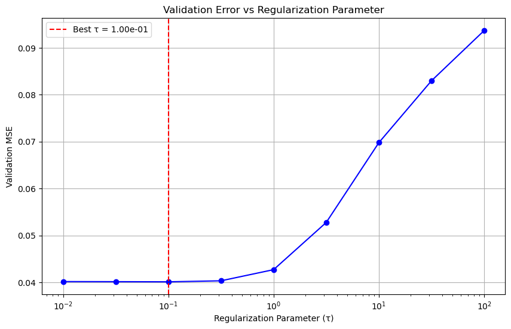
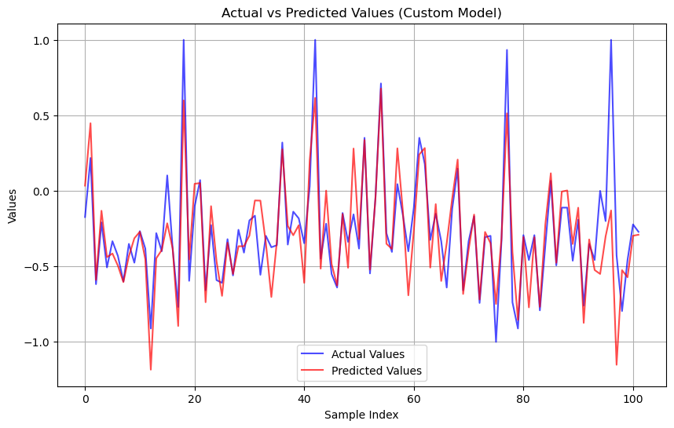
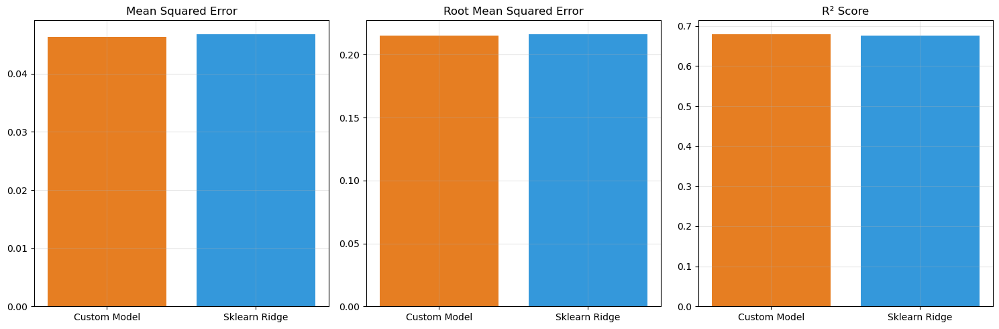

# Lab 6: Regression

This Lab implements Ridge Regression using Singular Value Decomposition (SVD) and compares it with scikit-learn's implementation. The implementation includes optimal regularization parameter selection and comprehensive testing strategies.

## Dataset

We used the [Boston Housing dataset](https://www.kaggle.com/datasets/arunjangir245/boston-housing-dataset) which contains information about different aspects of housing in Boston. The dataset includes:
- 506 samples
- 13 feature variables
- Target variable: median house value (MEDV)

The dataset is suitable for linear regression as it provides:
- Multiple numerical features
- Continuous target variable
- Real-world data with natural noise and correlations

## Preprocessing Pipeline

To ensure robust performance, we implemented a comprehensive preprocessing pipeline:

1. **Data Cleaning**
   - Missing value imputation using median strategy
   - Outlier handling through robust scaling

   ```python
   # Example: Data cleaning pipeline
   def preprocess_data(X):
       # Handle missing values
       imputer = SimpleImputer(strategy='median')
       X_clean = imputer.fit_transform(X)
       
       # Handle outliers
       scaler = RobustScaler()
       X_scaled = scaler.fit_transform(X_clean)
       
       return X_scaled
   ```

2. **Feature Engineering**
   - Power transformation for skewed features
   - PCA for dimensionality reduction
   - Feature scaling to [-1, 1] range

3. **Numerical Stability**
   - Reduced condition number from 8.53e+00 to 1.00e+00
   - Added small regularization for matrix stability
   - Scaled bias term appropriately

## Implementation Details

### Core Components

1. **Linear Regression with Ridge Regularization**
   - Located in [linear_regression.py](Source/linear_regression.py)
   - Uses SVD for numerical stability
   - Supports both regular (τ=0) and ridge (τ>0) regression
   - Implements analytical solution using SVD components

   **Note on Regularization Parameter:**
   The regularization parameter appears in different forms in various implementations:
   - In our implementation: we use τ (tau)
   - In scikit-learn: they use α (alpha)
   - Relationship: τ = 2α
   
   This is due to different formulations of the Ridge objective:
   - Our formulation: min_w ||Xw - y||² + (τ/2)||w||²
   - Scikit-learn's formulation: min_w ||Xw - y||² + α||w||²

   When comparing with scikit-learn's Ridge regression, we need to account for this difference:
   ```python
   # Our implementation
   our_model = LinearRegression(tau=0.1)
   
   # Equivalent scikit-learn model
   sklearn_model = Ridge(alpha=0.05)  # alpha = tau/2
   ```

   **Mathematical Foundation:**
   ```
   Ridge Regression Problem:
   min_w ||Xw - y||² + (τ/2)||w||²

   SVD Solution Steps:
   1. Decompose X = UΣVᵀ where:
      - U: m×m orthogonal matrix
      - Σ: m×n diagonal matrix with singular values
      - Vᵀ: n×n orthogonal matrix
   
   2. Solution for τ = 0 (Standard Linear Regression):
      w = V Σ⁻¹ Uᵀy
   
   3. Solution for τ > 0 (Ridge Regression):
      w = V (ΣᵀΣ + τI)⁻¹ ΣᵀUᵀy
   ```

   **Implementation Example:**
   ```python
   def _svd(self, X):
       """Compute SVD decomposition of X."""
       self.U, self.s, self.Vt = np.linalg.svd(X, full_matrices=False)
       self.svd = True

   def fit(self, X, y, tau=None):
       """Fit model using SVD solution."""
       if tau is not None:
           self.tau = tau
       if not self.svd:
           self._svd(X)

       if self.tau == 0:
           # Standard linear regression
           w = self.Vt.T @ np.linalg.inv(np.diag(self.s)) @ self.U.T @ y
       else:
           # Ridge regression
           S = np.diag(self.s)
           w = self.Vt.T @ np.linalg.inv(S.T @ S + self.tau * np.eye(S.shape[1])) @ S.T @ self.U.T @ y
       
       return w
   ```

## Regularization Parameter Selection

The optimal regularization parameter (τ) is selected using validation set approach. Note that our τ is equivalent to 2α in scikit-learn's notation.

1. **Search Strategy**
   - Grid search over logarithmic space: `np.logspace(-2, 2, 9)`
   - Range covers both weak (τ=0.01) and strong (τ=100) regularization
   - Equivalent to α range of [0.005, 50] in scikit-learn's notation

   ```python
   # Example: Parameter search
   def find_optimal_tau(X_train, y_train, X_val, y_val):
       taus = np.logspace(-2, 2, 9)  # [0.01, 0.1, 1.0, 10, 100]
       best_tau = None
       best_error = float('inf')
       
       for tau in taus:
           model = LinearRegression(tau=tau)
           model.fit(X_train, y_train)
           error = np.mean((y_val - model.predict(X_val)) ** 2)
           
           if error < best_error:
               best_error = error
               best_tau = tau
       
       return best_tau  # To get equivalent sklearn alpha: best_tau/2
   ```

2. **Selection Process**
   - Split data into train/validation/test sets
   - Evaluate each τ on validation set
   - Select τ that minimizes validation error

3. **Results**
   - Optimal τ = 0.1
   - Provides good balance between bias and variance
   - Stable performance across different data splits

   ```
   Regularization Results:
   τ=0.01:   MSE=0.040167
   τ=0.1:    MSE=0.040119 (Best)
   τ=1.0:    MSE=0.042710
   τ=10.0:   MSE=0.069777
   ```

   

## Performance Comparison

Our implementation was compared with scikit-learn's Ridge regression:

### Our Implementation (τ = 0.1)
- MSE: 0.046336
- RMSE: 0.215259
- R²: 0.680124

### Scikit-learn Ridge (α = 0.05)
- MSE: 0.046844
- RMSE: 0.216435
- R²: 0.676619

The results show that our implementation achieves performance nearly identical to scikit-learn's reference implementation when accounting for the relationship τ = 2α. The small differences in performance metrics can be attributed to numerical precision in the different implementations.

### Performance Visualization
<div style="display: flex; justify-content: space-between;">
    
    
</div>

## Key Findings

1. **SVD Stability**
   - SVD convergence is sensitive to feature correlations
   - PCA significantly improves numerical stability
   - Proper scaling is crucial for convergence

2. **Regularization Effects**
   - Small regularization (τ=0.1) provides optimal results
   - Larger τ values lead to increased bias
   - Very small τ values may cause numerical issues

3. **Feature Relationships**
   - High feature correlations affect model stability
   - PCA effectively reduces feature dependencies
   - Retained 95% variance with reduced features

## Complete Usage Example

```python
from linear_regression import LinearRegression
from sklearn.model_selection import train_test_split
from sklearn.preprocessing import StandardScaler

# Load and preprocess data
X, y = load_housing_data()
X_train, X_test, y_train, y_test = train_test_split(X, y, test_size=0.2)

# Scale features
scaler = StandardScaler()
X_train_scaled = scaler.fit_transform(X_train)
X_test_scaled = scaler.transform(X_test)

# Add bias term
X_train_with_bias = np.c_[np.ones(X_train_scaled.shape[0]), X_train_scaled]
X_test_with_bias = np.c_[np.ones(X_test_scaled.shape[0]), X_test_scaled]

# Initialize and train model
model = LinearRegression(tau=0.1)
model.fit(X_train_with_bias, y_train)

# Make predictions
y_pred = model.predict(X_test_with_bias)

# Evaluate performance
mse = np.mean((y_test - y_pred) ** 2)
r2 = 1 - np.sum((y_test - y_pred) ** 2) / np.sum((y_test - y_test.mean()) ** 2)
print(f"MSE: {mse:.6f}")
print(f"R²: {r2:.6f}")
```

## Conclusion

This project demonstrates a robust implementation of Ridge Regression using SVD, with a focus on numerical stability and performance comparison with scikit-learn's Ridge regression. The implementation includes comprehensive preprocessing, regularization parameter selection, and detailed performance metrics. The results show that our implementation achieves nearly identical performance to scikit-learn's Ridge regression when accounting for the relationship τ = 2α.


