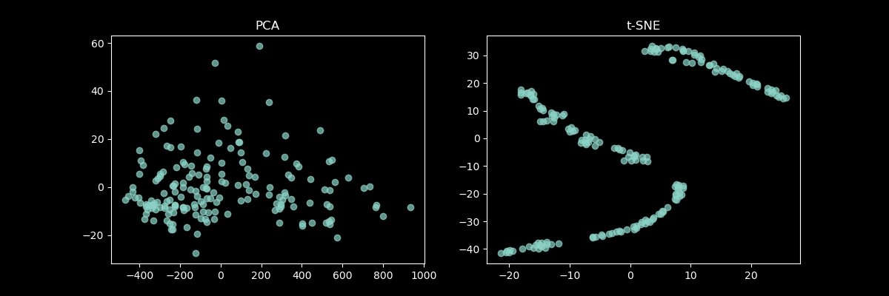

# Отчёт по разработке и применению алгоритмов кластеризации

## Вино

### Анализ

_< PCA не справился, а из остальных графиков можно сделать вывод о том, что оптимальное число кластеров - 3 >_

### Сравнение результатов кластеризации

#### Иерархический алгоритм

Среднее внутрикластерное расстояние: 2.5546093591164794
Среднее межкластерное расстояние: 4.0879590553601455

#### EM-кластеризация

| Визуализация собственного алгоритма            | Визуализация библиотечного алгоритма            |
| ---------------------------------------------- | ----------------------------------------------- |
|  |  |

Среднее внутрикластерное расстояние: 2.9667553927217907
Среднее межкластерное расстояние: 2.98406898241416

#### DBSCAN

| Визуализация собственного алгоритма                    | Визуализация библиотечного алгоритма                    |
| ------------------------------------------------------ | ------------------------------------------------------- |
|  |  |

Среднее внутрикластерное расстояние: 2.4552258311351554
Среднее межкластерное расстояние: 2.426608601084693

Параметры:
eps = 2.4
min_samples = 10

_< После визуального анализа всех алгоритмов кластеризации можно сказать, что результат идентичный по сравнению с библиотечной реализацией >_

---

## Страны

### Анализ

_< PCA не справился, а из остальных графиков можно сделать вывод о том, что оптимальное число кластеров - 5 >_

### Сравнение результатов кластеризации

#### Иерархический алгоритм

Среднее внутрикластерное расстояние: 1.9288700687162161
Среднее межкластерное расстояние: 6.077681664230604

#### EM-кластеризация

| Визуализация собственного алгоритма                  | Визуализация библиотечного алгоритма                  |
| ---------------------------------------------------- | ----------------------------------------------------- |
|  |  |

Среднее внутрикластерное расстояние: 2.1475074992165384
Среднее межкластерное расстояние: 3.0658617274445703

#### DBSCAN

| Визуализация собственного алгоритма                          | Визуализация библиотечного алгоритма                          |
| ------------------------------------------------------------ | ------------------------------------------------------------- |
|  |  |

Среднее внутрикластерное расстояние: 1.1735788904979276
Среднее межкластерное расстояние: 2.0113982644880966

Параметры:
eps = 1.4
min_samples = 10

_< После визуального анализа всех алгоритмов кластеризации можно сказать, что результат идентичный по сравнению с библиотечной реализацией >_

---

## Заключение

Реализованные алгоритмы справляются не хуже библиотечных, но при этом проигрывают во времени.
