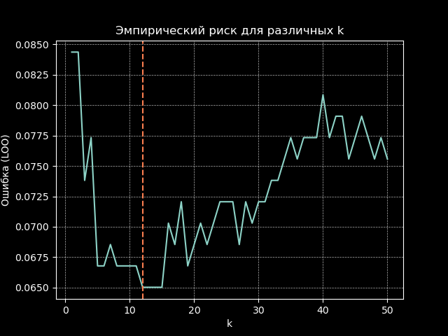

# Реализации алгоритма KNN с окном Парзена

## Введение

Целью работы является реализация алгоритма KNN с методом окна Парзена переменной ширины, использование гауссового ядра, подбор оптимального параметра _k_ методом скользящего контроля (LOO), а также сравнение результатов работы кастомной реализации с библиотечным аналогом из `scikit-learn` по метрикам качества и времени выполнения.

---

## Реализация

### Основные компоненты

1. **Функция гауссового ядра**:

```python
    def gaussian_kernel(distance, h):
        return np.exp(-((distance / h) ** 2) / 2) / (np.sqrt(2 * np.pi) * h)
```

2. **Класс KNNParzen**:
   Реализован метод `predict`, который:

   - Вычисляет евклидовы расстояния между тестовой точкой и всеми обучающими точками.
   - Применяет ядро Парзена с переменной шириной окна.
   - Голосует за классы с использованием весов, полученных из ядра.

3. **LOO-кросс-валидация**:
   Функция `LOO` перебирает значения _k_ и находит значение, при котором эмпирический риск минимальный.

---

## Результаты

### Подбор параметра k

На основе LOO-кросс-валидации был подобран оптимальный параметр _k_, минимизирующий эмпирический риск.

### Таблица результатов

| Реализация              | Accuracy | Precision | Recall | F1-Score | Время работы (сек) |
| ----------------------- | -------- | --------- | ------ | -------- | ------------------ |
| Библиотечная реализация | 0.9298   | 1.0000    | 0.8095 | 0.8947   | 0.0826             |
| Кастомная реализация    | 0.9386   | 1.0000    | 0.8333 | 0.9091   | 0.0364             |

### График эмпирического риска

Ниже представлен график зависимости эмпирического риска от параметра _k_:



---

## Обоснование выбора параметров

1. **Параметр _k_**:

   - Оптимальное значение _k_ было выбрано методом LOO, что гарантирует минимальный эмпирический риск.

2. **Ширина окна _h_**:

   - Параметр _h = 1.0_ был выбран эмпирически для гауссового ядра.

3. **Ядро**:
   - Гауссово ядро было выбрано из-за его гладкости и хорошей сходимости на практике.
