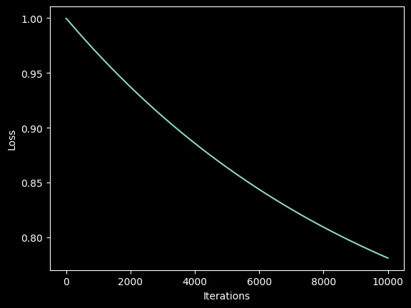
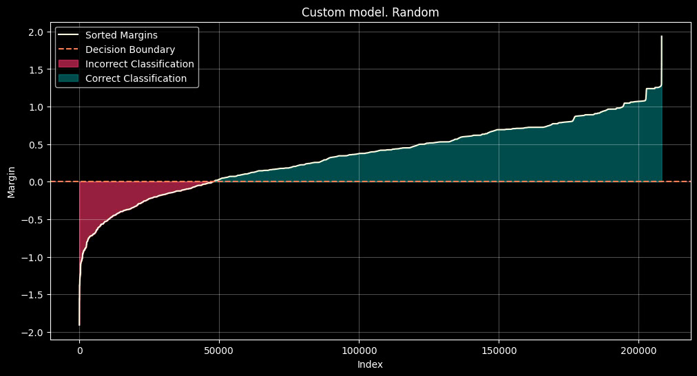
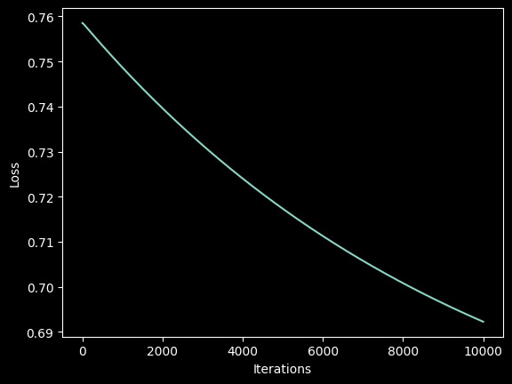
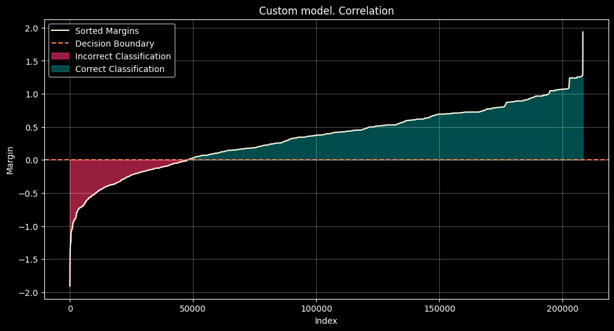
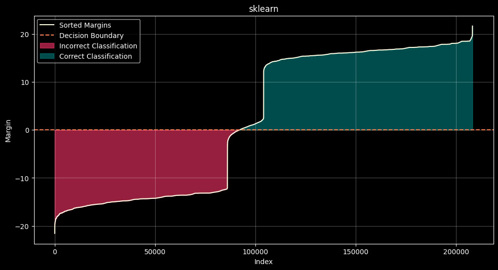

# Отчет о работе

## Введение
Целью данной работы являлось создание кастомной реализации линейного классификатора с различными методами инициализации весов, а также сравнение ее с библиотечной реализацией из `sklearn`.

---

## Методы

### Кастомные реализации
1. Случайная инициализация весов
2. Инициализация весов через корреляцию признаков и меток
3. Инициализация через мультистарт

### Библиотечная модель
Для сравнения была использована библиотечная модель `LogisticRegression` с аналогичными параметрами регуляризации и количеством итераций.

---

## Результаты

### Метрики качества

| Model                   | Accuracy | Precision | Recall | F1-Score | Время (с)  |
|-------------------------|----------|-----------|--------|----------|------------|
| random                  | 0.7691   | 0.7846    | 0.7418 | 0.7626   | 35.2       |
| corr                    | 0.7691   | 0.7846    | 0.7418 | 0.7626   | 34.6       |
| multi                   | 0.7691   | 0.7846    | 0.7418 | 0.7626   | 33.5       |
| sklearn                 | 0.7927   | 0.8137    | 0.7594 | 0.7856   | 0.488      |

### Графики

| Model    | Iterations                                             | Margins                                                  |
|----------|--------------------------------------------------------|----------------------------------------------------------|
| random   |  |  |
| corr     |      |      |
| multi    |    |    |
| sklearn  |                                                        |      |

---

## Анализ результатов

### Сравнение кастомных моделей
Кастомные реализации показали одинаковые метрики качества для всех трех методов инициализации весов. Это указывает на то, что различия в инициализации не влияют на конечный результат.

### Сравнение с библиотечной моделью
Библиотечная модель `LogisticRegression` показала лучшие метрики по сравнению с кастомными реализациями.

### Распределение отступов
1. **Кастомные модели**
- Распределение отступов в кастомных моделях было схожим для всех трех методов инициализации.
- Большинство объектов имело положительные отступы, что говорит о высокой уверенности в классификации.

2. **Библиотечная модель**
- Распределение отступов показало, что библиотечная модель имеет больше объектов с высокими положительными отступами, что объясняет ее лучшие метрики точности и F1-Score.

---

## Заключение
В ходе работы реализованы три варианта кастомного линейного классификатора, а также выполнено сравнение с библиотечной реализацией `LogisticRegression`. Основные выводы:

1. Библиотечная модель показала лучшие результаты за счет использования более точных методов оптимизации.
2. Различия в инициализации весов не оказали влияния на качество кастомных моделей для данного датасета.
3. Анализ распределения отступов подтвердил, что библиотечная модель более уверенно разделяет классы.
