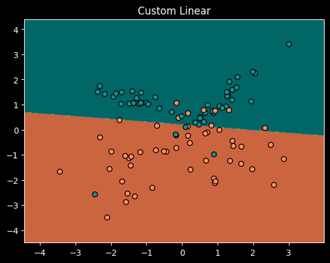
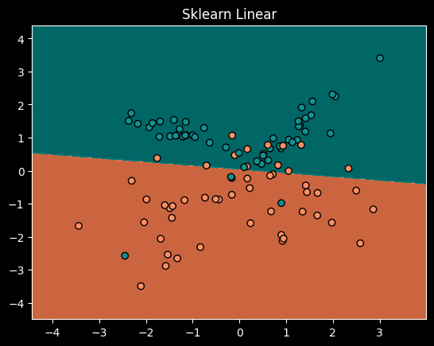
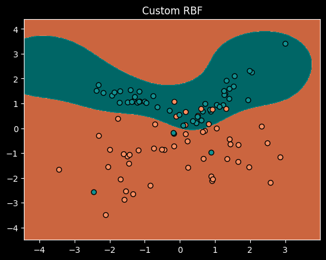
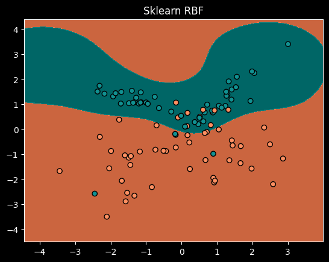
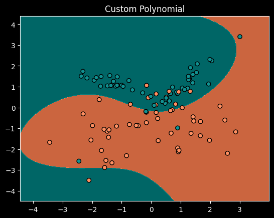
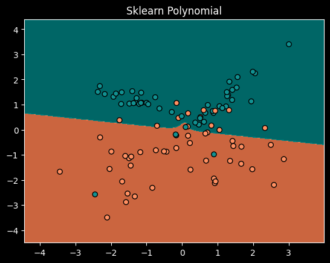

# Отчет о проделанной работе

## Описание задачи

В рамках работы реализована собственная версия метода опорных векторов (SVM) и проведено сравнение с эталонной реализацией из библиотеки `scikit-learn`.

## Данные

- **Датасет:** Генерировался с помощью функции `make_classification` из библиотеки `sklearn`.
- **Объем данных:** 500 объектов, 2 признака.
- **Метрики:** Точность классификации и время работы модели.

## Результаты сравнения

### Таблица с результатами

| Ядро               | Кастомная модель                                                                | Библиотечная модель                                                                    |
|--------------------|---------------------------------------------------------------------------------|----------------------------------------------------------------------------------------|
| **Линейное**       |    Accuracy: 0.86 Время: 13.8s |    Accuracy: 0.83 Время: 2.97ms |
| **RBF**            |    Accuracy: 0.87 Время: 23.5s       |    Accuracy: 0.87 Время: 2.48ms       |
| **Полиномиальное** |    Accuracy: 0.83 Время: 21.2s     |    Accuracy: 0.83 Время: 2.02ms     |

## Выводы

1. **Точность:** Кастомная реализация практически не отличается от библиотечной по точности.
2. **Время работы:** Собственная реализация значительно уступает по времени работы, особенно для ядра RBF и полиномиального.
