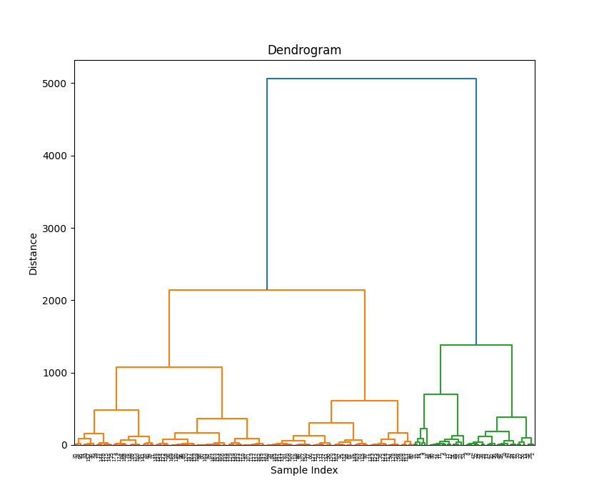
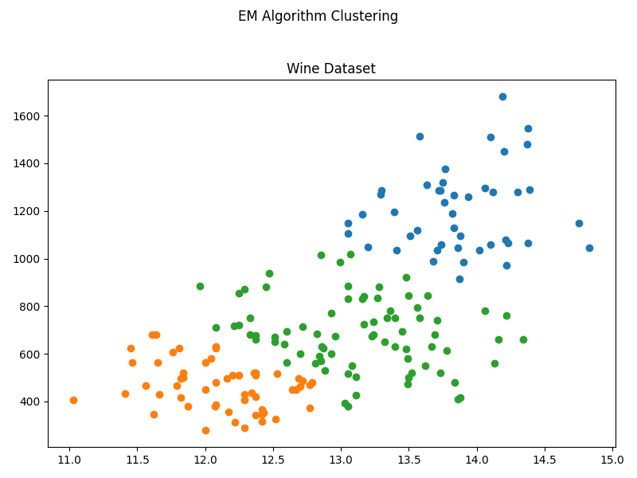
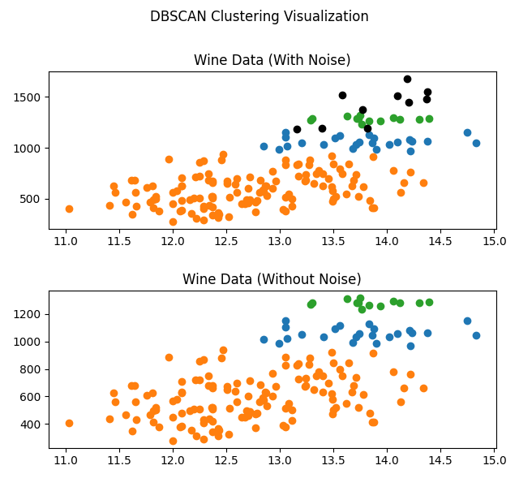

# Лабораторная работа №1. Кластеризация

В данной лабораторной работе были разработаны 3 алгоритма кластеризации: Иерархическая кластеризация, EM и DBSCAN.

## Отчет о работе

Для работы был выбран следующий датасет - [Wine Dataset](https://www.kaggle.com/datasets/harrywang/wine-dataset-for-clustering)

### Иерархическая

Дендрограмма:

Результат:  
Custom implementation: time=8.3146s, intra=81.8783, inter=485.9361  
Library implementation: time=0.0082s, intra=80.4834, inter=459.2570  

### EM

Визуализация:

Результат:  
Custom EM Algorithm:  
Execution Time: 0.0373 seconds  
Average Intra-cluster Distance: 92.4689  
Average Inter-cluster Distance: 495.8715  

Library EM Algorithm:  
Execution Time: 0.0927 seconds  
Average Intra-cluster Distance: 96.2037  
Average Inter-cluster Distance: 483.2618  

### DBSCAN

Визуализация:

Результат:  
Custom DBSCAN took 0.000451184 seconds to complete.  
Custom DBSCAN - Mean intra-cluster distance: 85.7452, Mean inter-cluster distance: 467.7881  
Library DBSCAN took 0.002220631 seconds to complete.  
Library DBSCAN - Mean intra-cluster distance: 87.6151, Mean inter-cluster distance: 463.6480  

