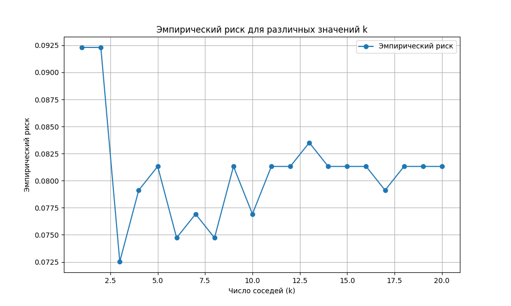

# Лабораторная работа №2. Метрическая классификация

В рамках лабораторной работы был реализован алгоритм классификации KNN и подобран параметр k методом скользящего контроля.

## Отчет о работе

Для работы был выбран следующий датасет - [Mall Customers](https://www.kaggle.com/datasets/abdallahwagih/mall-customers-segmentation)

Побор оптимального значения k:

Результат:  
Оптимальное значение k: 3  
Результаты пользовательской реализации KNN:  
Точность: 0.9298, Время выполнения: 0.0054 секунд  
Результаты библиотечной реализации KNN (sklearn):  
Точность: 0.9298, Время выполнения: 0.0930 секунд  

## Вывод

В результате работы был реализован алгоритм классификации KNN и подобран параметр k при помощи метода скользящего контроля. Полученные значения схожи с эталонными, при этом по времени выполнения пользовательская выигрывает.

