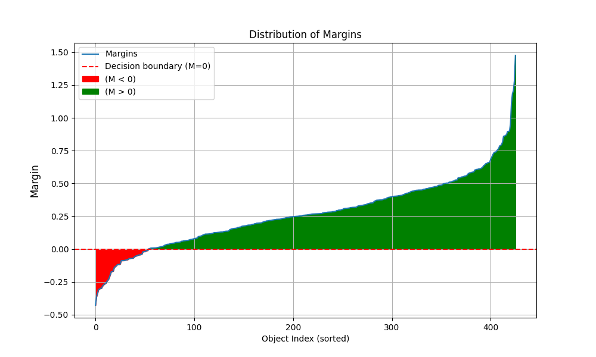

# Лабораторная работа №4. Линейная классификация

В рамках лабораторной работы был реализован линейный классификатор и обучен методом стохастического градиентного спуска с инерцией, с L2 регуляризацией и квадратичной функцией потерь.

## Отчет о работе

Для работы был выбран следующий датасет - [Breast Cancer](https://www.kaggle.com/datasets/rahmasleam/breast-cancer)

Визуализация вычисления отступа объекта:

## Результат

Далее представлен результат выполнения работы  

|   Вывод   |
|---|
| Correlation detected  
Comparison of methods:  
Correlation Initialization: Accuracy = 0.9231, Time = 0.011091948s  
Multi-start Initialization: Accuracy = 0.8811, Time = 0.008382797s  
Random Initialization: Accuracy = 0.8951, Time = 0.005989552s  
Library SGDClassifier: Accuracy = 0.9790, Time = 0.006411552s   |  