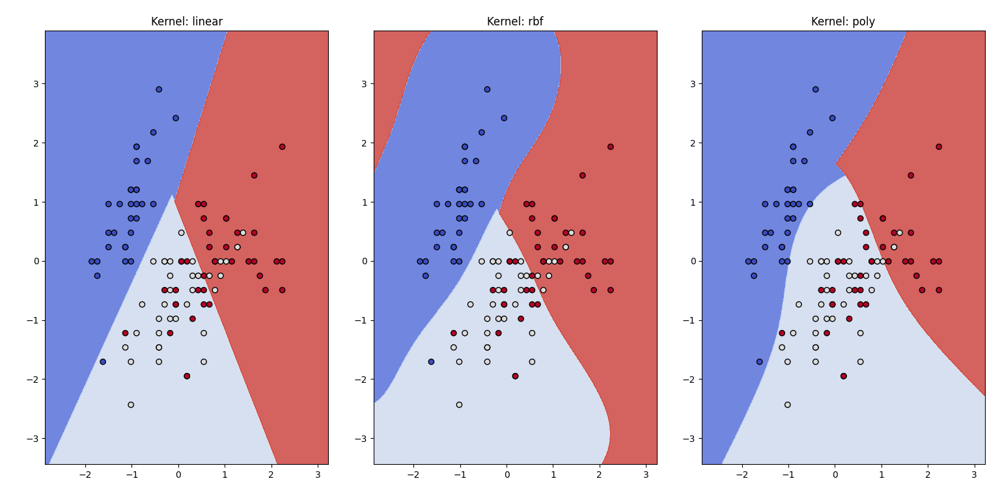

# Лабораторная работа №5. SVM

В рамках лабораторной работы был реализован SVM и проведено сравнение с эталонной реализацией алгоритма.

## Отчет о работе

Было реализовано решение двойственной задачи по лямбда с использованием scipy.optimize.minimize. Также использовались решения с линейным ядром, с RBF и с полиномиальным ядром.

Визуализация:  

Результаты:  

Kernel: linear, Accuracy: 0.5889, Time: 0.1361 seconds  
Kernel: rbf, Accuracy: 0.5889, Time: 103.8123 seconds  
Kernel: poly, Accuracy: 0.5889, Time: 13.3139 seconds  
Library Kernel: linear, Accuracy: 0.9778, Time: 0.0019 seconds  
Library Kernel: rbf, Accuracy: 1.0000, Time: 0.0010 seconds  
Library Kernel: poly, Accuracy: 0.9778, Time: 0.0010 seconds  