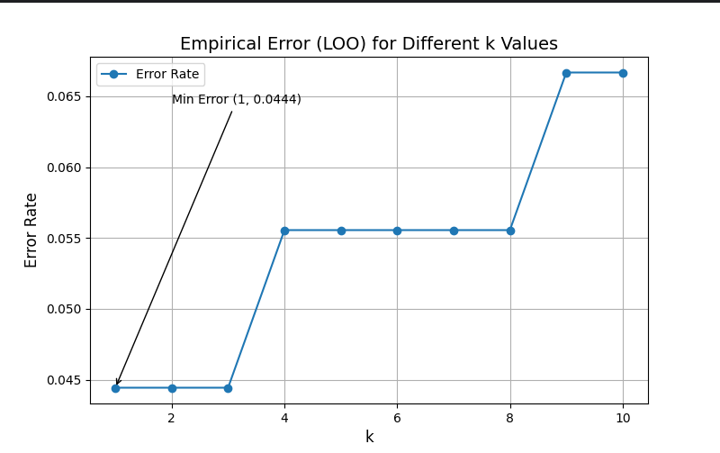

# LAB 2

Был реализован алгоритм KNN с методом окна Парзена переменной ширины

Для подбора параметра k был применен метод Leave One Out

После реализации алгоритма и подбора параметра k, было проведено сравнение нативной реализации с эталонной

Результаты сравнения:  
Optimal k (custom implementation): 1  
Execution time (custom implementation): 114395 microseconds  
Accuracy (custom implementation): 98.33%  
Precision: 0.9841  
Recall: 0.9833  
F1-score: 0.9833  
Optimal k (library implementation): 5  
Execution time (library implementation): 86710 microseconds  
Accuracy (library implementation): 96.67%  
Precision: 0.9694  
Recall: 0.9667  
F1-score: 0.9663

# График ошибки от параметра k 

