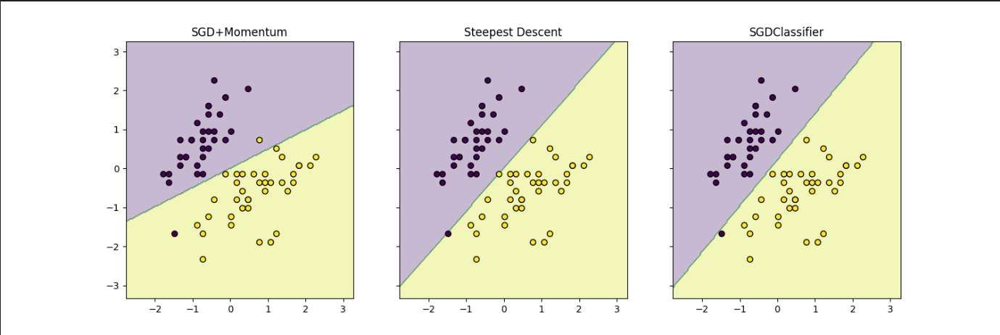

## Используемый набор данных  
Для экспериментов был взят набор данных Iris. Для задачи бинарной классификации были выбраны два класса. Все признаки предварительно приведены к нормальному распределению с применением метода `StandardScaler`.

## Реализация классификаторов  
### Линейный классификатор  
Реализация классификатора выполнена в виде пользовательского класса `CustomLinearClassifier`, поддерживающего два способа оптимизации:  
1. **SGD с использованием момента** — стохастический градиентный спуск, в котором используется момент для ускорения процесса обучения. Градиенты рассчитываются для каждого объекта, а обновление весов производится с учетом сглаживания изменений.  
2. **Ускоренный градиентный спуск** — алгоритм, где величина шага адаптируется на основе нормы градиента, что позволяет быстрее достигать сходимости на начальных этапах.

### Методы инициализации весов  
В классе предусмотрены три подхода к инициализации параметров:  
1. **Все значения равны нулю** — начальное значение всех параметров задается как нулевое.  
2. **Случайные значения** — веса инициализируются малыми случайными числами.  
3. **Корреляционный подход** — параметры задаются в зависимости от корреляции между признаками и метками классов.

### Функция потерь  
Для расчета функции потерь используется квадратичный критерий:  

Градиенты вычисляются с учетом регуляризационного члена, что способствует уменьшению нормы весов в процессе обучения.

### Выбор объектов для обучения  
Чтобы повысить эффективность обучения, приоритет отдается объектам, для которых модель демонстрирует меньшую уверенность. Для этого вычисляются отступы.  
Объекты сортируются по модулю отступов, и обучение фокусируется на наиболее значимых из них.

## Настраиваемые параметры  
### Основные параметры модели:  
1. **`lr` (скорость обучения)** — определяет шаг обновления параметров при оптимизации. По умолчанию: `0.01`.  
2. **`gamma` (момент)** — коэффициент, учитывающий предыдущие значения градиентов. Значение по умолчанию: `0.9`.  
3. **`reg_alpha` (регуляризация)** — регулирует силу штрафов за большие веса. Стандартное значение: `0.01`.  
4. **`epochs` (число эпох)** — количество циклов обучения по всему набору данных. Установленное значение: `50`.  
5. **`init_type` (инициализация весов)** — возможные варианты: `zeros`, `random`, `correlation`.  
6. **`selection` (выбор объектов)** — метод фильтрации объектов (`None` или `margin_selection`).

## Сравнение подходов  
### Обучение  
Для тренировки модели применялись следующие алгоритмы:  
1. **SGD с моментом**:  
   - Весовая инициализация: корреляционный метод.  
   - Эпохи: 10000.  
   - Параметр `alpha`: 0.3.  
   - Достигнутая точность: **1.00**.  
2. **Ускоренный градиентный спуск**:  
   - Весовая инициализация: корреляционный метод.  
   - Эпохи: 10000.  
   - Параметр `alpha`: 0.3.  
   - Достигнутая точность: **1.00**.  

Для проверки использовалась эталонная реализация `SGDClassifier` из библиотеки `sklearn`, продемонстрировавшая аналогичную точность **1.00**.

### Визуализация  
Разделяющие гиперплоскости для каждого метода обучения представлены на графиках:  
1. **SGD с моментом** — обеспечивает высокое качество классификации благодаря моменту.  
2. **Ускоренный градиентный спуск** — точность сравнимая, но алгоритм требует больше времени для достижения сходимости.  
3. **SGDClassifier из sklearn** — стандартное решение, подтверждающее правильность пользовательских методов.\

