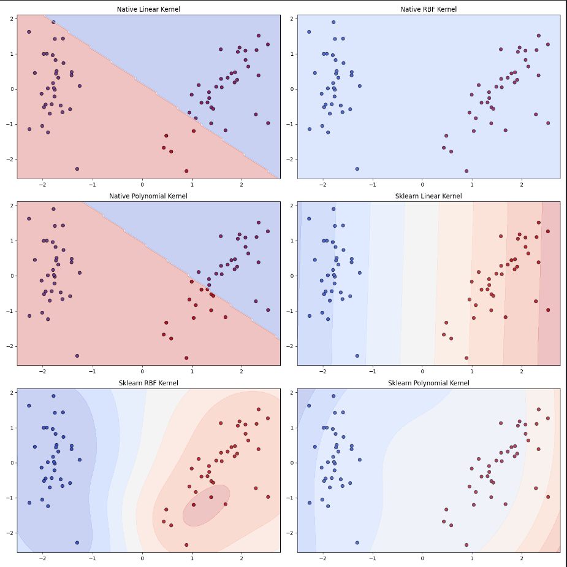

# Lab5
В качестве датасета для классификации был выбран датасет iris

Linear Kernel: 
  Native - Accuracy: 1.0000, Time: 2.9673 seconds  
  Sklearn - Accuracy: 1.0000, Time: 0.0010 seconds  
RBF Kernel: 
  Native - Accuracy: 0.4333, Time: 16.7492 seconds 
  Sklearn - Accuracy: 1.0000, Time: 0.0010 seconds 
Polynomial Kernel: 
  Native - Accuracy: 1.0000, Time: 2.5511 seconds 
  Sklearn - Accuracy: 1.0000, Time: 0.0000 seconds 

Все реализации, за исключением RBF показывают результаты идентичные с библиотечными по точности, но уступают по скорости.

