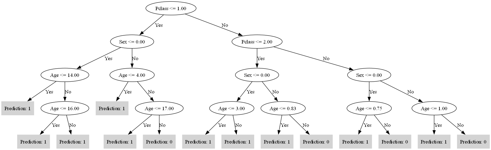
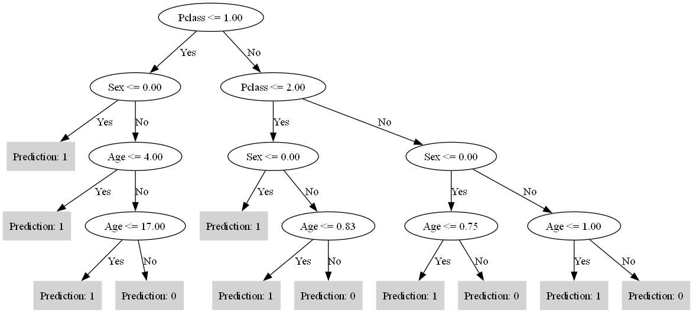
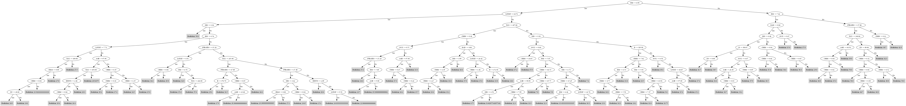

# ID3
## Классификация
В качестве датасета для классификации был выбран датасет пассажиров Титаника https://www.kaggle.com/datasets/shubhamgupta012/titanic-dataset/data

Датасет содержит числовые и категориальные признаки, но не содержит пропуски, поэтому была реализована вспомогательная функция inject_nan_values, позволяющая добавить заданных процент пропусков

Реализуем алгоритм построения дерева ID3 с критерием Донского и многоклассовым энтропийным критерием, а также добавим опциональный прунинг и сравним результаты точности классификации по двух критериям и библиотечной реализацией

Проведем эксперименты с исходным датасетом без пропусков и с добавлением 5% пропусков в каждый признак. Максимальная глубина дерева - 4, с лучшими результатами в ходе экспериментов за рамками отчета.

| Эксперимент                        | Accuracy | Time         |
|------------------------------------|----------|--------------|
| Энтропия без пропусков             | 0.8164   | 0.6422 sec   |
| Энтропия без пропусков с прунингом | 0.8164   | 0.6328 sec   |
| Донского без пропусков             | 0.7903   | 0.5236 sec   |
| Донского без пропусков с прунингом | 0.7903   | 0.5133 sec   |
| Sklearn без пропусков              | 0.8202   | 0.0040 sec   |
| ------------------------           | -------- | ------------ |
| Энтропия с пропусками              | 0.7715   | 0.5603 sec   |
| Энтропия с пропусками и прунингом  | 0.7715   | 0.6025 sec   |
| Донского с пропусками              | 0.7753   | 0.4806 sec   |
| Донского с пропусками и прунингом  | 0.7753   | 0.4972 sec   |
| Sklearn с пропусками               | 0.7715   | 0.0030 sec   |

####  Без пропусков в данных:
- В случае использования библиотечной реализации (Sklearn) достигается наибольшая точность (0.8202) с минимальным временем выполнения (0.0040 сек). Это может свидетельствовать о том, что встроенные методы оптимизированы для работы с такими данными.
- Использование критерия многоклассовой энтропии даёт точность 0.8164, что близко к эталонному результату, но с немного большим временем выполнения (0.6422 сек).
- Критерий Донского показал наименьшую точность среди всех методов (0.7903), что может быть связано с его особенностью выбора наиболее значимых признаков и возможным чрезмерным обобщением, что снижает точность на данных без пропусков.

#### С пропусками в данных:
- После добавления пропусков в датасет критерий Донского показал точность 0.7753, что на 0.0038 выше, чем у библиотечной реализации Sklearn (0.7715), и на 0.0038 выше, чем у критерия многоклассовой энтропии. Это может указывать на то, что критерий Донского более эффективно справляется с отсутствующими данными за счёт своей способности фокусироваться на более значимых признаках.
- Использование многоклассовой энтропии с пропусками дало схожие результаты (0.7715), но с более высоким временем выполнения (0.6025 сек по сравнению с 0.5603 сек без пропусков).

#### С прунингом:
- Применение обрезки дерева в некоторых случаях позволило уменьшить дерево без потреи точности путем обрезки от листа к корню, объединяя узлы, которые не увеличивают ошибку.

Дерево по критерию Донского с пропусками до прунинга

После прунинга

## Регрессия
В качестве датасета для регрессии был выбран датасет цен на жилье https://www.kaggle.com/datasets/fedesoriano/the-boston-houseprice-data

Были внесены некоторые изменения для задачи регрессии, реализован критерий mse.

Эксперименты проводились на датасете до внедрения пропусков по трем критериям - энтропии, донского и mse

Глубина дерева ограничивается 9, при которых наблюдаются сравнительно высокие показатели точности.

Сравним результаты экспериментов по R^2

| Эксперимент                        | R^2      | Time         |
|------------------------------------|----------|--------------|
| Энтропия без пропусков             | 0.6375   | 11.2131 sec  |
| Энтропия без пропусков с прунингом | 0.6375   | 11.4590 sec  |
| Донского без пропусков             | 0.6004   | 8.8647 sec   |
| Донского без пропусков с прунингом | 0.5931   | 8.9767 sec   |
| MSE без пропусков                  | 0.7112   | 14.6025 sec  |
| MSE без пропусков с прунингом      | 0.7137   | 15.1055 sec  |
| Sklearn (mse) без пропусков        | 0.6682   | 0.0044 sec   |
| ------------------------           | -------- | ------------ |
| Энтропия с пропусками              | 0.2709   | 8.1622 sec   |
| Энтропия с пропусками и прунингом  | 0.2709   | 8.8542 sec   |
| Донского с пропусками              | 0.3447   | 6.0666 sec   |
| Донского с пропусками и прунингом  | 0.3323   | 6.2599 sec   |
| MSE с пропусками                   | 0.6759   | 11.7005 sec  |
| MSE с пропусками и прунингом       | 0.6805   | 11.3918 sec  |
| Sklearn (mse) с пропусками         | 0.6383   | 0.0062 sec   |

####  Без пропусков в данных:
- Критерий Донского и критерий многоклассовой энтропии продемонстрировали стабильно низкие значения R², что указывает на их меньшую эффективность в задаче регрессии по сравнению с критерием MSE.
- Ручная реализация с MSE показала наилучшие результаты, с R² равным 0.7112 без прунинга и 0.7137 с прунингом. Это подтверждает, что критерий MSE работает наиболее эффективно в контексте задачи регрессии.
- Библиотечная реализация Sklearn по mse показала приемлемые результаты с R² равным 0.6682, однако её время выполнения значительно быстрее, чем у других методов.
#### С пропусками в данных:
- При добавлении пропусков в данные, критерий MSE по-прежнему показал лучшие результаты по точности: 0.6759 без прунинга и 0.6805 с прунингом.
- Критерий Донского и энтропии при наличии пропусков показали значительно более низкие результаты в задаче регрессии.
- Библиотечная реализация Sklearn также уступила ручной реализации с R² равным 0.6682, однако её время выполнения значительно быстрее, чем у других методов.

Дерево после прунинга по MSE

## Вывод
Деревья решений являются универсальными инструментами, позволяющие решать как для задачи классификации, так и задачи регрессии. Для классификации критерий многоклассовой энтропии показал лучшие результаты, особенно при работе с данными без пропусков. 
В случае наличия пропусков в данных, критерий Донского, ориентированный на выбор значимых признаков, может показать более высокие результаты.
Однако для задач регрессии деревья решений не являются лучшим выбором. При увеличении числа признаков деревья становятся громоздкими и склонными к переобучению, что ухудшает качество модели и время ее обучения.