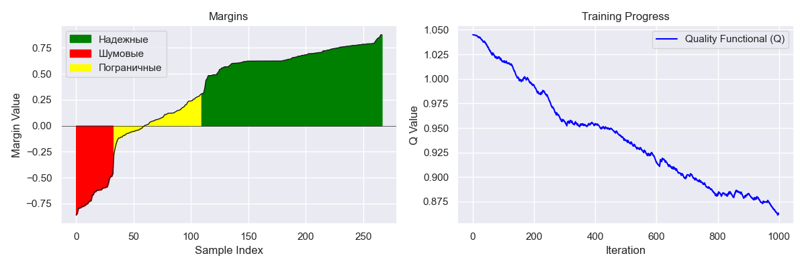
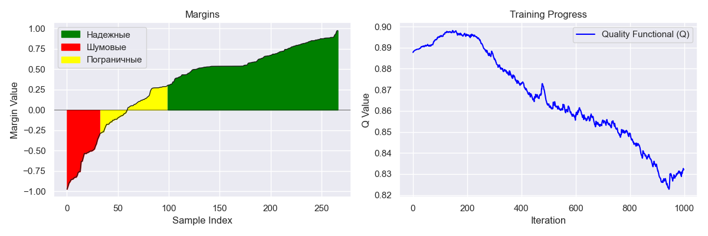

# Линейная классификация
В качестве датасета для классификации был выбран датасет пассажиров Титаника https://www.kaggle.com/datasets/shubhamgupta012/titanic-dataset/data

В классификаторе реализовано вычисление и визуализация отступов, вычисление градиента функции потерь, реккурентная оценка функционала качества с последующим выводом графика.
Реализованы опционально включаемые: L2-регуляризация, Моменты Нестерова, скорейший градиентный спуск, выбор объектов по отступу.

Рассмотрим результаты экспериментов:

# Эксперимент: GD
**Параметры классификатора:**
- learning_rate = 0.01
- start_weights = random
- l2 = None
- momentum = None
- forget_temp = 0.001
- fast_gd = False
- margin_based_sampling = False

**Результаты:**
- Время: 0.4493 секунд
- Точность: 0.7640

---
# Эксперимент: NAG  
**Параметры классификатора:**  
- learning_rate = 0.01  
- start_weights = random  
- l2 = None  
- momentum = 0.05  
- forget_temp = 0.001  
- fast_gd = False  
- margin_based_sampling = False  

**Результаты:**  
- Время: 0.5130 секунд  
- Точность: 0.7828  

---

# Эксперимент: L2  
**Параметры классификатора:**  
- learning_rate = 0.01  
- start_weights = random  
- l2 = 0.01  
- momentum = None  
- forget_temp = 0.001  
- fast_gd = False  
- margin_based_sampling = False  

**Результаты:**  
- Время: 0.5069 секунд  
- Точность: 0.7753  

---

# Эксперимент: Fast  
**Параметры классификатора:**  
- learning_rate = 0.01  
- start_weights = random  
- l2 = 0.01  
- momentum = 0.05  
- forget_temp = 0.001  
- fast_gd = True  
- margin_based_sampling = False  

**Результаты:**  
- Время: 0.3405 секунд  
- Точность: 0.6891  

---

# Эксперимент: Margin_based  
**Параметры классификатора:**  
- learning_rate = 0.01  
- start_weights = random  
- l2 = 0.01  
- momentum = 0.05  
- forget_temp = 0.001  
- fast_gd = False  
- margin_based_sampling = True  

**Результаты:**  
- Время: 3.7410 секунд  
- Точность: 0.7753  

---

# Эксперимент: Correlation  

Проверим, что сильной корреляции между признаками не наблюдается

**Параметры классификатора:**  
- learning_rate = 0.01  
- start_weights = correlation  
- l2 = 0.01  
- momentum = 0.05  
- forget_temp = 0.001  
- fast_gd = False  
- margin_based_sampling = False  

**Результаты:**  
- Время: 0.4486 секунд  
- Точность: 0.6067  

---

# Эксперимент: Multistart  
**Параметры классификатора:**  
- learning_rate = 0.01  
- start_weights = multistart  
- l2 = 0.01  
- momentum = 0.05  
- forget_temp = 0.001  
- fast_gd = False  
- margin_based_sampling = False  

**Результаты:**  
- Время: 3.7298 секунд  
- Точность: 0.7715  

---

# Эксперимент: NAG+L2  
**Параметры классификатора:**  
- learning_rate = 0.01  
- start_weights = random  
- l2 = 0.01  
- momentum = 0.05  
- forget_temp = 0.001  
- fast_gd = False  
- margin_based_sampling = False  

**Результаты:**  
- Время: 0.4548 секунд  
- Точность: 0.7753

---

# Эксперимент: SKLEARN  
**Параметры классификатора:**  
- Используется стандартный классификатор SGDClassifier из библиотеки sklearn  

**Результаты:**  
- Время: 0.0021 секунд  
- Точность: 0.7378  

---
# Итоговая таблица

| Эксперимент  | Точность  | Время (сек) |
|--------------|-----------|-------------|
| GD           | 0.7640    | 0.4493      |
| NAG          | 0.7828    | 0.5130      |
| L2           | 0.7753    | 0.5069      |
| Fast         | 0.6891    | 0.3405      |
| Margin_based | 0.7753    | 3.7410      |
| Correlation  | 0.6067    | 0.4486      |
| Multistart   | 0.7715    | 3.7298      |
| NAG+L2       | 0.7753    | 0.4548      |
| **SKLEARN**  | 0.7378    | 0.0021      |

Можем заметить, что все эксперименты показали достаточно высокие показатели, добавление моментов Нестерова и L2 регуляризации повысило качество модели.

Применение моментов Нестерова и L2 регулярищации показало большую точность, по сравнению с реализацией sklearn, но уступает по времени библиотечному классификатору.

