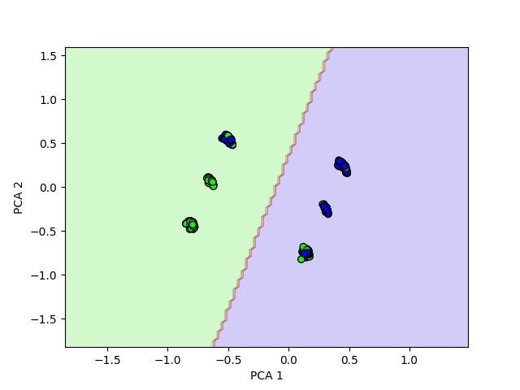
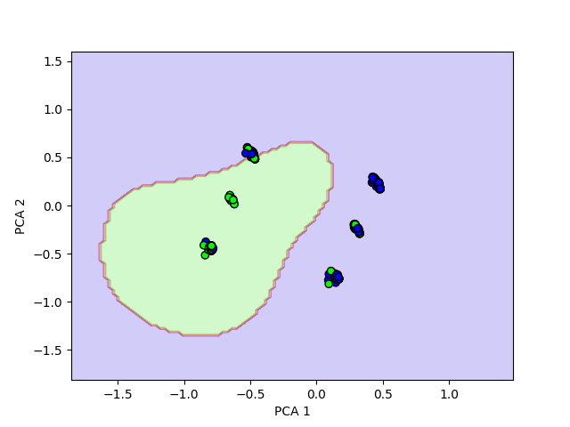
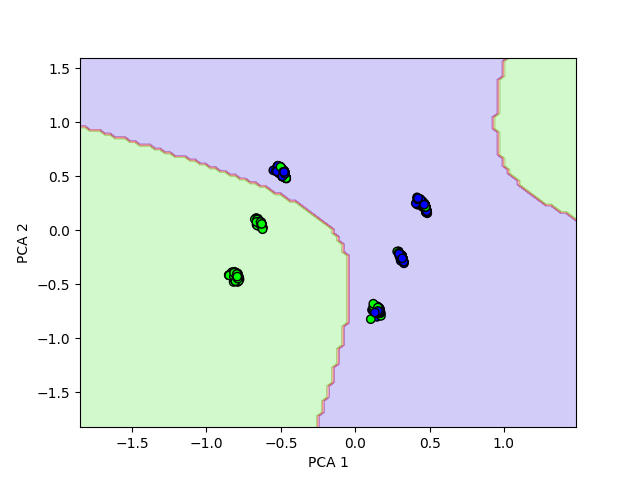
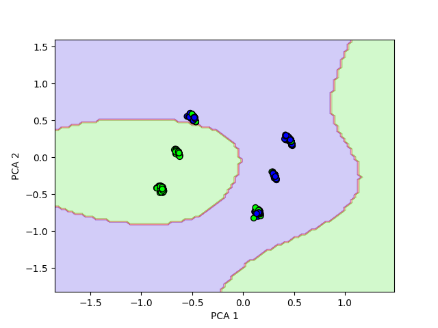

# SVM
В качестве датасета для классификации был выбран датасет пассажиров Титаника https://www.kaggle.com/datasets/shubhamgupta012/titanic-dataset/data

Реализовано решение двойственной задачи с линейным ядром, с rbf, с полиномиальным ядром.
Для оптимизации вычислений используется библиотека cvxopt, которая в данной задаче срабатала несколько быстрее.

## Эксперименты
| Эксперимент                     | Точность | Время (секунды) |
|---------------------------------|----------|-----------------|
| Linear kernel                   | 0.7978   | 0.2805          |
| RBF kernel                      | 0.7865   | 0.3080          |
| Polynomial kernel ^2            | 0.7790   | 0.2890          |
| Polynomial kernel ^3            | 0.7790   | 0.3659          |
|---------------------------------|----------|-----------------|
| Sklearn Linear kernel           | 0.7978   | 0.0050          |
| Sklearn RBF kernel              | 0.7790   | 0.0040          |
| Sklearn Polynomial kernel ^2    | 0.7978   | 0.0050          |
| Sklearn Polynomial kernel ^3    | 0.7790   | 0.0041          |

Заметим, что ручная реализация линейного ядра показывает схожие результаты с библиотечной реализацией, но занимает значительно больше времени.
Реализация RBF ядра обгоняет по точности библиотечную реализацию, но также уступает по времени.
Полиномиальное ядро второй степени 2 уступает библиотечной реализации, а степени 3 соответствует ей по качеству.

## Линейное ядро

## RBF ядро

## Полиномиальное ядро степени 2

## Полиномиальное ядро степени 3
