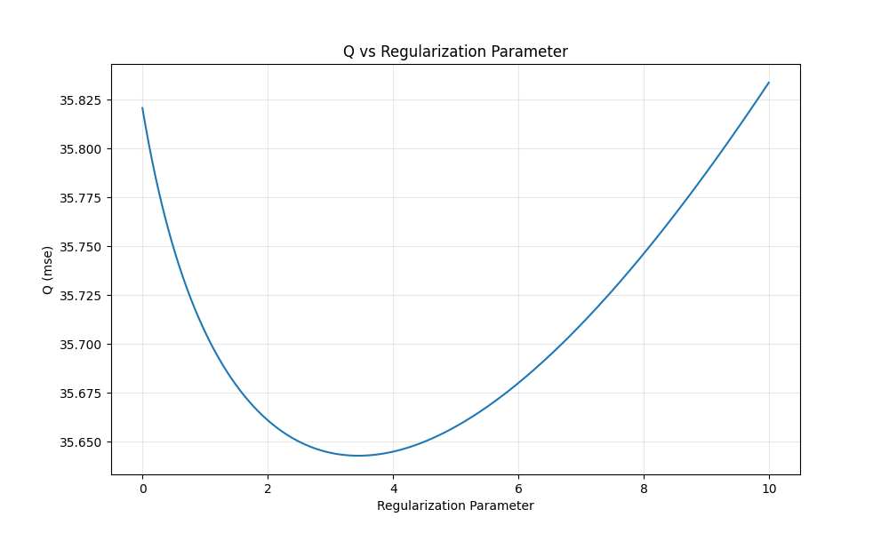
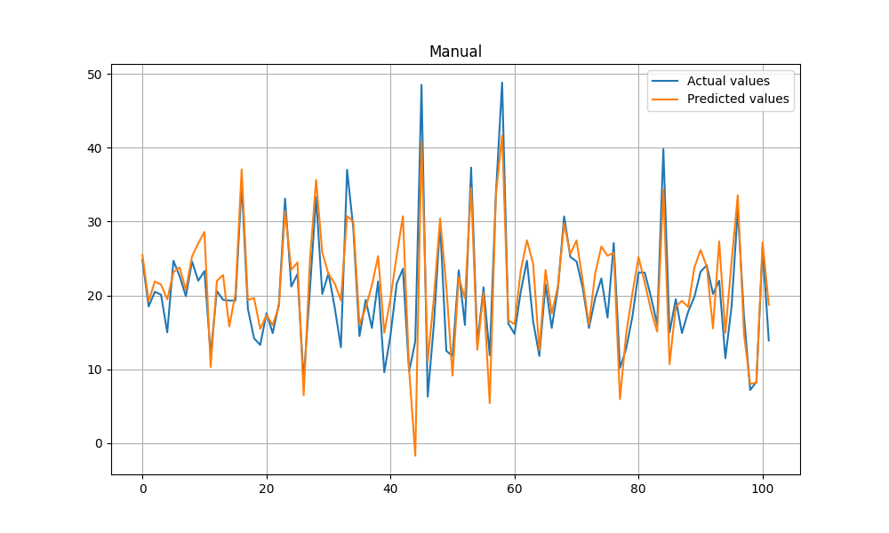
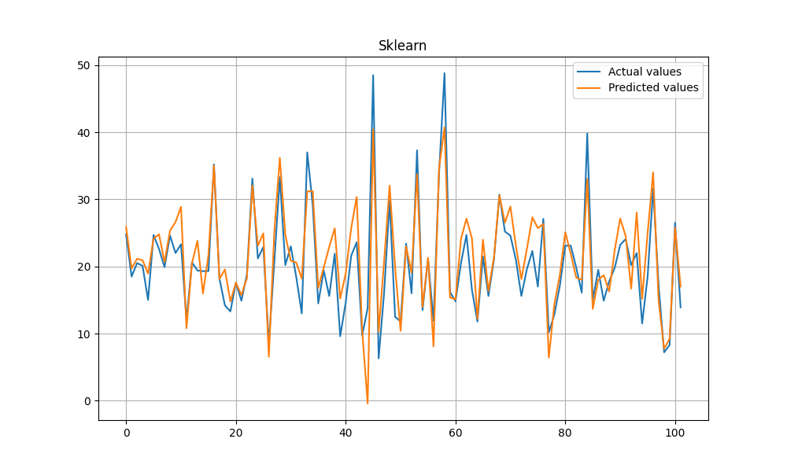
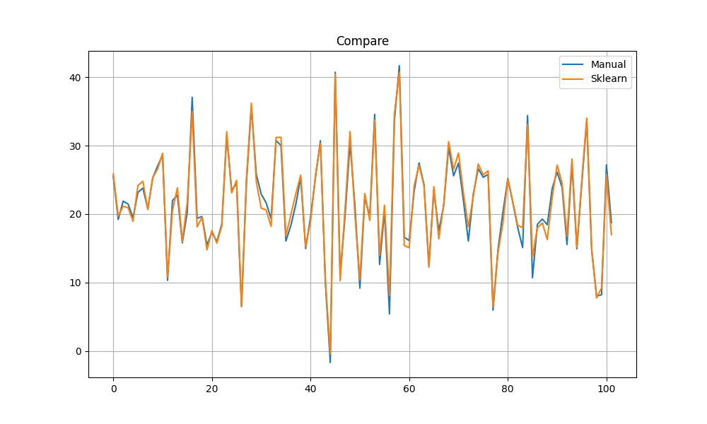

# Регрессия

В качестве датасета для регрессии был выбран датасет цен на жилье https://www.kaggle.com/datasets/fedesoriano/the-boston-houseprice-data

Реализовано реализовать решение задачи гребневой регрессии через сингулярное разложение

Для подбора параметра реализована функция перебора по заданному диапазону с целью минимизации mse

Исходный датасет был разделен на тренировочную (60%), валидационную (20%) и тестовую (20%) выборки. 
Валидационная выборка использовалась для поиска оптимального параметра, эксперименты проводились на тестовой выборке.

- Optimal alpha: 3.44
- Time spent on finding the optimal parameter: 0.4937 seconds

Результаты сравнения ручной реализации и библиотечного решения приведены в таблице

| Эксперимент | MSE    | MAE     | R^2     | Time       |
|-------------|--------|---------|---------|------------|
| Manual      | 14.503 | 2.88189 | 0.74625 | 0.0010 sec |
| Sklearn     | 13.857 | 2.82349 | 0.74912 | 0.0030 sec |

Ручная реализация показывает схожие значения точности, затрачивая при этом чуть меньше времени.

График предсказаний ручной модели относительно действительных данных:

График предсказаний библиотечной модели относительно действительных данных:

Сравнение ручных и библиотечных предсказаний:

