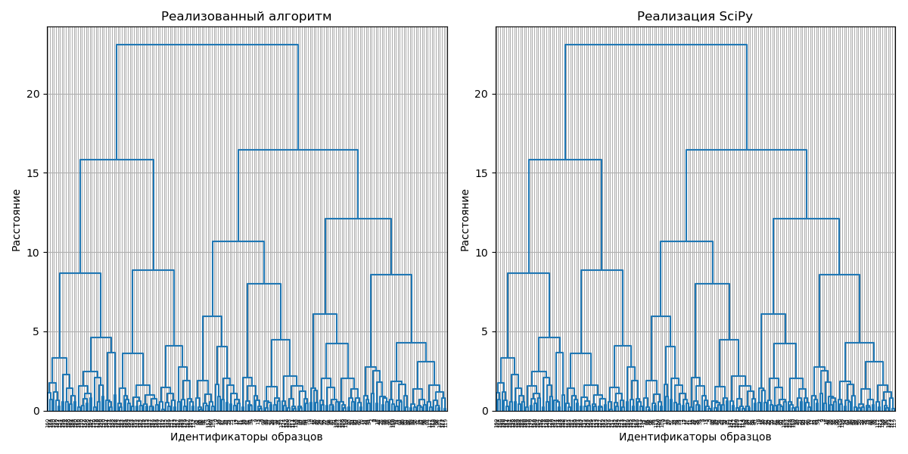

# Лабораторная работа №1. Кластеризация

## Выбор датасетов
Для выполнения лабораторной работы были выбраны следующие датасеты:
1. **Wine Dataset**: Этот датасет содержит химические свойства различных вин.
    ```python
    wine_df = kagglehub.dataset_download("harrywang/wine-dataset-for-clustering")
    ```

2. **Customer Segmentation Dataset**: Этот датасет содержит данные о покупательском поведении клиентов.
    ```python
    mall_df = kagglehub.dataset_download("vjchoudhary7/customer-segmentation-tutorial-in-python")
    ```

## Визуализация данных:
  
*Рисунок 1: Визуализация данных wine_df с использованием PCA и t-SNE*
  
*Рисунок 2: Визуализация данных mall_df с использованием PCA и t-SNE*

## Иерархическая кластеризация

### Построенные дендрограммы:

*Рисунок 3: Дендрограмма wine_df*

*Рисунок 4: Дендрограмма mall_df*


Построенные графики не отличаются от эталонной реализации.  
Оптимальное количество кластеров для wine_df - 3.  
Оптимальное количество кластеров для mall_df - 5 (основываясь на дендрограмме и визуализации данных).  


## EM-алгоритм
В процессе реализации EM-алгоритма был получен результат, который был сравнен с эталонной реализацией из библиотеки sklear:


*Рисунок 5: Результат EM-алгоритма для wine_df*

Были рассчитаны основные метрики (время выполнения, среднее внутрикластерное и среднее межкластерное расстояние):
```
Время выполнения кастомной функции: 0.0070 секунд
Время выполнения sklearn функции: 0.2030 секунд
Среднее внутрикластерное расстояние (кастомная функция): 3.5139
Среднее межкластерное расстояние (кастомная функция): 5.5483
Среднее внутрикластерное расстояние (sklearn функция): 3.5662
Среднее межкластерное расстояние (sklearn функция): 5.5632
```


*Рисунок 6: Результат EM-алгоритма для mall_df*

Были рассчитаны основные метрики (время выполнения, среднее внутрикластерное и среднее межкластерное расстояние):
```
Время выполнения кастомной функции: 0.0030 секунд
Время выполнения sklearn функции: 0.0110 секунд
Среднее внутрикластерное расстояние (кастомная функция): 2.0335
Среднее межкластерное расстояние (кастомная функция): 3.2743
Среднее внутрикластерное расстояние (sklearn функция): 1.6051
Среднее межкластерное расстояние (sklearn функция): 3.9779
```

Кастомная реализация показала сопоставимые метрики (небольшое отличие во внутрикластерном и межкластерном расстояниях) при существенно меньшем времени выполнения по сравнению с библиотечной функцией, что указывает на похожее качество кластеризации и более высокую производительность кастомного метода.

## DBSCAN
Для DBSCAN также был получен итоговый результат, представленный в виде следующих графиков:


*Рисунок 7: Результат EM-алгоритма для wine_df*

Были рассчитаны основные метрики (время выполнения, среднее внутрикластерное и среднее межкластерное расстояние):
```
Время выполнения кастомной функции DBSCAN: 0.0060 секунд
Время выполнения sklearn функции DBSCAN: 0.0040 секунд
Среднее внутрикластерное расстояние (кастомная функция): 3.5622
Среднее межкластерное расстояние (кастомная функция): 5.6303
Среднее внутрикластерное расстояние (sklearn функция): 3.5622
Среднее межкластерное расстояние (sklearn функция): 5.6303
```


*Рисунок 8: Результат EM-алгоритма для mall_df*

Были рассчитаны основные метрики (время выполнения, среднее внутрикластерное и среднее межкластерное расстояние):
```
Время выполнения кастомной функции DBSCAN: 0.0040 секунд
Время выполнения sklearn функции DBSCAN: 0.0020 секунд
Среднее внутрикластерное расстояние (кастомная функция): 1.1675
Среднее межкластерное расстояние (кастомная функция): 2.8152
Среднее внутрикластерное расстояние (sklearn функция): 1.1675
Среднее межкластерное расстояние (sklearn функция): 2.8152
```

Подытожив, кастомная функция DBSCAN выполняется дольше, чем функция sklearn. Средние внутрикластерные расстояния одинаковы для обеих реализаций, а средние межкластерные расстояния также совпадают, что указывает на сходство результатов кластеризации.