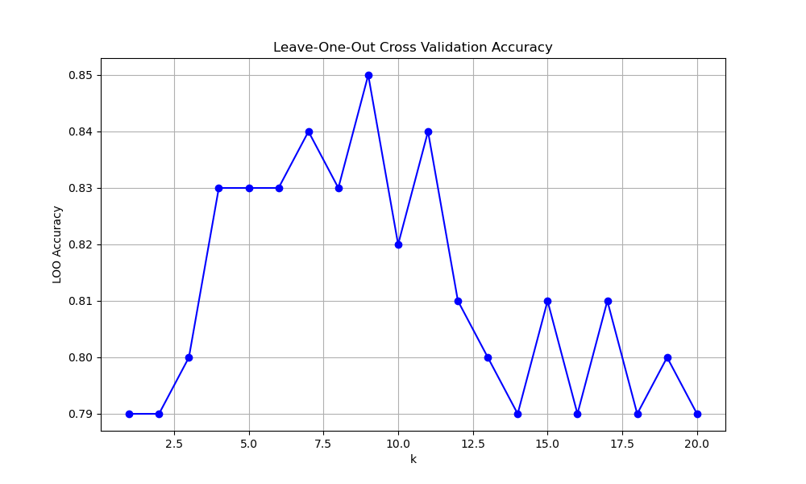

# Lab 2

## Данные

Для задачи классификации выбран датасет Mountains vs Beaches Preference. Датасет содержит информацию о предпочтениях людей между горами и пляжами.

**Источник:** [Kaggle - Mountains vs Beaches Preference](https://www.kaggle.com/datasets/jahnavipaliwal/mountains-vs-beaches-preference)

**Структура данных:**
- **Признаки:**
  - **Возраст (Age):** Возраст респондента.
  - **Пол (Gender):** Пол респондента.
  - **Доход (Income):** Уровень дохода.
  - **Образование (Education):** Уровень образования.
  - **Страна (Country):** Страна проживания.
  - **Остальные характеристики:** Можно ознакомиться в источнике.
  
- **Целевой признак:**
  - **Preference:** Предпочтение — `Mountain` (горы) или `Beach` (пляжи).

Для более быстрой обрботки данных алгоритмом, случайным образом из более 50 тысяч записей были выбраны 6 тысячи (3тыс гор + 3 тыс пляжей)
```python
beach_samples = df[df['Preference'] == 0].sample(n=3000, random_state=42)
mountain_samples = df[df['Preference'] == 1].sample(n=3000, random_state=42)

df_balanced = pd.concat([beach_samples, mountain_samples])

df_balanced = df_balanced.sample(frac=1, random_state=42).reset_index(drop=True)
```

**Визуализацияч данных:**  


## Реализация KNN
Функция knn_predict_parzen реализует метод k-ближайших соседей сиспользованием подхода Парзена для взвешивания соседей. (В качестве ядра взято гаусово ядро)  

Основные шаги:
1. **Вычисление расстояний:**  
    Для каждой тестовой точки вычисляются евклидовы расстояния до   всехобучающих точек.
2. **Выбор k ближайших соседей:**  
    Определяются индексы k ближайших обучающих точек на основе наименьших   расстояний.
3. **Адаптивный параметр сглаживания (bandwidth) h:**  
    Вычисляется медиана расстояний среди k ближайших соседей.
    Если h равен нулю, используется среднее значение расстояний сдобавлением малого значения для избегания деления на ноль.
4. **Взвешивание соседей с помощью гауссового ядра:**  
    Применяется функция gaussian_kernel для вычисления весов на основе расстояний и ширины h.
5. **Взвешенное голосование:**  
    Для каждого класса суммируются веса соседей.
    Предсказание класса происходит на основе сравнения суммарных весов поклассам.
6. **Формирование предсказаний:**  
    Для каждой тестовой точки добавляется предсказанный класс в список  predictions, который возвращается в виде массива.

## Подбор параметра k методом скользящего контроля (LOO)  
При использовании LOO каждый экземпляр данных по очереди выступает в роли тестовой выборки, тогда как оставшиеся экземпляры используются для обучения модели. Процесс повторяется n раз, где n — общее количество наблюдений в датасете.


*Рисунок 1: График LOO*  

Ось k - представляет количество ближайших соседей k используемых в алгоритме KNN, диапазон от 1 до 20.  
Ось LOO Accuracy - отображает точность модели, полученную с помощью метода LOO. Единицы измерения - доля правильных предсказаний.  

Точка на графике, где LOO Accuracy достигает пика, указывает на оптимальное количество соседей для модели KNN.  
**Итог:**
```bash
Optimal k value: 9
Test accuracy with k=9: 0.8792
```

## Графики эмпирического риска для различных k


**Значения осей:**

- **Ось k:** представляет количество ближайших соседей k используемых в алгоритме KNN, диапазон от 1 до 20.

- **Ось Error Rate:** Отображает уровень ошибки модел, где значения принимаются от 0 до 1, 0 — означает отсутствие ошибок, а 1 — полную ошибку.

**Легенда:**

- **Training Error (Ошибка на обучающей выборке):**  
    Процент неверных предсказаний модели на обучающих данных (показывает насколько хорошо модель подогнана под обучающую выборку. Низкая ошибка - гуд, но супер низкая ошибка может говорить о переобучении).

- **Test Error (Ошибка на тестовой выборке):**  
  Процент неверных предсказаний модели на независимых тестовых данных (показывает способность модели обобщать знания на новых данных. Низкая ошибка говорит о высокой обобщающей способности модели)

**Полученные результаты:**

**Optimal k value based on test error** — значение k, при котором ошибка на тестовой выборке достигает минимального значения.  
**Minimum test error rate** — наименьшее значение ошибки на тестовой выборке среди всех проверенных значений k.  
**Training error rate at optimal k** — значение ошибки на обучающей выборке для лучшего значения k.
```bash
Optimal k value based on test error: 7
Minimum test error rate: 0.1150
Training error rate at optimal k: 0.0750
```
Подытожив, k=7 является оптимальным, поскольку он обеспечивает минимальную ошибку на тестовых данных при низком уровне ошибки на обучающей выборке.

## Сравнение с эталоном

Для сравнения с эталонной реализацией метода KNN в библиотеке sklearn были выбраны метрики качество работы и время работы (по заданию).

```bash
Sklearn KNN:
Accuracy: 0.8792
Time: 0.0180 seconds

Custom KNN:
Accuracy: 0.8792
Time: 0.7015 seconds

Prediction agreement between implementations: 0.9983
```

Обе реализации показывают одинаково высокую точность, что говорит о правильной реализации алгоритма. Эталонная реализация sklearn значительно превосходит кастомную по времени выполнения. Высокая согласованность предсказаний (зrediction agreement) говорит о том, что кастомная реализация корректно воспроизводит поведение эталонного алгоритма KNN.