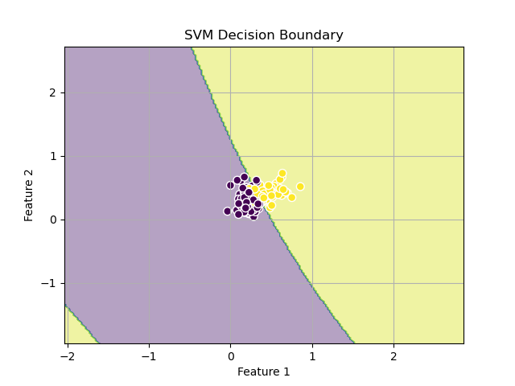

# Lab 5

## Данные

Используется набор данных "Wisconsin Breast Cancer", предназначенный для классификации опухолей молочной железы как злокачественных или доброкачественных.

**Подготовка данных:**

**Выбор признаков:**
   Были выбраны следующие особенности для анализа:
   - `radius_mean`
   - `texture_mean`
   - `perimeter_mean`
   - `area_mean`
   - `smoothness_mean`

Целевая переменная была закодирована как `1` для злокачественных опухолей и `-1` для доброкачественных.

## Реализации алгоритма SVM

#### Линейное ядро (linear)
Линейное ядро пытается разделить данные прямой линией. Оно подходит для линейно разделимых данных.

- **Вычисление ядра:**  
  Используется простое скалярное произведение между входными данными (`data_X` и `data_Y`)

- **Обучение модели:**  
  Строится матрица ядра для обучающего набора.  
  Решается оптимизационная задача для нахождения коэффициентов альфа с учетом регуляризации. 
  Определяются опорные векторы на основе ненулевых значений альфа.  
  Вычисляются веса модели как сумма произведений альфа, меток и опорных векторов.  
  Рассчитывается смещение (bias) как среднее значение разности между метками и предсказаниями.
 
- **Предсказание:**  
   Используются веса и смещение для вычисления линейной комбинации входных признаков.  
   Классификация происходит путем применения знаковой функции к результату.

#### Полиномиальное ядро (poly)
Полиномиальное ядро позволяет создавать не только прямые, но и криволинейные границы решений. Параметр degree определяет степень полинома и влияет на сложность модели.

- **Вычисление ядра:**  
  Применяется полиномиальная функция к скалярному произведению входных данных.  
  Параметр degree определяет степень полинома.

- **Обучение модели:**
  Строится полиномиальная матрица ядра для обучающего набора.  
  Решается оптимизационная задача для нахождения коэффициентов альфа.  
  Определяются опорные векторы на основе ненулевых значений альфа.  
  Рассчитывается смещение bias с использованием полиномиальной матрицы ядра и опорных векторов.

- **Предсказание:**  
   Вычисляется решение как сумма произведений альфа, меток и значений полиномиального ядра между входом и опорными векторами.  
   Классификация происходит путем применения знаковой функции к результату.

#### Радиально-базисное ядро (rbf)

RBF (Radial Basis Function) ядро способно создавать сложные и гибкие границы.
Это достигается за счет того, что RBF ядро учитывает расстояние между точками в многомерном пространстве и экспоненциально уменьшает значение ядра с увеличением расстояния. Таким образом, точки, находящиеся ближе друг к другу, имеют большее значение ядра.

- **Вычисление ядра:**  
  Используется радиально-базисная функция (Gaussian Kernel) для измерения сходства между точками. Параметр `gamma` контролирует ширину гауссовой функции.
 
- **Обучение модели:**  
  Строится RBF матрица ядра для обучающего набора.   
  Решается оптимизационная задача для нахождения коэффициентов альфа.  
  Определяются опорные векторы на основе ненулевых значений альфа.  
  Рассчитывается смещение bias с использованием RBF матрицы ядра и опорных векторов.

- **Предсказание:**  
  Вычисляется решение как сумма произведений альфа, меток и значений RBF ядра между входом и опорными векторами.
  Классификация происходит путем применения знаковой функции к результату.


## Графики

### Линейное ядро

### Полиномиальное ядро 1 степени

### Полиномиальное ядро 2 степени

### Полиномиальное ядро 3 степени

### Радиально-базисное ядро


## Метрики

### Метрики кастомной реализации  
```bash
Kernel: linear
Accuracy: 0.8947
Execution time: 6.19 seconds
----------------------------------------
Kernel: poly, Degree: 1
Accuracy: 0.8947
Execution time: 5.81 seconds
----------------------------------------
Kernel: poly, Degree: 2
Accuracy: 0.9035
Execution time: 7.44 seconds
----------------------------------------
Kernel: poly, Degree: 3
Accuracy: 0.9123
Execution time: 7.98 seconds
----------------------------------------
Kernel: rbf
Accuracy: 0.7456
Execution time: 16.48 seconds
```
### Метрики эталонной реализации sklearn
```bash
linear:
Accuracy: 0.8070
Time: 0.0226 seconds
----------------------------------------
poly_deg1:
Accuracy: 0.9035
Time: 0.0581 seconds
----------------------------------------
poly_deg2:
Accuracy: 0.9123
Time: 0.0150 seconds
----------------------------------------
poly_deg3:
Accuracy: 0.9123
Time: 0.0459 seconds
----------------------------------------
rbf:
Accuracy: 0.9123
Time: 0.0242 seconds
```
### Итог
1. **Линейное ядро:**  
   - Кастомная реализация имеет выше точность, чем sklearn, но существенно проигрывает по скорости.

2. **Полиномиальное ядро (1 степени):**  
   - Кастомная реализация и sklearn показывают схожую точность (0.89 и 0.9), но разница во времени не сопоставима (5.81 сек против 0.0581 сек).

3. **Полиномиальное ядро (2 и 3 степени):**  
   - Аналогично полиному 1 степени.

4. **RBF ядро:**  
   - Кастомная реализация сильно уступает по точности и скорости.

В целом, кастомная реализация часто достигает сопоставимой или более высокой точности, но оказывается сильно медленнее. Реализация sklearn оптимизирована и работает быстрее на всех типах ядер.