# Lab Work №1

# The used datasets
### Dataset 1: Wine Clustering
[Link to the dataset](https://www.kaggle.com/datasets/harrywang/wine-dataset-for-clustering)

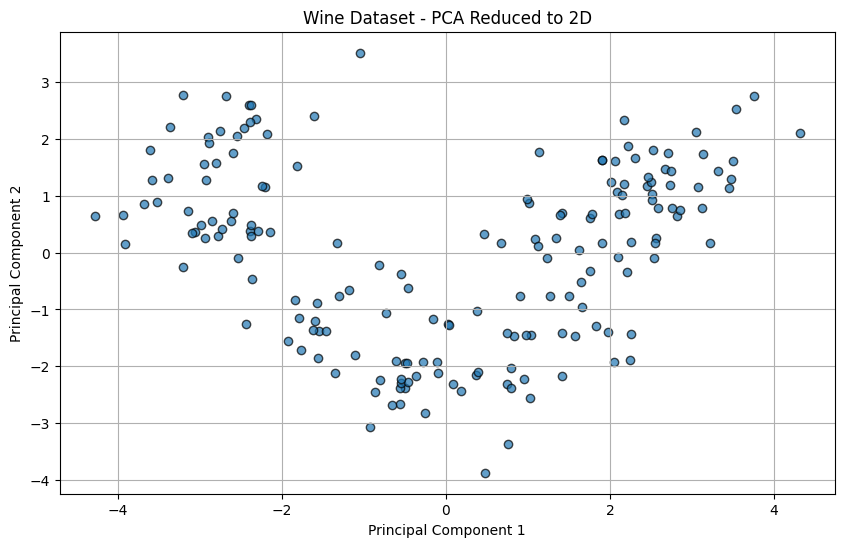
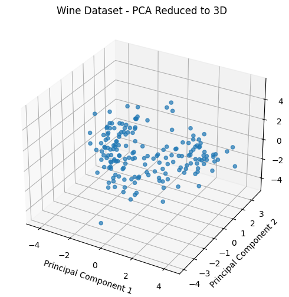
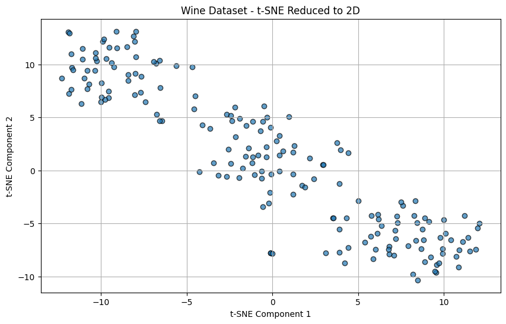

**Hypothesis**: Judging by the dataset visualization, the algorithms should identify 3 clusters. PCA visualizations wasn't good enough to visualize, but by looking at T-SNE visualization we can see 2 clusters.

### Dataset 2: Mall Customers 
[Link to the dataset](https://www.kaggle.com/datasets/vjchoudhary7/customer-segmentation-tutorial-in-python)

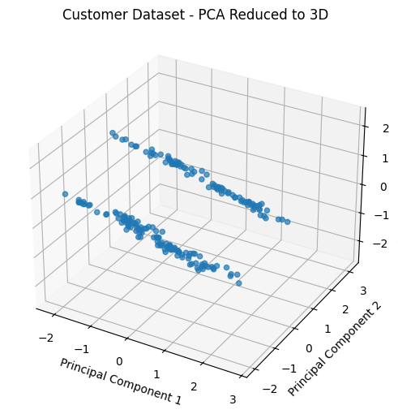
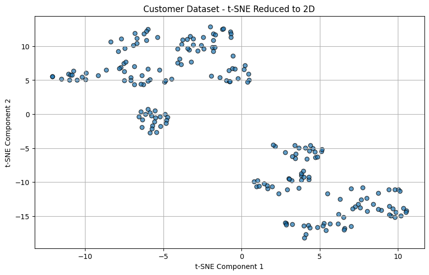

**Hypothesis**: Judging by the dataset visualization, the algorithms should identify 2 clusters. PCA 2D visualization wasn't good enough to visualize, but by looking at PCA 3D and T-SNE visualizations we can see 2 clusters.

# Hierarchical and Agglomerative Clustering

## Wine Dataset

### Libraries Implementation
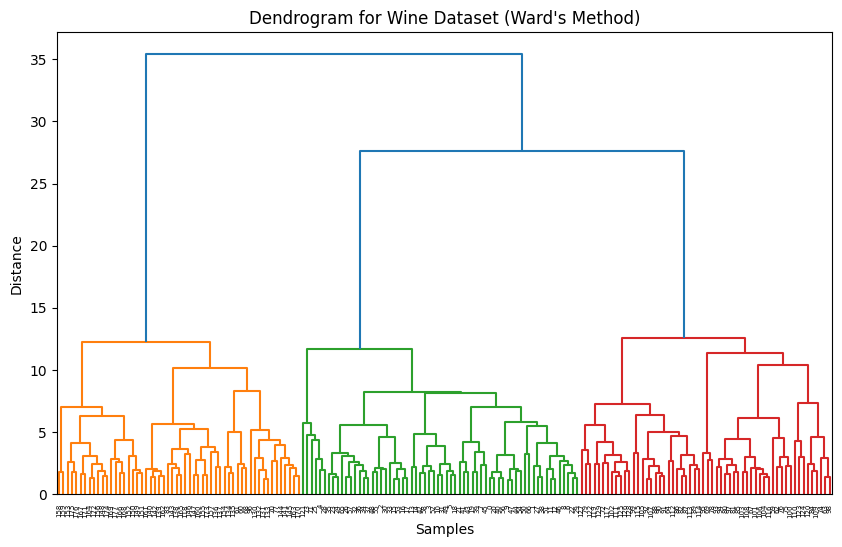
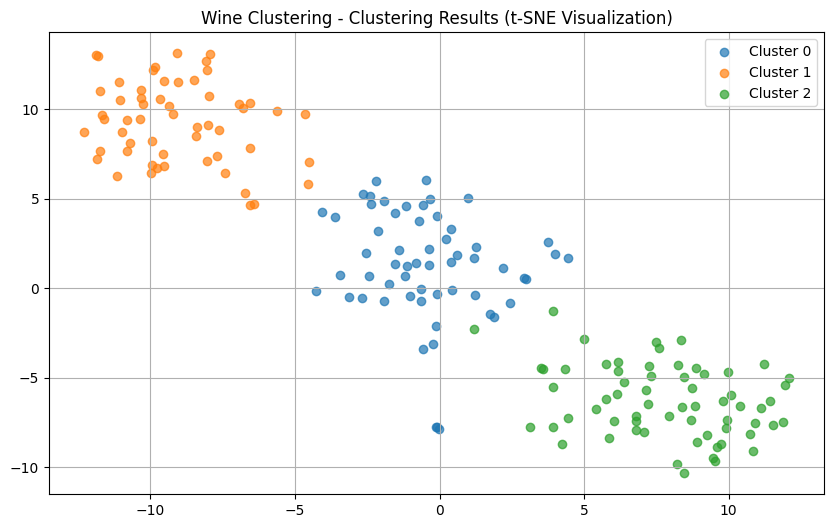

### Manual Implementation
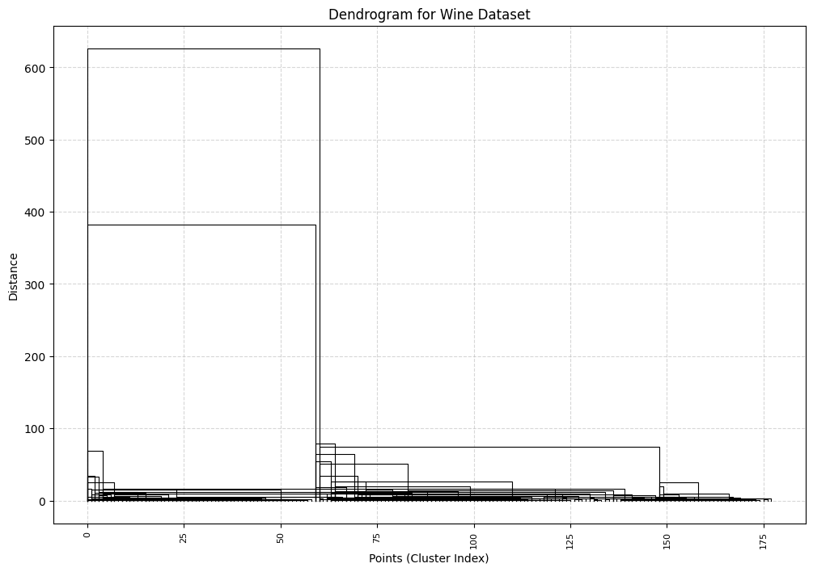

It is evident that the dendrograms and clusters constructed by the developed manual algorithm and its implementation with libraries are similar (the clusters are almost identical).

### Comparison

| Implementation | Time (S) | Intra Cluster Distance | Inter Cluster Distance |
|------------|----------------|--------------|-----------------|
| Libraries Implementation  | 0.0075    | 2.5619128220711183 | 4.0879590553601460 |
| Manual Implementation     | 100.6263  | 2.5619128220711183 | 4.0879590553601455 |

From the table above we can see that the  **Manual Implementation** results were almost identical to the **Libraries Implementation** result but was much more slower.

Both implementations found that the optimal number of clusters is 3 for this dataset (using ward's linkage method).

## Mall Customers Dataset

### Libraries Implementation
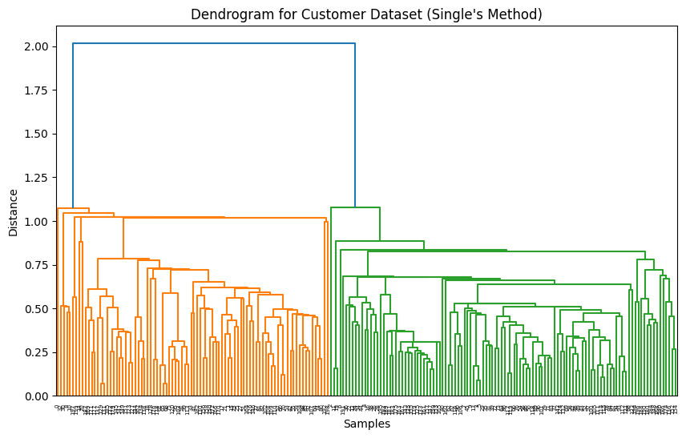
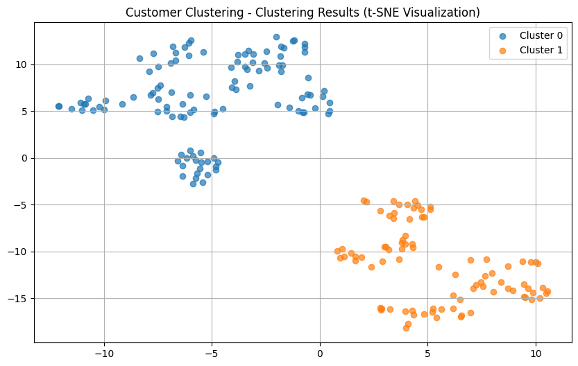

### Manual Implementation
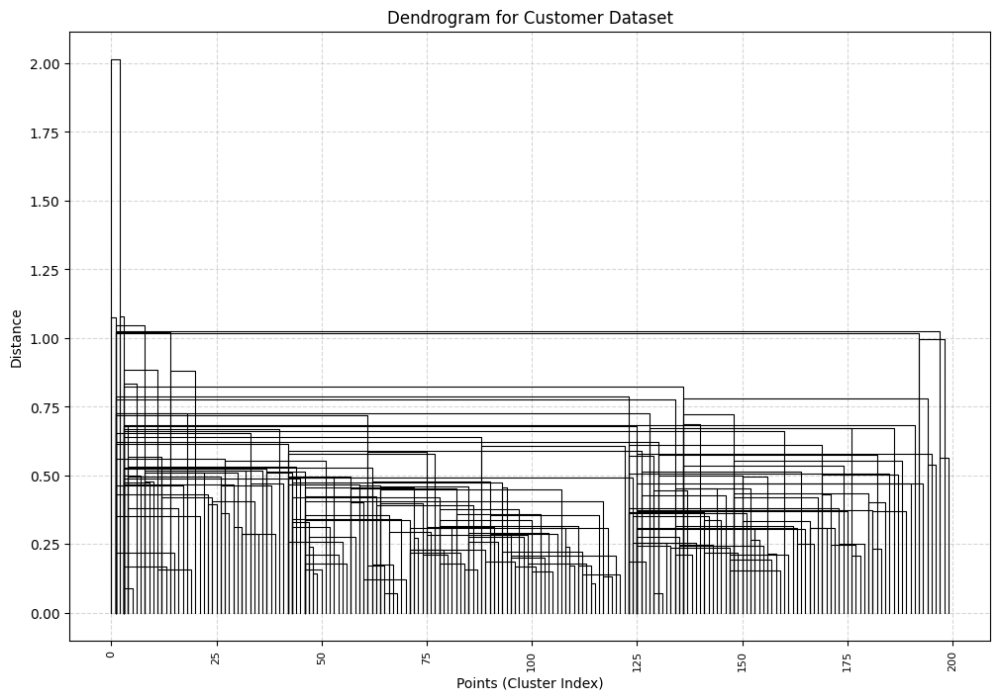
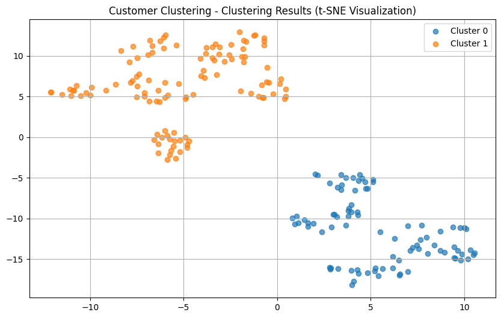

It is evident that the dendrograms and clusters constructed by the developed manual algorithm and its implementation with libraries are similar (the clusters are almost identical).

### Comparison

| Implementation | Time (S) | Intra Cluster Distance | Inter Cluster Distance |
|------------|----------------|--------------|-----------------|
| Libraries Implementation  | 0.0027    | 1.6317346696989905 | 2.0248692548719602 |
| Manual Implementation     | 21.9066   | 1.6317346696989905 | 2.0248692548719602 |

From the table above we can see that the  **Manual Implementation** results were almost identical to the **Libraries Implementation** result but was slower (not as slow as using ward's linkage method).

Both implementations found that the optimal number of clusters is 2 for this dataset (using single's linkage method).
