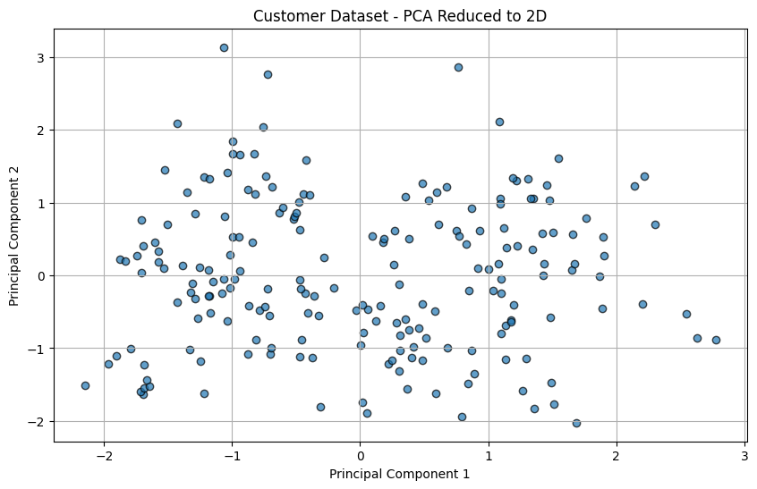
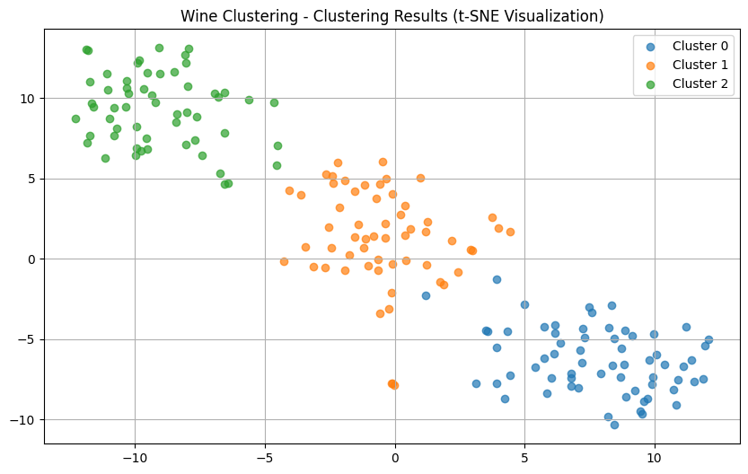
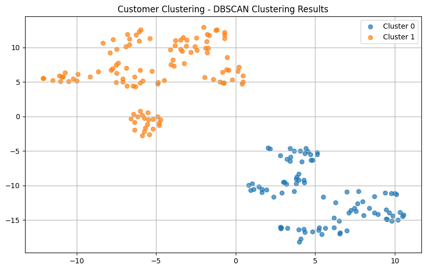

# Lab Work №1

# The used datasets

### Dataset 1: Wine Clustering

[Link to the dataset](https://www.kaggle.com/datasets/harrywang/wine-dataset-for-clustering)

**Hypothesis**: Judging by the dataset visualization, the algorithms should identify 3 clusters. PCA visualizations wasn't good enough to visualize, but by looking at T-SNE visualization we can see 2 clusters.

### Dataset 2: Mall Customers

[Link to the dataset](https://www.kaggle.com/datasets/vjchoudhary7/customer-segmentation-tutorial-in-python)

**Hypothesis**: Judging by the dataset visualization, the algorithms should identify 2 clusters. PCA 2D visualization wasn't good enough to visualize, but by looking at PCA 3D and T-SNE visualizations we can see 2 clusters.

# Hierarchical and Agglomerative Clustering

## Wine Dataset

### Libraries Implementation

### Manual Implementation

It is evident that the dendrograms and clusters constructed by the developed manual algorithm and its implementation with libraries are similar (the clusters are almost identical).

### Comparison

| Implementation           | Time (S) | Intra Cluster Distance | Inter Cluster Distance |
| ------------------------ | -------- | ---------------------- | ---------------------- |
| Libraries Implementation | 0.0075   | 2.5619128220711183     | 4.0879590553601460     |
| Manual Implementation    | 100.6263 | 2.5619128220711183     | 4.0879590553601455     |

From the table above we can see that the **Manual Implementation** results were almost identical to the **Libraries Implementation** result but was much more slower.

Both implementations found that the optimal number of clusters is 3 for this dataset (using ward's linkage method).

## Mall Customers Dataset

### Libraries Implementation

### Manual Implementation

It is evident that the dendrograms and clusters constructed by the developed manual algorithm and its implementation with libraries are similar (the clusters are almost identical).

### Comparison

| Implementation           | Time (S) | Intra Cluster Distance | Inter Cluster Distance |
| ------------------------ | -------- | ---------------------- | ---------------------- |
| Libraries Implementation | 0.0027   | 1.6317346696989905     | 2.0248692548719602     |
| Manual Implementation    | 21.9066  | 1.6317346696989905     | 2.0248692548719602     |

From the table above we can see that the **Manual Implementation** results were almost identical to the **Libraries Implementation** result but was slower (not as slow as using ward's linkage method).

Both implementations found that the optimal number of clusters is 2 for this dataset (using single's linkage method).

# EM Clustering

## Wine Dataset

### Libraries Implementation

### Manual Implementation

It is evident that the clusters constructed by the developed manual algorithm and its implementation with libraries are similar.

### Comparison

| Implementation           | Time (S) | Intra Cluster Distance | Inter Cluster Distance |
| ------------------------ | -------- | ---------------------- | ---------------------- |
| Libraries Implementation | 0.0110   | 2.5234201274965593     | 4.199476358573155      |
| Manual Implementation    | 1.4728   | 2.5288443209469835     | 4.194094847196198      |

From the table above we can see that the **Manual Implementation** results were too similar to the **Libraries Implementation** result but was slower.

## Mall Customers Dataset

### Libraries Implementation

### Manual Implementation

It is evident that the clusters constructed by the developed manual algorithm are not as good as its implementation with libraries.

### Comparison

| Implementation           | Time (S) | Intra Cluster Distance | Inter Cluster Distance |
| ------------------------ | -------- | ---------------------- | ---------------------- |
| Libraries Implementation | 0.0121   | 1.6317346696989905     | 2.0248692548719602     |
| Manual Implementation    | 2.7873   | 1.6619583714507438     | 1.6619583714507438     |

From the table above we can see that the **Manual Implementation** was slower than **Libraries Implementation** but their Intra Cluster Distance and Inter Cluster Distance are similar to each other.

# DBSCAN Clustering

## Wine Dataset

### Libraries Implementation

### Manual Implementation

The figure shows the distribution of labels on the constructed data. Here `epsilon=2.34`, `min_samples=12` with `noise_data=75`. With such a selection of parameters, the algorithm identifies 3 clusters. Here we couldn't get rid of all the noise data because the clusters are close to each others with sparse density.

It is evident that the clusters constructed by the developed manual algorithm and its implementation with libraries are similar (the clusters are almost identical).

### Comparison

| Implementation           | Time (S) | Intra Cluster Distance | Inter Cluster Distance |
| ------------------------ | -------- | ---------------------- | ---------------------- |
| Libraries Implementation | 0.0067   | 4.460022309422037     | 3.687927445611518      |
| Manual Implementation    | 0.1737   | 4.460022309422037     | 3.687927445611518      |

From the table above we can see that the **Manual Implementation** results were almost identical to the **Libraries Implementation** result but was slower.

## Mall Customers Dataset

### Libraries Implementation

### Manual Implementation

The figure shows the distribution of labels on the constructed data. Here `epsilon=1.5`, `min_samples=5` with `noise_data=0`. With such a selection of parameters, the algorithm identifies 3 clusters. Here there was no noise data because there is a gap between the clusters so they were easily separated.

It is evident that the clusters constructed by the developed manual algorithm and its implementation with libraries are similar (the clusters are almost identical).

### Comparison

| Implementation           | Time (S) | Intra Cluster Distance | Inter Cluster Distance |
| ------------------------ | -------- | ---------------------- | ---------------------- |
| Libraries Implementation | 0.0047   | 1.6317346696989905     | 2.0248692548719602     |
| Manual Implementation    | 0.1714   | 1.6317346696989905     | 2.0248692548719602     |

From the table above we can see that the **Manual Implementation** results were almost identical to the **Libraries Implementation** result but was slower.
