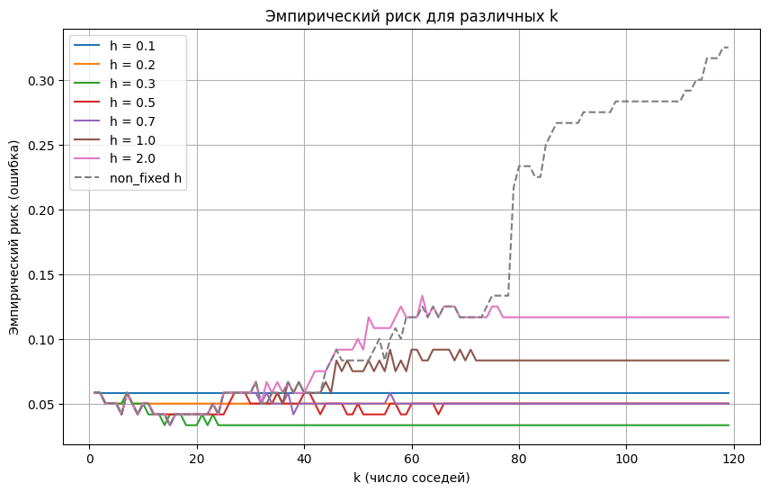

# Отчёт по лабораторной работе  
**Тема**: Реализация алгоритма KNN с методом окна Парзена переменной ширины и сравнительный анализ с эталонной реализацией KNN

---

## 1. Цель работы
1. Освоить метод k-ближайших соседей (K-Nearest Neighbors, KNN) с использованием окна Парзена переменной ширины.
2. Научиться подбирать оптимальное число соседей \( k \) методом скользящего контроля (Leave-One-Out, LOO).
3. Сравнить полученные результаты работы собственного алгоритма с эталонной реализацией из библиотеки (например, `sklearn`):
   - сравнить точность классификации,
   - сравнить время работы,
   - провести анализ и сделать выводы.

---

## 2. Описание датасета
Для демонстрации работы алгоритма в данном примере использовался датасет **Iris** из библиотеки `sklearn`.  

Датасет **Iris** содержит 150 объектов, каждый из которых описывается четырьмя признаками:
- Длина чашелистика (*Sepal Length*),
- Ширина чашелистика (*Sepal Width*),
- Длина лепестка (*Petal Length*),
- Ширина лепестка (*Petal Width*).

Класс (целевая переменная) может принимать одно из трех значений:  
- *Setosa*,  
- *Versicolor*,  
- *Virginica*.

---

## 3. Теоретические сведения

### 3.1. Алгоритм k-ближайших соседей (KNN)
Алгоритм k-ближайших соседей заключается в том, что для классификации нового объекта необходимо:
1. Найти \( k \) ближайших соседей в обучающей выборке по некоторой метрике (чаще всего используется евклидово расстояние).
2. Класс объекта определяется как класс, наиболее часто встречающийся среди \( k \) ближайших соседей (большинство голосов).

### 3.2. Окна Парзена и гауссово ядро
Оконные функции Парзена используются для взвешенного голосования. В данном случае, чем ближе сосед к классифицируемому объекту, тем больший вес он получает.  
Гауссово ядро задаётся формулой:
$$
K(u) = \frac{1}{\sqrt{2 \pi} h} \exp\left(-\frac{u^2}{2}\right),
$$
где \( h \) — ширина окна (параметр сглаживания).

### 3.3. Метод Leave-One-Out (LOO)
Метод скользящего контроля Leave-One-Out для оценки качества классификатора предполагает:
1. Для каждого объекта датасета мы «убираем» (исключаем) его из обучающей выборки.
2. Обучаем алгоритм на оставшихся данных.
3. Тестируем на «убранном» объекте.
4. Среднее значение ошибки по всем объектам даёт оценку качества.

Используя LOO, мы можем подобрать оптимальное число соседей \( k \), минимизирующее среднюю ошибку (эмпирический риск).

---

## 4. Описание реализованных функций и кода

### 4.1. Файл `knn.py`
```python
import numpy as np

# Ядро Парзена (Гауссовское ядро)
def gaussian_kernel(distance, bandwidth):
    return (1 / (np.sqrt(2 * np.pi) * bandwidth)) * np.exp(-0.5 * (distance / bandwidth) ** 2)

# KNN с окном Парзена переменной ширины
def knn_parzen(X_train, y_train, X_test, k, bandwidth):
    predictions = []
    
    for x in X_test:
        distances = np.linalg.norm(X_train - x, axis=1)  # Расстояния до всех точек обучения
        neighbors_idx = np.argsort(distances)[:k+1]      # Индексы k ближайших соседей
        
        # Если bandwidth не задан (None), то берём расстояние до самого далёкого соседа из первых k
        if bandwidth is None:
            bandwidth = distances[neighbors_idx[-1]]
            print(f'non fixed bandwidth: {bandwidth}')

        # Исключаем самого дальнего соседа из набора (т.к. мы взяли k+1)
        neighbors_idx = neighbors_idx[:-1]
        
        # Вычисляем веса с помощью гауссовского ядра
        weights = gaussian_kernel(distances[neighbors_idx], bandwidth)
        
        # Классы ближайших соседей
        classes = y_train[neighbors_idx]
        
        # Взвешенное голосование
        class_weights = {}
        for cls, w in zip(classes, weights):
            if cls not in class_weights:
                class_weights[cls] = 0
            class_weights[cls] += w
        
        # Предсказываем класс с максимальным взвешенным голосом
        predictions.append(max(class_weights, key=class_weights.get))
    
    return np.array(predictions)

# Подбор оптимального k методом Leave-One-Out (LOO)
def loo_knn_parzen(X, y, bandwidth):
    n = len(X)
    best_k = 1
    min_risk = n
    risks = []

    for k in range(1, n):
        risk = 0
        
        for i in range(n):
            X_train = np.delete(X, i, axis=0)
            y_train = np.delete(y, i)
            X_test = X[i].reshape(1, -1)
            y_test = y[i]
            
            prediction = knn_parzen(X_train, y_train, X_test, k, bandwidth)
            if prediction != y_test:
                risk += 1
        
        risk = risk / n
        if risk < min_risk:
            min_risk = risk
            best_k = k

        risks.append(risk)
    return best_k, risks
```
---
## 5. Результаты
### Зависимость эмпирического риска (ошибки) от числа соседей $k$

```
Best fixed h: 0.3, Min LOO risk: 0.0333
Best k for fixed h: 14
Best k for non-fixed h: 15
```
### Метрики модели:
```python
Test Accuracy: 1.0
Время работы алгоритма: 0.0010 секунд
Отчет о классификации:
              precision    recall  f1-score   support

      setosa       1.00      1.00      1.00        10
  versicolor       1.00      1.00      1.00         9
   virginica       1.00      1.00      1.00        11

    accuracy                           1.00        30
   macro avg       1.00      1.00      1.00        30
weighted avg       1.00      1.00      1.00        30

```
### Метрики эталона:
```
Время работы алгоритма: 0.0020 секунд
Точность: 1.0000
Отчет о классификации:
              precision    recall  f1-score   support

      setosa       1.00      1.00      1.00        10
  versicolor       1.00      1.00      1.00         9
   virginica       1.00      1.00      1.00        11

    accuracy                           1.00        30
   macro avg       1.00      1.00      1.00        30
weighted avg       1.00      1.00      1.00        30
```