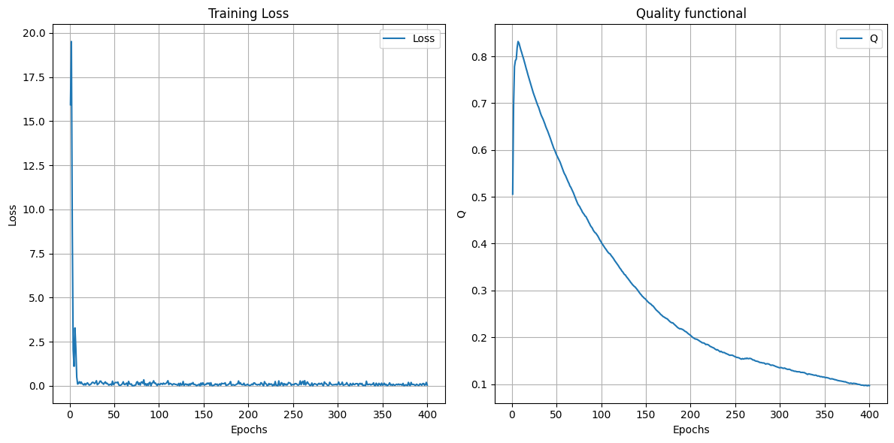
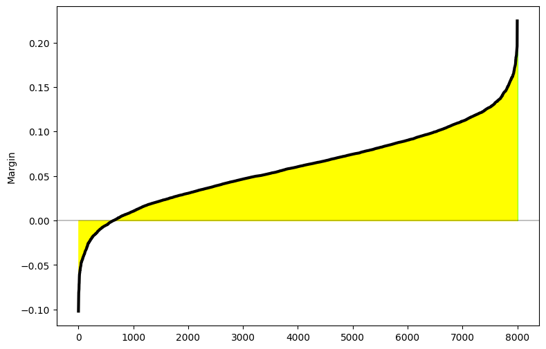
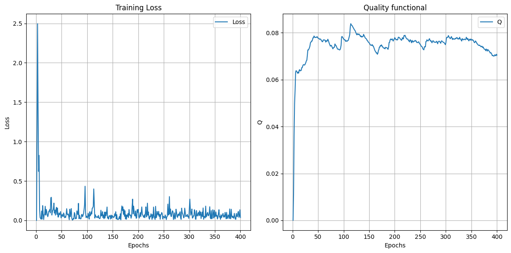
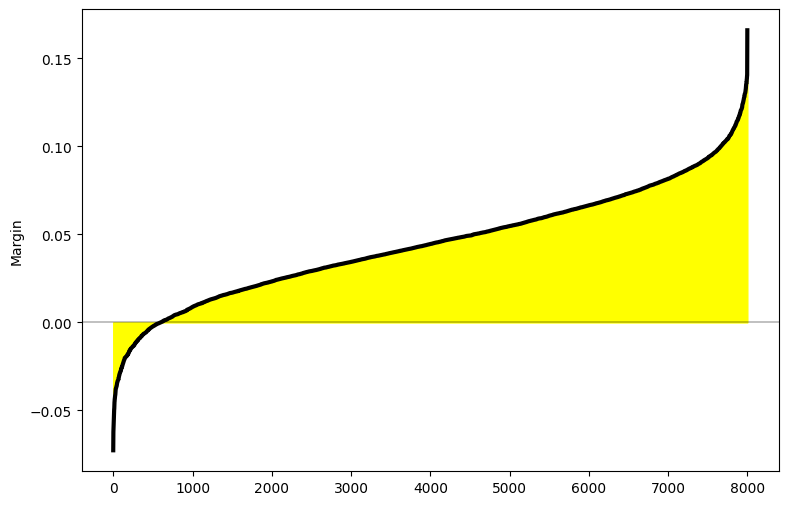
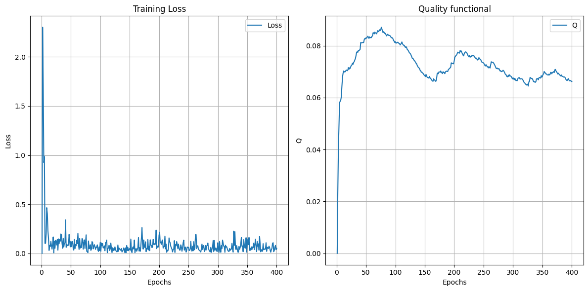
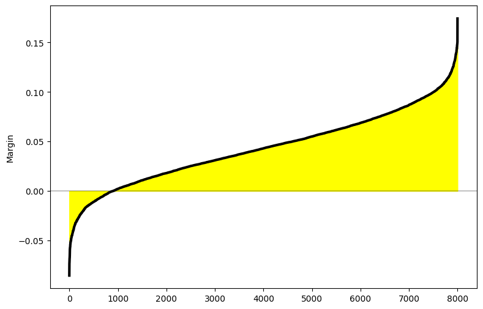

# Лабораторная работа №4. Линейная классификация

**Цель работы**:  
- Реализовать линейный классификатор с квадратичной функцией потерь.
- Обучить его методом стохастического градиентного спуска с инерцией, используя \(L_2\)-регуляризацию.
- Провести различные эксперименты по инициализации весов (через корреляцию, мультистарт, случайная инициализация и т.д.).
- Сравнить полученные результаты с эталонной реализацией (например, `sklearn.linear_model.SGDClassifier`).

---

## 1. Краткое описание задания

1. **Выбрать датасет** для задачи классификации (в примере использован датасет цитрусовых (*orange* / *grapefruit*)).
2. **Реализовать вычисление отступа** объекта $( \text{margin} = y_i \cdot (\mathbf{x}_i \cdot \mathbf{w} + b) )$, визуализировать и проанализировать распределение отступов на обучающей выборке.
3. **Реализовать вычисление градиента функции потерь** (в данном случае рассмотрено линейное SVM-подобное приближение с модификациями, где используется максимум от 0 и отрицательного отступа).
4. **Реализовать рекуррентную оценку функционала качества** (подсчёт метрики \(Q\) на каждом шаге обучения).
5. **Реализовать метод стохастического градиентного спуска с инерцией (Momentum/NAG)**.
6. **Добавить $(L_2)$-регуляризацию** (penalty = 'l2').
7. **Реализовать “скорейший” градиентный спуск** (быстрое вычисление шага, $ lr = \frac{1}{\|\mathbf{X}\|^2 + \varepsilon}$.
8. **Реализовать предъявление объектов по модулю отступа** – т.е. выбор тех объектов, которые находятся “близко к границе”.
9. **Обучить линейный классификатор** на выбранном датасете, используя различные схемы инициализации весов и мультистарта.
10. **Сравнить** работу полученных моделей с эталонной реализацией из `sklearn`.
11. **Подготовить отчёт** по проделанной работе.

---

## 2. Описание используемого датасета

В примере используется датасет **citrus.csv**, состоящий из двух видов цитрусовых:
- *orange* (апельсины),
- *grapefruit* (грейпфруты).

Каждая запись в датасете имеет признаки:
- `diameter` (диаметр плода),
- `weight` (вес плода),
- цветовые каналы `red`, `green`, `blue`,
- целевую метку `name`, которую мы кодируем как $\{+1, -1\}$ для двух классов.

Общее число объектов: 10000 (примерное значение, зависит от самого датасета). Для обучения мы используем часть выборки, а для тестирования — другую часть.

---

## 3. Теоретические сведения

### 3.1. Линейный классификатор

Линейный классификатор в двумерном случае можно представить как:  
$
f(\mathbf{x}) = \text{sign}(\mathbf{w} \cdot \mathbf{x} + b),
$
где $\mathbf{w}$ — вектор весов, \(b\) — смещение (bias).

### 3.2. Отступ объекта
Отступ (margin) на объекте $(\mathbf{x}_i, y_i)$ определяется так:  
$
\text{margin}_i = y_i (\mathbf{w} \cdot \mathbf{x}_i + b).
$
Если $\text{margin}_i > 0$, объект классифицирован верно, если $\text{margin}_i < 0$, то неверно.

### 3.3. Функция потерь
В данной работе используется модифицированная функция потерь (похожа на Hinge Loss), где
$
\text{loss}_i = \max(0, -\text{margin}_i).
$
Если отступ положительный и большой, объект далеко от разделяющей гиперплоскости, штраф отсутствует; если отступ неположительный, штраф растёт.

### 3.4. \(L_2\)-регуляризация
Добавляет к функции потерь слагаемое $\lambda \|\mathbf{w}\|^2$, что препятствует переобучению и помогает сделать веса меньшими.

### 3.5. Стохастический градиентный спуск (SGD) с инерцией
- **Momentum**: добавляем “инерцию” к обновлению весов:
  $
  \mathbf{v}_t = \gamma \mathbf{v}_{t-1} + \eta \nabla_{\mathbf{w}} L(\mathbf{w})
  $
  $
  \mathbf{w}_t = \mathbf{w}_{t-1} - \mathbf{v}_t
  $
- **NAG (Nesterov Accelerated Gradient)**: делаем “выпад” вперёд при вычислении градиента, что позволяет учесть движение инерции заранее.

### 3.6. Рекуррентная оценка функционала качества
На каждом шаге вычисляется:
$
Q \leftarrow \lambda \cdot \text{loss(batch)} + (1 - \lambda) \cdot Q,
$
где $\text{loss(batch)}$ — ошибка/функционал по мини-батчу.

### 3.7. “Скорейший” градиентный спуск
Динамический шаг обучения:
$
\eta = \frac{1}{\|\mathbf{X}\|^2 + \varepsilon},
$
что позволяет учитывать масштаб признаков.

---

## 4. Описание структуры кода

### 4.1. Модуль `linear_model.py`

Ниже приводится упрощённая схема класса **`LinearClassifier`**:
```python
class LinearClassifier:
    def __init__(
        self,
        units_out: int,
        initializer: Literal["random", "glorot", "zeros"] = "random",
        optimizer: Literal["default", "momentum", "nag"] = "default",
        lr_mode: Literal["default", "fast"] = "default",
        regularizer: bool = False,
    ):
        self.units_out = units_out
        self.initializer = initializer
        self.optimizer = optimizer
        self.lr_mode = lr_mode
        self.regularizer = regularizer
        # ...
    
    # Инициализация весов
    def _init_weights(self, n_features: int, n_samples: int) -> None:
        # ...

    # Расчёт отступа: margin = y * (X @ w + b)
    def _calc_margin(self, X: np.ndarray, y: np.ndarray, w: np.ndarray, b: np.ndarray) -> np.ndarray:
        # ...

    # Функция потерь (пример: hinge-like loss, + L2)
    def _misclassification_loss(self, X, y, w, b, reg_c):
        # ...

    # Вычисление градиентов
    def _compute_gradients(self, X, y, w, b, reg_c):
        # ...

    # Обновление весов (различные оптимизаторы)
    def _update_weights(self, X, y, lr, reg_c, gamma=0.9):
        # ...
    
    # Основной цикл обучения
    def fit(self, X, y, epochs, lr, reg_c, _lambda, batch_size, gamma):
        # Инициализация весов
        # Цикл по эпохам:
        #   1) Формируем мини-батч
        #   2) Считаем градиенты
        #   3) Опционально пересчитываем lr (fast)
        #   4) Считаем loss
        #   5) Рекуррентно считаем Q
        #   6) Обновляем веса
        #   7) Логируем метрики в history
    
    # Предсказание
    def predict(self, X):
        # ...
```

## Результаты экспериментов

**Различные инициализации**  
**Xavier (glorot)**:



   ```
    Accuracy: 0.9270
    Classification Report:
                precision    recall  f1-score   support

        orange      0.94      0.91      0.92       977
    grapefruit      0.91      0.95      0.93      1023

        accuracy                        0.93      2000
    macro avg       0.93      0.93      0.93      2000
    weighted avg    0.93      0.93      0.93      2000
   ``` 
**Random**: 


```
Accuracy: 0.9310
Classification Report:
            precision    recall  f1-score   support

    orange      0.96      0.90      0.93       977
grapefruit      0.91      0.96      0.93      1023

    accuracy                        0.93      2000
macro avg       0.93      0.93      0.93      2000
weighted avg    0.93      0.93      0.93      2000
``` 
**Zeros**:


```
Accuracy: 0.8920
Classification Report:
            precision    recall  f1-score   support

    orange      0.99      0.79      0.88     977
grapefruit      0.83      0.99      0.90     1023

    accuracy                        0.89     2000
macro avg       0.91      0.89      0.89     2000
weighted avg    0.91      0.89      0.89     2000
```

**Сравнение с `sklearn.SGDClassifier`**  
``` 
Accuracy: 0.9295
Classification Report:
            precision    recall  f1-score   support

    orange      0.90      0.96      0.93       977
grapefruit      0.96      0.90      0.93      1023

    accuracy                        0.93      2000
macro avg       0.93      0.93      0.93      2000
weighted avg    0.93      0.93      0.93      2000
```


