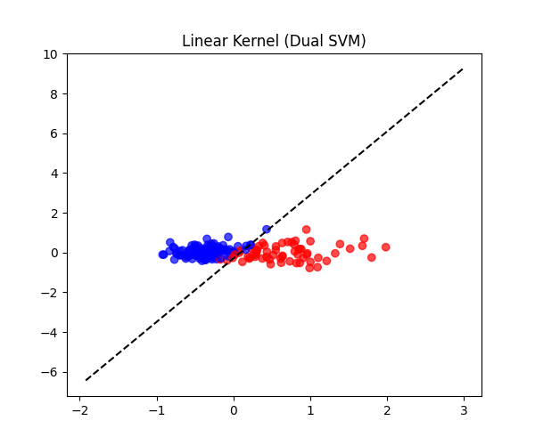
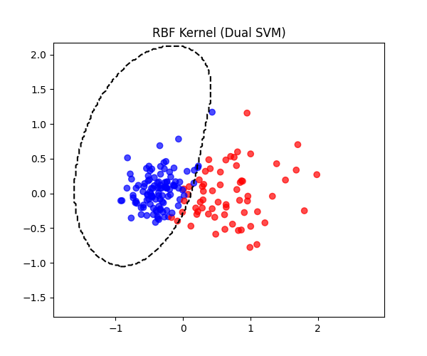
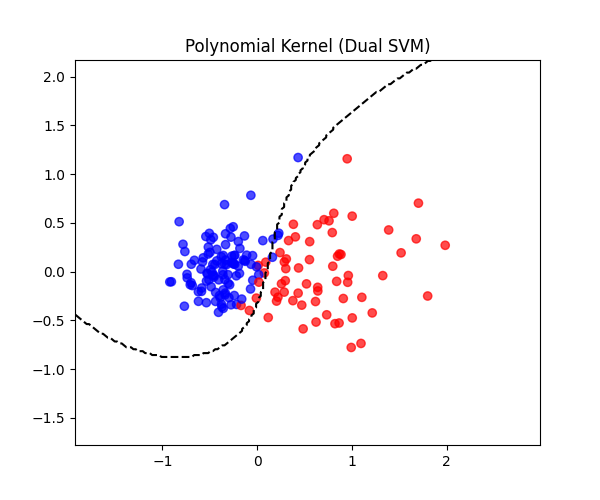

# Лабораторная работа: Реализация SVM через двойственную задачу

## Введение

В данной работе реализуется алгоритм **Support Vector Machine (SVM)** на основе **двойственной** постановки задачи с использованием библиотеки `scipy.optimize` для решения оптимизационной части. Также проводится сравнение полученного решения с эталонной реализацией (`sklearn.svm.SVC`).

Цели лабораторной работы:
1. Выбрать датасет для бинарной классификации (Breast Cancer).
2. Реализовать двойственную задачу SVM с помощью `scipy.optimize.minimize`.
3. Решить задачу с разными ядрами: линейным, RBF и полиномиальным.
4. Вычислить параметры разделяющей гиперплоскости $(\mathbf{w})$ и $(b)$ для линейного ядра.
5. Визуализировать результаты.
6. Сравнить качество и скорость работы с эталоном из `sklearn`.

---

## Теоретические основы

### Постановка задачи SVM

Пусть дан набор данных $(\bigl\{(x_i, y_i)\bigr\}_{i=1}^n)$, где $(x_i \in \mathbb{R}^d)$ — вектор признаков, а $(y_i \in \{-1, +1\})$ — метка класса.  
Задача обучения SVM в **прямой** постановке (при линейной разделимости) формулируется так:

$$
\min_{\mathbf{w}, b} \quad \frac{1}{2}\|\mathbf{w}\|^2 
\quad \text{при}\quad 
y_i \bigl(\mathbf{w}^\top x_i + b\bigr) \,\ge\, 1 \quad \forall i.
$$

При наличии неточной (мягкой) разделимости добавляются слаки-переменные и параметр регуляризации $(C)$.

### Двойственная формулировка

В двойственной задаче для мягкого зазора мы ищем вектор лагранжевых множителей $\lambda = (\lambda_1, \dots, \lambda_n)$:

$$
\max_{\lambda} \;\Bigl(\sum_{i=1}^n \lambda_i\Bigr)\;-\;\frac{1}{2}\,\sum_{i=1}^n\sum_{j=1}^n \lambda_i\,\lambda_j\,y_i\,y_j\,K(x_i, x_j),
$$

при условии

$$
\sum_{i=1}^n \lambda_i \, y_i = 0, 
\quad
0 \,\le\, \lambda_i \,\le\, C.
$$

Здесь $K(x_i, x_j)$ — ядровая функция.

### Ядра и ядровые методы

**Ядро** $K(x, z)$ позволяет перейти к **нелинейному** разделению, неявно отображая вектора в более высокое пространство. В работе используются три типа ядер:
1. **Линейное**: $K(x, z) = x^\top z.$
2. **RBF (гауссово)**: $K(x, z) = \exp\bigl(-\gamma\,\|x - z\|^2\bigr).$
3. **Полиномиальное**: $K(x, z) = \bigl(x^\top z + c\bigr)^{d}.$

### Параметры разделяющей гиперплоскости

Для **линейного** ядра решение в исходном пространстве имеет вид $\mathbf{w}^\top x + b$.  
Искомые параметры $(\mathbf{w})$ и $(b)$ выражаются так:

$$
\mathbf{w} \;=\; \sum_{i=1}^n \lambda_i^*\,y_i\,x_i,
\quad
b \;=\; y_k \;-\;\sum_{i=1}^n \lambda_i^*\,y_i\,K(x_i, x_k),
$$

где $(x_k)$ — опорный вектор (или несколько, и тогда берётся среднее по ним).

---

## Описание кода

### Класс DualSVM

Вся функциональность заключена в классе `DualSVM`, который содержит:

- **Параметры**:  
  - `kernel_type` — тип ядра (`linear`, `rbf`, `poly`).  
  - `C` — коэффициент регуляризации.  
  - `gamma`, `degree`, `c_poly` — параметры для RBF и полиномиального ядра.  

- **Методы**:  
  - `fit(X, y)` — обучение SVM по двойственной задаче.  
  - `predict(X)` — предсказание меток $(\pm 1)$.  

Ниже приведён код, в котором задаются ограничения и вызывается `minimize`:

```python
lc = LinearConstraint(y.reshape(1, -1), 0, 0)
bnds = Bounds(np.zeros(n_samples), np.full(n_samples, self.C))
lmbda_init = np.zeros(n_samples)

res = minimize(
    fun=objective_function,
    x0=lmbda_init,
    jac=objective_gradient,
    bounds=bnds,
    constraints=[lc],
    method='SLSQP',
    options={'disp': False}
)
```
Здесь `minimize` решает задачу минимизации функции:

$$
f(\lambda) \;=\; 0.5 \, (\lambda \circ y)^\top K (\lambda \circ y) \;-\; \sum_{i=1}^n \lambda_i,
$$

при соблюдении линейного ограничения (через `lc`) и границ (через `bnds`). После успешной оптимизации в `res.x` находится итоговый вектор $(\lambda^*)$. 

Далее в коде выполняется вычисление:

1. **Опорные векторы**.  
   Используется маска `sv_mask`, определяющая индексы $(k)$, для которых $(\lambda_k)$ лежит в диапазоне $(\varepsilon,\, C-\varepsilon)$.  
2. **Сдвиг** $(b)$.  
   Вычисляется путём усреднения значений $(y_k - \sum_i(\lambda_i y_i K_{i,k}))$ по опорным векторам $(k)$.  
3. **Вектор $(\mathbf{w})$** (только для линейного ядра).  
   Суммирование $\sum_i (\lambda_i^* y_i)$, $x_i$ обеспечивает переход к явным параметрам гиперплоскости \(w\).

Таким образом, при `kernel_type='linear'` мы получаем явный вектор $(\mathbf{w})$ и скаляр $(b)$. Для случаев `rbf` и `poly`, атрибут `self.w` будет `None`, так как в исходном пространстве не существует линейной гиперплоскости, а функция принятия решения строится непосредственно на ядровом представлении:

$$
\mathrm{sign}\Bigl(\sum_i \lambda_i^* \, y_i \, K(x_i, x) \;+\; b\Bigr).
$$
Ниже приводятся строки кода, реализующие эти операции:

```python
self.lmbda_star = res.x
eps = 1e-7
sv_mask = (self.lmbda_star > eps) & (self.lmbda_star < self.C - eps)
support_indices = np.where(sv_mask)[0]

if len(support_indices) == 0:
    support_indices = np.where(self.lmbda_star > eps)[0]

if len(support_indices) == 0:
    self.b = 0.0
else:
    b_vals = []
    for k in support_indices:
        val = y[k] - np.sum((self.lmbda_star * y) * K[:, k])
        b_vals.append(val)
    self.b = np.mean(b_vals)

if self.kernel_type == 'linear':
    self.w = np.sum((self.lmbda_star * y)[:, None] * X, axis=0)
else:
    self.w = None
```


# Результаты экспериментов

## 1. Введение

В данном разделе представлены результаты, полученные при обучении SVM с использованием трех типов ядер:
- Линейного,
- RBF (гауссового),
- Полиномиального.

Для каждого ядра проанализированы:
- Метрики качества,
- Визуализация разделяющей гиперплоскости или нелинейной разделяющей области.

Сравнение также проведено с эталонной реализацией `sklearn.svm.SVC`.

---

## 2. Результаты по ядрам

### 2.1 Линейное ядро

<!-- start-metrics-linear -->
#### Метрики:
- **Точность на обучающей выборке**: `0.947`
- **Точность на тестовой выборке**: `0.942`
- **Сравнение с `sklearn`**:
  - **Точность на обучении**: `0.947`
  - **Точность на тесте**: `0.942`

<!-- end-metrics-linear -->

#### Визуализация разделяющей гиперплоскости:
  
- Dual SVM:
  
  

---

### 2.2 RBF ядро

<!-- start-metrics-rbf -->
#### Метрики:
- **Точность на обучающей выборке**: `0.950`
- **Точность на тестовой выборке**: `0.942`
- **Сравнение с `sklearn`**:
  - **Точность на обучении**: `0.950`
  - **Точность на тесте**: `0.942`

<!-- end-metrics-rbf -->

#### Визуализация разделяющей области:
  
- Dual SVM:

  

---

### 2.3 Полиномиальное ядро

<!-- start-metrics-poly -->
#### Метрики:
- **Точность на обучающей выборке**: `0.947`
- **Точность на тестовой выборке**: `0.942`
- **Сравнение с `sklearn`**:
  - **Точность на обучении**: `0.947`
  - **Точность на тесте**: `0.942`

<!-- end-metrics-poly -->

#### Визуализация разделяющей области:
  
- Dual SVM:

  

---

## 3. Сравнение метрик и времени работы

<!-- start-metrics-comparison -->
| Ядро  | Dual SVM (Train/Test), % | Sklearn SVM (Train/Test), % | Dual SVM Time (sec) | Sklearn SVM Time (sec) |
|-------|--------------------------|----------------------------|---------------------|-------------------------|
| **Linear** | 94.72 / 94.15 | 94.72 / 94.15 | 3.1088 | 0.0020 |
| **Rbf** | 94.97 / 94.15 | 94.97 / 94.15 | 3.0594 | 0.0000 |
| **Poly** | 94.72 / 94.15 | 94.72 / 94.15 | 2.5447 | 0.0010 |
<!-- end-metrics-comparison -->

*(Время работы указано условно; конкретные значения зависят от характеристик компьютера).*


