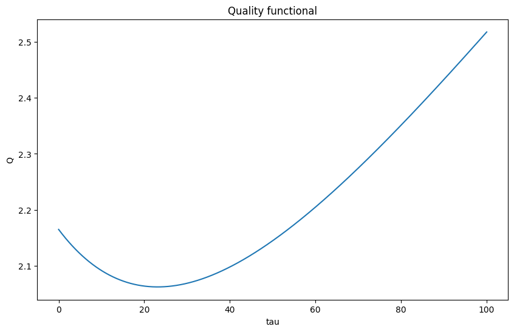
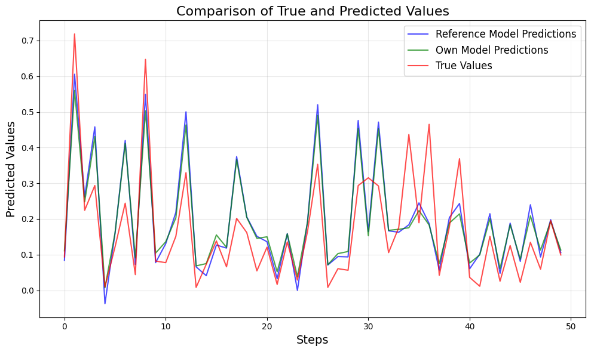

# Лабораторная работа №6. Регрессия

## Цель работы
В рамках лабораторной работы предстояло реализовать линейную регрессию, сравнить собственную реализацию с эталонной, используя подходы гребневой регрессии через сингулярное разложение. Также был осуществлен оптимальный подбор параметра регуляризации и выполнено сравнение моделей по качеству.

---

## Задание
1. Выбрать датасет для линейной регрессии.
2. Реализовать решение задачи гребневой регрессии через сингулярное разложение.
3. Реализовать оптимальный подбор параметра регуляризации.
4. Сравнить с эталонным решением по качеству и времени работы.

---

## Датасет
Использовался датасет **insurance.csv**, содержащий данные о медицинских расходах.

## Результаты

### Сравнение моделей
| Модель                        | R² Score | Время работы |
|-------------------------------|----------|---------------------|
| Эталонная модель              | 0.7343   | 308 µs ± 8.39 µs    |
| Собственная модель (best tau) | 0.7333   | 111 µs ± 13 µs      |
| Собственная модель (tau = 0)  | 0.7200   | 107 µs ± 3.69 µs    |

---

### Графики

#### График зависимости функционала качества от параметра \( \tau \)



```best tau: 23.128```
---

#### Сравнение истинных значений и предсказаний модели

