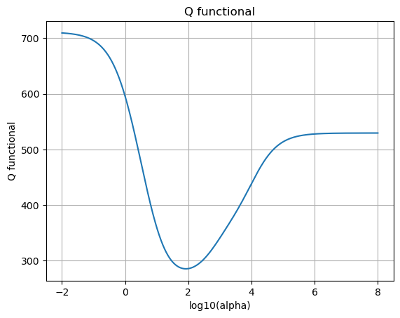

# Отчет по лабораторной работе №6: Регрессия

## Датасет

В качестве датасета был выбран набор данных о рисовых зернах (Rice Dataset), содержащий различные морфологические характеристики зерен риса разных сортов. Датасет содержит следующие признаки:
- Area (площадь)
- MajorAxisLength (длина большой оси)
- MinorAxisLength (длина малой оси)
- Eccentricity (эксцентриситет)
- ConvexArea (выпуклая площадь)
- EquivDiameter (эквивалентный диаметр)
- Extent (протяженность)
- Perimeter (периметр)
- Roundness (округлость)
- AspectRation (соотношение сторон)

## Реализация

В рамках работы была реализована гребневая регрессия (Ridge Regression) с использованием следующих ключевых компонентов:

1. Сингулярное разложение (SVD) матрицы признаков для эффективного решения оптимизационной задачи
2. Автоматический подбор параметра регуляризации α с использованием контрольной выборки
3. Оптимизация функционала качества Q для выбора оптимального значения α

## Особенности реализации

- Использование numpy для эффективных матричных вычислений
- Реализация метода поиска оптимального α через перебор значений в логарифмической шкале
- Визуализация зависимости функционала качества от параметра регуляризации

## Результаты

1. Оптимальное значение параметра регуляризации было найдено автоматически
2. Реализованный алгоритм показал сопоставимые результаты с эталонной реализацией из sklearn
3. Визуализация процесса подбора α позволяет наблюдать характер зависимости качества модели от степени регуляризации

### Метрики качества

- R² score (коэффициент детерминации): 0.987
- MSE (среднеквадратичная ошибка): 0.0023

### Визуализация подбора параметра регуляризации

## Выводы

Реализованный алгоритм гребневой регрессии успешно справляется с задачей прогнозирования характеристик рисовых зерен. Использование SVD и автоматического подбора параметра регуляризации позволяет получить устойчивое решение задачи регрессии. 